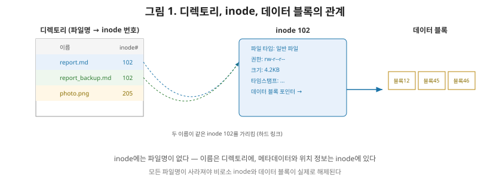
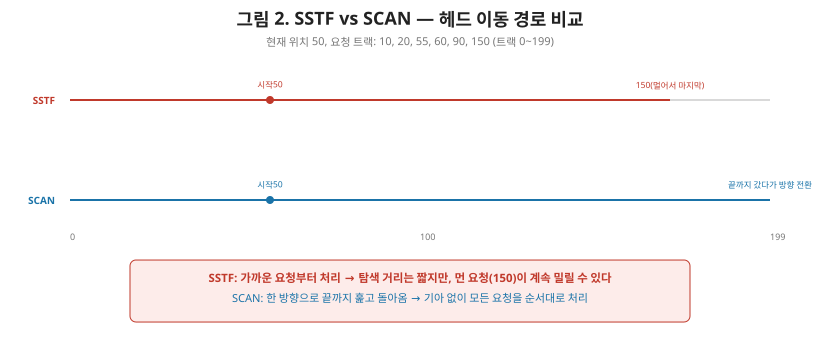

# [운영체제 7편] 파일 시스템 — 디스크 위의 데이터를 정리하는 방법

5, 6편에서는 프로세스가 실행되는 동안 메모리를 어떻게 쓰는지 다뤘습니다. 그런데 프로세스가 종료돼도 살아남아야 하는 데이터, 예를 들어 문서나 사진 같은 건 디스크 같은 영구 저장장치에 남아 있어야 합니다. 이번 편에서는 이 데이터를 **파일**이라는 단위로 관리하는 **파일 시스템**의 구조와, 디스크 접근을 효율적으로 만드는 **디스크 스케줄링**을 정리하겠습니다.

## 1. 파일은 메타데이터와 데이터로 나뉜다

파일 하나에는 실제 내용(데이터) 말고도 부가 정보가 따라붙습니다. 파일 크기, 소유자, 접근 권한, 생성/수정 시각, 그리고 그 데이터가 디스크의 어느 블록에 흩어져 있는지 같은 정보입니다. 이런 부가 정보를 **메타데이터**라고 부르며, 파일 시스템은 이 메타데이터를 별도의 자료구조로 관리합니다.

## 2. inode — 파일 하나의 신분증

유닉스 계열 파일 시스템(리눅스의 ext4 등)에서는 파일마다 **inode**라는 자료구조가 하나씩 있습니다. inode에는 다음과 같은 정보가 담깁니다.

| inode에 담기는 정보 | 설명 |
|---|---|
| 파일 타입 | 일반 파일인지, 디렉토리인지, 심볼릭 링크인지 |
| 권한 | 소유자/그룹/기타 사용자의 읽기·쓰기·실행 권한 |
| 크기 | 파일의 바이트 수 |
| 타임스탬프 | 생성/수정/접근 시각 |
| 데이터 블록 포인터 | 실제 데이터가 저장된 디스크 블록들의 위치 |

여기서 상급자가 짚어야 할 흥미로운 포인트는, **inode에는 파일명이 들어있지 않다**는 사실입니다. 파일명은 inode가 아니라 **디렉토리**에 저장됩니다. 디렉토리는 사실 "파일명 → inode 번호"를 매핑해주는 특수한 종류의 파일일 뿐입니다.

이 구조 덕분에 재미있는 일이 가능해집니다. 같은 inode(같은 데이터)를 가리키는 파일명을 디렉토리에 여러 개 만들 수 있는데, 이를 **하드 링크**라고 부릅니다. 파일명 하나를 지워도(디렉토리에서 매핑만 제거) 다른 이름으로 여전히 같은 데이터에 접근할 수 있고, 그 데이터는 **참조하는 파일명이 하나도 남지 않았을 때** 비로소 디스크에서 실제로 삭제됩니다.

## 3. 데이터 블록을 어떻게 흩뿌려 저장할 것인가

inode의 데이터 블록 포인터는 파일의 실제 내용이 디스크의 어느 블록들에 저장돼 있는지를 가리킵니다. 이 블록들을 어떻게 할당하느냐에 따라 방식이 나뉩니다.

| 할당 방식 | 설명 | 장점 | 단점 |
|---|---|---|---|
| 연속 할당 | 파일 전체를 디스크의 연속된 블록에 저장 | 순차 접근이 빠름 | 외부 단편화, 파일 크기 변경 어려움 |
| 연결 할당 | 각 블록이 다음 블록 주소를 포인터로 연결 | 단편화 문제 없음 | 임의 접근(특정 위치로 바로 이동)이 느림 |
| 색인 할당 | 블록 주소들을 모아놓은 색인 블록을 따로 둠(inode 방식) | 임의 접근도 빠름 | 색인 블록 자체의 공간·관리 비용 |

현대 파일 시스템 대부분은 색인 할당(정확히는 inode의 데이터 블록 포인터 구조)을 기본으로 쓰며, 파일이 커질 때는 간접 포인터(포인터를 가리키는 포인터)를 추가로 두어 확장성을 확보합니다.

## 4. 디스크 접근의 병목 — 헤드는 물리적으로 움직인다

파일의 데이터가 디스크 어디에 있는지 찾았다고 해도, 하드디스크(HDD)라면 실제로 그 데이터를 읽으려면 **디스크 헤드가 물리적으로 이동**해야 합니다. 이 이동 시간(탐색 시간, seek time)이 디스크 접근에서 가장 큰 병목입니다. 그래서 어떤 순서로 요청을 처리할지 정하는 **디스크 스케줄링**이 필요합니다. 3편에서 다룬 CPU 스케줄링과 목적은 다르지만 발상은 비슷합니다 — "여러 요청 중 어떤 걸 먼저 처리할까"를 정한다는 점에서요.

## 5. 대표적인 디스크 스케줄링 알고리즘

- **FCFS**: 요청이 들어온 순서 그대로 처리한다. 단순하지만, 디스크 트랙 번호가 뒤죽박죽인 순서로 요청이 들어오면 헤드가 디스크 전체를 왔다 갔다 하며 탐색 시간이 크게 낭비된다.
- **SSTF(Shortest Seek Time First)**: 현재 헤드 위치에서 가장 가까운 요청부터 처리한다. 탐색 거리는 최소화되지만, 3편에서 다룬 SJF와 똑같은 함정에 빠진다 — 헤드 근처에 요청이 계속 몰리면, 멀리 있는 요청은 기아 상태에 빠질 수 있다.
- **SCAN**: 헤드가 디스크의 한쪽 끝에서 다른 쪽 끝까지 쭉 이동하면서, 지나가는 길에 있는 요청들을 순서대로 처리한다. 끝에 도달하면 방향을 바꿔 반대로 훑는다. 엘리베이터가 한 방향으로 계속 올라가며 요청이 있는 층에 서는 것과 같다고 해서 **엘리베이터 알고리즘**이라고도 부른다.
- **C-SCAN(Circular SCAN)**: SCAN과 비슷하지만, 끝에 도달하면 방향을 반대로 바꾸는 대신 처음 지점으로 곧장 되돌아가 다시 같은 방향으로만 훑는다. 모든 구간에 대해 대기 시간을 더 균등하게 만들어준다.

| 알고리즘 | 방식 | 장점 | 단점 |
|---|---|---|---|
| FCFS | 요청 순서대로 | 구현 단순, 공정함 | 헤드 이동 거리 낭비 가능 |
| SSTF | 가장 가까운 요청 우선 | 평균 탐색 거리 최소 | 기아 가능 |
| SCAN | 한쪽 끝까지 갔다가 반대로 | 기아 없음, 탐색 거리 준수 | 끝 근처 요청은 상대적으로 불리 |
| C-SCAN | 한 방향으로만, 끝나면 처음으로 복귀 | 대기 시간이 가장 균등 | 복귀 구간은 요청 처리 없이 이동 |

## 6. 정리

- 파일은 데이터와 메타데이터로 나뉘며, 유닉스 계열은 메타데이터를 inode에, 파일명은 디렉토리에 별도로 저장한다.
- 같은 inode를 여러 파일명이 가리킬 수 있는 하드 링크 구조 덕분에, 데이터는 참조하는 이름이 모두 사라져야 실제로 삭제된다.
- 디스크 블록 할당 방식은 연속·연결·색인 할당으로 나뉘며, 현대 파일 시스템은 색인 할당(inode 포인터 구조)을 기본으로 쓴다.
- 디스크 헤드의 물리적 이동(탐색 시간)이 접근 성능의 병목이며, FCFS·SSTF·SCAN·C-SCAN이 이를 최소화하는 대표적인 전략이다. SSTF는 SJF처럼 효율적이지만 기아 위험이 있고, SCAN 계열은 이를 구조적으로 방지한다.

다음 편에서는 입출력 관리로 넘어가, CPU가 느린 디스크 작업을 어떻게 기다리지 않고 처리하는지 — 인터럽트 기반 입출력과 DMA(Direct Memory Access), 그리고 버퍼링·캐싱으로 입출력 성능을 끌어올리는 기법을 다룹니다.
