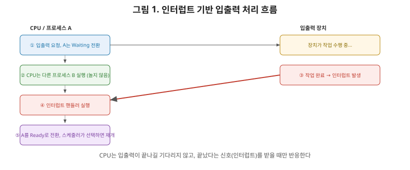
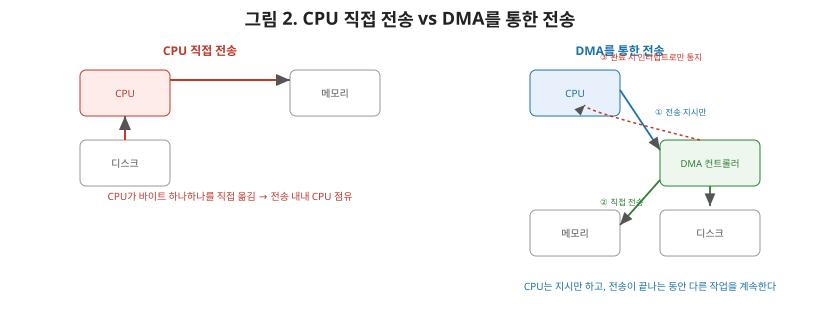

# [운영체제 8편] 입출력 관리 — CPU는 느린 장치를 어떻게 기다리지 않는가

7편에서 디스크 헤드의 물리적 이동이 병목이라고 했습니다. CPU의 연산 속도와 디스크·네트워크 같은 입출력 장치의 속도 차이는 수천에서 수백만 배에 달합니다. 만약 CPU가 입출력이 끝날 때까지 멍하니 기다린다면 엄청난 낭비겠죠. 이번 편에서는 CPU가 느린 장치를 효율적으로 다루는 방법 — **인터럽트**, **DMA**, 그리고 **버퍼링·캐싱**을 정리하겠습니다.

## 1. 폴링 — 계속 물어보는 방식

가장 단순한 방법은 **폴링(Polling)**입니다. CPU가 주기적으로 "작업 끝났어?"라고 장치 상태를 계속 확인하는 방식입니다. 구현은 쉽지만, 장치가 응답할 때까지 CPU가 다른 일은 못 하고 상태 확인만 반복하게 되어 CPU 자원을 그대로 낭비합니다.

## 2. 인터럽트 — 끝나면 알려줘

**인터럽트(Interrupt) 기반 입출력**은 반대로 접근합니다. CPU는 장치에게 작업을 요청해놓고 곧바로 다른 프로세스의 일을 처리하러 갑니다. 장치가 작업을 끝내면, 장치가 CPU에게 **인터럽트 신호**를 보내 "나 끝났어"라고 알려줍니다.

1편에서 시스템 콜을 다룰 때 나온 **트랩**을 기억하실 겁니다. 트랩이 "프로세스가 스스로 커널에 요청을 보내는" 소프트웨어적 신호였다면, 인터럽트는 **하드웨어 장치가 CPU에게 보내는** 신호라는 차이가 있습니다. 하지만 둘 다 "지금 실행 중인 흐름을 멈추고 커널의 처리 루틴으로 제어권을 넘긴다"는 메커니즘 자체는 동일합니다.

1. CPU가 장치에게 입출력 작업을 요청하고, 그 프로세스는 2편에서 다룬 Waiting 상태로 전환된다.
2. CPU는 곧바로 Ready 큐에 있는 다른 프로세스를 실행한다(3편에서 다룬 스케줄러가 이 전환을 담당).
3. 장치가 작업을 마치면 인터럽트를 발생시킨다.
4. CPU는 현재 작업을 잠시 멈추고(인터럽트 핸들러 실행), 해당 프로세스를 Waiting에서 Ready로 옮긴다.
5. 스케줄러가 다시 그 프로세스를 선택하면, 입출력 결과를 이어서 처리한다.

이 구조 덕분에 CPU는 입출력을 기다리는 동안 절대 놀지 않고, 다른 프로세스의 일을 계속 처리할 수 있습니다. 이것이 바로 2편에서 언급했던 "Waiting 상태로 전환해 CPU를 다른 프로세스에게 넘긴다"는 전략의 실제 구현체입니다.

## 3. DMA — CPU 없이도 데이터가 옮겨진다

인터럽트로 "기다리는 시간"은 아꼈지만, 아직 남은 문제가 있습니다. 실제 데이터를 장치와 메모리 사이에서 옮기는 작업 자체를 CPU가 직접 수행한다면, 그 전송 과정에서는 여전히 CPU가 붙잡혀 있어야 합니다. 대용량 파일을 디스크에서 읽어올 때 이 전송을 CPU가 한 바이트씩 처리한다면 매우 비효율적이겠죠.

이 문제를 해결하는 것이 **DMA(Direct Memory Access)**입니다. DMA 컨트롤러라는 별도의 하드웨어에게 "이 장치에서 저 메모리 주소로 이만큼 옮겨줘"라고 지시만 해두면, 실제 데이터 전송은 DMA 컨트롤러가 CPU 개입 없이 직접 처리합니다. CPU는 전송이 진행되는 동안 완전히 자유롭게 다른 연산을 계속하다가, 전송이 끝났을 때 인터럽트 한 번만 받으면 됩니다.

| 구분 | CPU 직접 전송 | DMA |
|---|---|---|
| 전송 주체 | CPU | DMA 컨트롤러 |
| CPU 개입 | 전송 내내 필요 | 시작 지시와 완료 통지 시점만 |
| 효율 | 대용량 전송 시 비효율적 | 대용량 전송에 특히 유리 |
| CPU가 하는 일 | 전송이 끝날 때까지 다른 일 거의 불가 | 전송 중에도 다른 프로세스 실행 가능 |

## 4. 버퍼링과 캐싱 — 속도 차이를 완충하기

인터럽트와 DMA가 "CPU가 기다리지 않게" 만드는 방법이었다면, **버퍼링**과 **캐싱**은 애초에 느린 장치에 접근하는 횟수 자체를 줄이는 전략입니다.

- **버퍼링(Buffering)**: 데이터를 곧바로 최종 목적지로 보내지 않고, 메모리의 임시 공간(버퍼)에 모아뒀다가 한꺼번에 처리한다. 예를 들어 네트워크로 데이터가 조금씩 도착할 때마다 매번 처리하는 대신, 일정량이 버퍼에 쌓일 때까지 기다렸다가 한 번에 처리하면 처리 효율이 올라간다. 속도가 들쭉날쭉한 두 장치(빠른 CPU와 느린 디스크, 또는 서로 다른 속도의 두 장치) 사이의 속도 차이를 완충하는 역할이다.
- **캐싱(Caching)**: 한 번 읽어온 데이터의 사본을 더 빠른 저장 공간(메모리)에 보관해뒀다가, 같은 데이터를 다시 요청받으면 느린 장치까지 갈 필요 없이 캐시에서 바로 응답한다. 5편에서 다룬 TLB도 사실 주소 변환 결과를 캐싱하는 것과 같은 원리이고, 네트워크 시리즈 5편에서 다룬 HTTP 캐싱도 근본적으로 같은 아이디어입니다.

두 개념은 종종 함께 등장하지만 목적이 다릅니다. 버퍼링은 "속도와 타이밍의 차이"를 완충하는 것이 목적이고, 캐싱은 "반복되는 요청"을 줄이는 것이 목적입니다. 실제 파일 시스템은 디스크에서 읽은 블록을 메모리의 **페이지 캐시**에 보관해두는데, 이는 캐싱이면서 동시에 쓰기 작업을 모아 처리하는 버퍼링 역할도 겸합니다.

## 5. 정리

- 폴링은 CPU가 계속 상태를 확인하는 비효율적인 방식이고, 인터럽트는 장치가 작업을 마쳤을 때만 CPU에게 알려주는 방식으로 CPU 자원 낭비를 없앤다.
- 인터럽트는 트랩과 마찬가지로 "실행 흐름을 멈추고 커널로 제어권을 넘긴다"는 메커니즘을 공유하지만, 발생 주체가 하드웨어라는 점이 다르다.
- DMA 컨트롤러는 CPU 개입 없이 장치와 메모리 사이의 데이터 전송을 직접 처리해, CPU를 전송 작업에서 완전히 해방시킨다.
- 버퍼링은 속도 차이를 완충하고, 캐싱은 반복 요청을 줄이는 것이 목적이며, 실제로는 페이지 캐시처럼 두 역할을 함께 수행하는 구조가 많다.

다음 편에서는 가상화와 컨테이너로 넘어가, 지금까지 배운 프로세스·메모리·파일 시스템 개념 위에서 가상 머신과 컨테이너가 각각 어떻게 격리를 구현하는지 — 하이퍼바이저, 네임스페이스, cgroup의 원리를 다룹니다.
