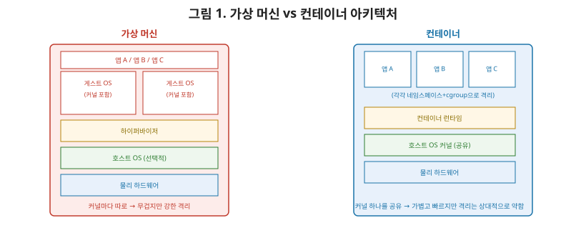
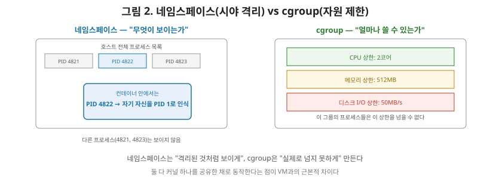

# [운영체제 9편] 가상화와 컨테이너 — 격리를 구현하는 두 가지 방식

지금까지 프로세스, 메모리, 파일 시스템, 입출력까지 하나의 운영체제 안에서 일어나는 일들을 다뤘습니다. 이제 시야를 한 단계 넓혀 보겠습니다. 그런데 요즘 서버 인프라는 한 대의 물리 서버 위에서 여러 개의 독립된 환경을 동시에 돌리는 것이 기본입니다. 이걸 가능하게 하는 두 가지 대표적인 기술이 **가상 머신(VM)**과 **컨테이너**입니다. 이번 편에서는 이 둘이 격리를 구현하는 방식이 근본적으로 어떻게 다른지, 그리고 컨테이너를 실제로 지탱하는 리눅스 커널 기능인 **네임스페이스**와 **cgroup**을 살펴보겠습니다.

## 1. 가상 머신 — OS 전체를 통째로 격리한다

**가상 머신(Virtual Machine)**은 물리 서버 하나 위에 **하이퍼바이저(Hypervisor)**라는 소프트웨어를 두고, 그 위에 완전히 독립된 **게스트 OS**를 여러 개 실행하는 방식입니다. 각 VM은 자기만의 커널, 자기만의 가상 CPU·메모리·디스크를 가진, 사실상 완전히 별개의 컴퓨터처럼 동작합니다.

하이퍼바이저는 크게 두 종류로 나뉩니다. 물리 하드웨어 위에서 직접 실행되며 게스트 OS들을 관리하는 **타입 1(베어메탈)** 방식과, 일반 OS 위에 설치되는 애플리케이션 형태로 동작하는 **타입 2(호스티드)** 방식입니다. 서버 환경에서는 성능 오버헤드가 적은 타입 1 방식(VMware ESXi, KVM 등)이 주로 쓰입니다.

## 2. 컨테이너 — 커널은 공유하고 프로세스만 격리한다

**컨테이너(Container)**는 접근이 다릅니다. 게스트 OS를 따로 두지 않고, **호스트의 커널을 그대로 공유**하면서, 그 위에서 실행되는 프로세스가 마치 자기만의 독립된 시스템에 있는 것처럼 느끼도록 **격리된 실행 환경**만 만들어줍니다. 컨테이너 안에서 실행되는 프로세스는 실제로는 호스트 OS 위에서 돌아가는 일반 프로세스이지만, 다른 프로세스나 다른 컨테이너를 볼 수 없고 자기만의 파일 시스템, 네트워크, 프로세스 목록을 가진 것처럼 보입니다.

| 구분 | 가상 머신 | 컨테이너 |
|---|---|---|
| 격리 단위 | 게스트 OS 전체(커널 포함) | 프로세스(커널은 호스트와 공유) |
| 부팅 시간 | 수십 초~분(OS 부팅 필요) | 수백 밀리초~초(프로세스 시작 수준) |
| 리소스 오버헤드 | 큼(OS마다 커널·메모리 중복) | 작음(커널 하나를 여러 컨테이너가 공유) |
| 격리 수준 | 강함(커널 자체가 분리됨) | 상대적으로 약함(커널 취약점이 전체에 영향 가능) |
| 이식성 | OS 이미지 전체가 필요해 무거움 | 이미지가 가벼워 빠르게 배포 가능 |

컨테이너는 부팅 시간이 사실상 "프로세스를 하나 실행하는 시간"과 같습니다. 왜냐하면 컨테이너를 실행한다는 것은 정말로 **새 커널을 부팅하는 게 아니라, 호스트 커널 위에서 격리된 상태로 프로세스 하나를 fork/exec하는 것**에 가깝기 때문입니다. 이 가벼움이 컨테이너가 마이크로서비스, CI/CD 환경에서 폭넓게 쓰이는 핵심 이유입니다. 다만 커널을 공유한다는 건 커널 자체의 보안 취약점이 발견되면 호스트 위의 모든 컨테이너가 영향받을 수 있다는 뜻이기도 해서, VM보다 격리 수준이 상대적으로 낮다는 트레이드오프가 있습니다.

## 3. 네임스페이스 — "보이는 것"을 격리한다

컨테이너가 커널을 공유하면서도 격리된 것처럼 느껴지게 만드는 핵심 기술이 리눅스의 **네임스페이스(Namespace)**입니다. 네임스페이스는 커널의 특정 전역 자원을 프로세스 그룹별로 "따로 보이게" 나눠주는 기능입니다.

| 네임스페이스 종류 | 격리 대상 |
|---|---|
| PID | 프로세스 ID 목록 — 컨테이너 안에서는 자기 프로세스만 보이고, PID 1부터 새로 시작한다 |
| Network | 네트워크 인터페이스, IP 주소, 포트 |
| Mount | 파일 시스템 마운트 지점(컨테이너 전용 루트 디렉토리처럼 보이게 함) |
| UTS | 호스트명, 도메인명 |
| IPC | 프로세스 간 통신 자원(공유 메모리, 세마포어 등) |
| User | 사용자 ID, 그룹 ID |

예를 들어 PID 네임스페이스 덕분에, 호스트에서는 실제로 PID 4821번인 프로세스가 컨테이너 안에서는 자신을 PID 1번으로 인식합니다. 2편에서 다룬 PCB와 프로세스 상태 관리는 호스트 커널이 그대로 수행하지만, "어떤 프로세스가 보이는가"라는 시야만 네임스페이스로 나눠주는 것입니다.

## 4. cgroup — "쓸 수 있는 양"을 제한한다

네임스페이스가 "무엇이 보이는가"를 격리한다면, **cgroup(Control Group)**은 "얼마나 쓸 수 있는가"를 제한합니다. 특정 프로세스 그룹이 사용할 수 있는 CPU 시간, 메모리 용량, 디스크 입출력 대역폭 등에 상한선을 걸어두는 커널 기능입니다.

3편에서 다룬 CPU 스케줄링, 6편에서 다룬 메모리 관리는 원래 시스템 전체의 프로세스를 대상으로 동작합니다. cgroup은 여기에 "이 그룹에 속한 프로세스들의 합계는 CPU 2코어, 메모리 512MB를 넘을 수 없다"는 제약 조건을 추가로 걸어주는 역할을 합니다. 한 컨테이너가 폭주해서 CPU나 메모리를 독차지하면 같은 호스트의 다른 컨테이너에도 영향을 줄 수 있는데, cgroup이 바로 이런 상황을 막아주는 안전장치입니다.

## 5. 컨테이너 = 네임스페이스 + cgroup + 이미지

정리하면, 컨테이너라는 기술은 사실 완전히 새로운 발명품이 아니라, **네임스페이스(보이는 것을 격리)**와 **cgroup(쓸 수 있는 양을 제한)**이라는 기존 리눅스 커널 기능을 조합해 "격리된 프로세스"를 만들고, 여기에 애플리케이션 실행에 필요한 파일들을 하나로 묶은 **이미지** 개념을 더한 것입니다. Docker 같은 도구는 이 조합을 사람이 다루기 쉬운 명령어와 이미지 포맷으로 감싸준 것이라고 이해하면 됩니다.

## 6. 정리

- 가상 머신은 하이퍼바이저 위에서 게스트 OS 전체(커널 포함)를 격리하는 무거운 방식이고, 컨테이너는 호스트 커널을 공유하면서 프로세스 수준에서 격리하는 가벼운 방식이다.
- 컨테이너의 가벼움은 "커널을 새로 부팅하지 않고, 격리된 프로세스를 실행하는 것"이라는 본질에서 나온다. 대신 커널 취약점에 대한 격리 수준은 VM보다 낮다.
- 네임스페이스는 PID·네트워크·마운트 등 커널 자원이 "어떻게 보이는지"를 프로세스 그룹별로 나눠주는 기능이다.
- cgroup은 프로세스 그룹이 사용할 수 있는 CPU·메모리 등의 자원량에 상한을 거는 기능이다.
- 컨테이너는 결국 네임스페이스와 cgroup이라는 커널 기능의 조합 위에, 실행에 필요한 파일을 묶은 이미지 개념을 더한 것이다.

다음 편에서는 실전 진단으로 넘어가, 지금까지 배운 개념들을 실제 리눅스 서버에서 어떻게 확인하고 문제를 진단하는지 — top, ps, vmstat, iostat 같은 도구로 CPU·메모리·디스크 병목을 찾아내는 실전 트러블슈팅을 다룹니다.
