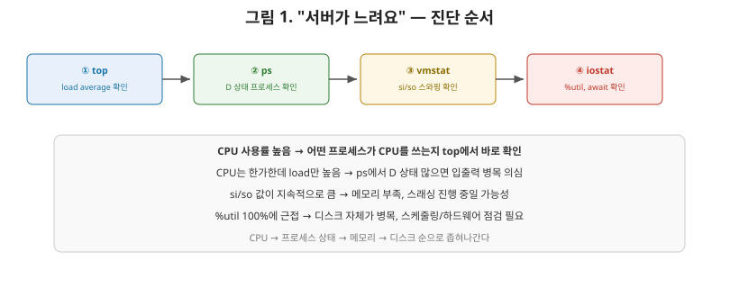
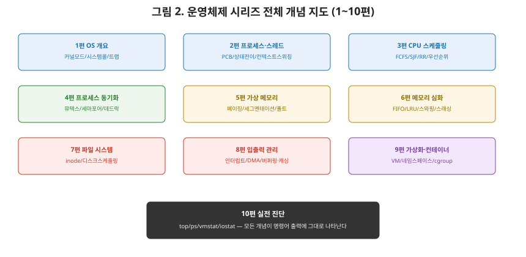

# [운영체제 10편] 실전 진단 — 이론을 현장의 언어로 옮기기

1편에서 9편까지 프로세스, 스케줄링, 메모리, 파일 시스템, 가상화까지 운영체제의 핵심 원리를 함께 훑어왔습니다. 이번 마지막 편에서는 이 개념들을 실제 리눅스 서버 진단에 어떻게 적용하는지 살펴보겠습니다. "서버가 느려요"라는 한 마디를 받았을 때, 어떤 도구로 어디를 들여다봐야 하는지가 이번 편의 핵심입니다.

## 1. top — 지금 이 순간의 전체 그림

`top`(또는 개선판인 `htop`)은 서버 상태를 파악할 때 가장 먼저 실행하는 명령어입니다. CPU 사용률, 메모리 사용량, 프로세스별 자원 소비를 실시간으로 보여줍니다.

여기서 가장 먼저 볼 지표가 **load average**입니다. 최근 1분, 5분, 15분 동안 **실행 중이거나 실행 대기 중인 프로세스의 평균 개수**를 나타냅니다. 3편에서 다룬 Ready 큐를 떠올려 보면, load average는 사실상 "Ready 큐에 평균적으로 몇 개의 프로세스가 쌓여 있었는가"를 요약한 숫자입니다. 이 값이 CPU 코어 수보다 훨씬 크다면, CPU가 처리할 수 있는 것보다 더 많은 작업이 몰려 대기하고 있다는 뜻입니다.

## 2. ps — 특정 프로세스를 콕 집어보기

`ps aux`는 현재 실행 중인 모든 프로세스의 상태를 한눈에 보여줍니다. 여기서 나오는 프로세스 상태 코드(R, S, D, Z 등)는 정확히 2편에서 다룬 **프로세스 상태 전이**와 대응합니다.

| ps 상태 코드 | 의미 | 2편의 대응 상태 |
|---|---|---|
| R (Running) | 실행 중이거나 실행 대기 중 | Running / Ready |
| S (Sleeping) | 이벤트를 기다리며 대기 중 | Waiting |
| D (Uninterruptible Sleep) | 입출력 완료를 기다리며 대기(강제 종료 불가) | Waiting(특히 디스크 I/O) |
| Z (Zombie) | 종료됐지만 부모가 아직 정리하지 않은 상태 | Terminated 직전 |

특히 D 상태 프로세스가 많이 보인다면, 8편에서 다룬 디스크 입출력이 지연되고 있다는 강력한 신호입니다. CPU 문제가 아니라 디스크나 네트워크 쪽 병목을 의심해야 하는 순간입니다.

## 3. vmstat — 메모리와 스와핑을 들여다보기

`vmstat`은 메모리 사용 현황과 함께, 6편에서 다룬 **스와핑**이 실제로 일어나고 있는지를 보여줍니다. 출력의 `si`(swap in), `so`(swap out) 컬럼 값이 0이 아니라면, 물리 메모리가 부족해 디스크와 메모리 사이에서 데이터가 오가고 있다는 뜻입니다. 이 값이 지속적으로 크게 나온다면 6편에서 다룬 **스래싱**이 실제로 진행 중일 가능성이 높습니다 — CPU가 실제 작업보다 메모리 정리에 더 많은 시간을 쓰고 있는 상황입니다.

## 4. iostat — 디스크가 병목인지 확인하기

`iostat`은 디스크 입출력 통계를 보여줍니다. `%util`(디스크가 바쁜 시간의 비율)이 100%에 가깝다면, 7편과 8편에서 다룬 디스크 접근 자체가 병목이라는 뜻입니다. `await`(입출력 요청이 완료되기까지 걸린 평균 시간)이 비정상적으로 크다면, 디스크 스케줄링이나 하드웨어 자체의 한계를 의심할 수 있습니다.

## 5. free — 메모리 현황 요약

`free -h`는 전체 메모리 중 사용 중인 양, 여유분, 그리고 **캐시로 쓰이는 양**을 보여줍니다. 여기서 상급자가 흔히 하는 실수가, "여유 메모리(free)가 적다"는 걸 보고 무조건 메모리 부족이라고 오판하는 것입니다. 리눅스는 8편에서 다룬 **페이지 캐시**를 적극적으로 활용해서, 남는 메모리를 최대한 캐시로 채워두는 것이 정상적인 동작입니다. 진짜 메모리 부족 여부는 `available`(캐시를 반납하고도 실제 새 프로세스에게 즉시 줄 수 있는 메모리) 값으로 판단해야 합니다.

## 6. 진단 도구 한눈에 비교

| 도구 | 주로 보는 것 | 관련 개념(회차) |
|---|---|---|
| top / htop | CPU·메모리 전반, load average | Ready 큐, 스케줄링(3편) |
| ps | 프로세스별 상태(R/S/D/Z) | 프로세스 상태 전이(2편) |
| vmstat | 스와핑 발생 여부(si/so) | 스와핑·스래싱(6편) |
| iostat | 디스크 사용률, 대기 시간 | 디스크 스케줄링·입출력(7,8편) |
| free | 메모리·캐시 사용 현황 | 페이지 캐시(8편) |

## 7. 실전 시나리오 — "서버가 느려요"를 받았을 때

이 도구들을 조합하면 다음과 같은 진단 흐름이 만들어집니다.

1. `top`으로 load average를 확인해 "CPU가 감당 못 할 만큼 작업이 밀려 있는지" 먼저 본다.
2. CPU 사용률 자체가 높다면, 어떤 프로세스가 CPU를 많이 쓰는지 top에서 바로 확인한다.
3. CPU는 한가한데 load average만 높다면, `ps`로 D 상태 프로세스가 많은지 확인해 입출력 병목을 의심한다.
4. `vmstat`으로 si/so 값을 확인해 스와핑·스래싱 여부를 점검한다.
5. `iostat`으로 디스크 `%util`과 `await`을 확인해 실제 디스크 병목인지 최종 확인한다.

여기서 핵심은, 증상 하나(서버가 느림)의 원인이 CPU·메모리·디스크 중 어느 계층에 있는지 **순서대로 좁혀나가는 것**입니다. 이 순서 자체가 지금까지 이 시리즈가 다뤄온 계층 구조 — 스케줄링(3편) → 메모리(5,6편) → 파일·디스크(7,8편) — 를 그대로 따라간다는 점을 눈여겨보시기 바랍니다.

## 8. 시리즈를 마치며

10편에 걸쳐 운영체제의 핵심 뼈대를 훑어왔습니다. 1편에서 커널 모드와 시스템 콜이라는 기본 동작 원리를 다졌고, 2·3편에서 프로세스와 스레드, 그리고 이들을 스케줄링하는 원리를 봤습니다. 4편에서는 여러 실행 흐름이 자원을 안전하게 공유하는 방법(동기화)과 그 부작용(데드락)을, 5·6편에서는 가상 메모리가 어떻게 작동하고 한계에 부딪히는지를 다뤘습니다. 7·8편에서는 데이터가 디스크에 어떻게 저장되고, CPU가 느린 장치를 어떻게 효율적으로 다루는지를 봤고, 9편에서는 이 모든 원리 위에서 격리를 구현하는 가상화와 컨테이너를 살펴봤습니다. 그리고 이번 10편에서, 그 모든 개념이 실제 서버 진단 명령어 한 줄 한 줄에 그대로 녹아 있다는 것을 확인했습니다.

운영체제를 공부하는 이유는 결국 "왜 이 코드가, 이 서버가 이렇게 동작하는가"를 설명할 수 있기 위해서입니다. `top` 화면의 숫자 하나, `ps`의 상태 코드 한 글자가 이제는 그냥 기호가 아니라, 커널 안에서 실제로 벌어지는 일을 가리키는 신호로 읽히신다면 이 시리즈의 목적은 달성된 것입니다. 앞서 다룬 네트워크 시리즈와 스프링 시리즈까지 이어보면, 애플리케이션 코드 한 줄이 스레드로, 스레드가 스케줄러와 메모리로, 그리고 소켓과 패킷으로 이어지는 전체 그림이 하나로 연결됩니다. 여기까지 함께해 주셔서 감사합니다.
