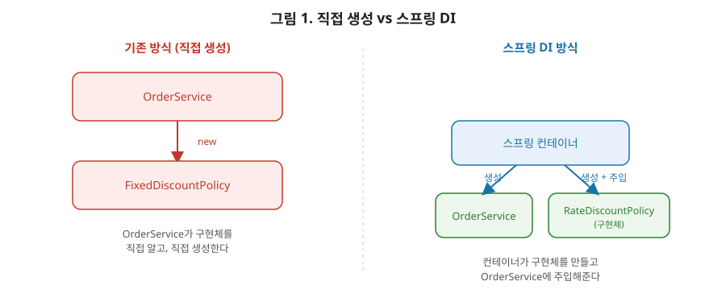

# [스프링 1편] 스프링의 시작점, IoC와 DI를 제대로 이해하기

스프링을 처음 배울 때 누구나 "IoC와 DI"라는 말을 듣는다. 문제는 대부분 "제어의 역전, 의존성 주입" 정도로 한글 풀이만 외우고 넘어간다는 점이다. 상급자로 넘어가려면 이 개념이 *왜* 필요했는지, 스프링이 그것을 *어떻게* 구현했는지, 그리고 그 구현이 만들어내는 부작용(순환참조 같은)까지 이해해야 한다. 이번 글에서는 그 전체 흐름을 처음부터 끝까지 짚어본다. 참고로 이 시리즈는 1편(IoC/DI) → 2편(빈 등록·라이프사이클) → 3편(설정 방식) → 4편(AOP) 순으로, 뒤로 갈수록 이번 편에서 정리한 개념 위에 살을 붙여가는 구조다.

이 글에서 계속 쓸 비유를 하나 먼저 소개한다. 손님이 식당에서 밥을 먹는 상황을 생각해보자. 스프링이 없는 코드는 손님이 직접 장을 보고, 재료를 손질하고, 요리까지 해서 먹는 것과 같다. 재료(의존 객체)를 바꾸고 싶으면 손님 자신의 동선(코드) 전체를 바꿔야 한다. IoC/DI가 적용된 코드는 손님이 그냥 "이 메뉴 주세요"라고만 하고, 어떤 재료를 어떻게 조합할지는 주방(컨테이너)이 알아서 처리해 완성된 요리를 내어주는 구조다. 손님은 재료 조달 방법을 전혀 몰라도 되고, 주방은 재료를 바꿔도 손님의 주문 방식을 바꿀 필요가 없다. 이 비유에서 "주방이 요리를 조립해서 준다"는 부분이 IoC, "완성된 재료 조합이 손님에게 전달된다"는 부분이 DI라고 보면 된다.



자, 그림으로 한번 정리해볼게요. 왼쪽은 우리가 스프링 없이 자바로만 개발할 때의 모습이고, 오른쪽은 스프링 컨테이너가 개입했을 때의 모습입니다. 왼쪽에서는 `OrderService`가 화살표를 뻗어서 `FixedDiscountPolicy`를 직접 만들어냅니다. 반면 오른쪽에서는 화살표의 시작점이 컨테이너입니다. 컨테이너가 두 객체를 각각 만들고, `OrderService` 쪽으로 완성된 구현체를 "주입"해주는 그림이죠. 이 그림 하나만 기억하셔도 이번 편의 절반은 이해하신 겁니다.

## 1. 문제의 시작: 객체가 스스로 의존 객체를 만들 때

스프링 없이 자바로 서비스 계층을 짠다고 해보자.

```java
public class OrderService {
    private final DiscountPolicy discountPolicy = new FixedDiscountPolicy();

    public int calculatePrice(int price) {
        return price - discountPolicy.discount(price);
    }
}
```

`OrderService`는 `FixedDiscountPolicy`라는 구체 클래스를 **직접 생성**한다. 이 코드의 문제는 다음과 같다.

- **OCP 위반**: 할인 정책을 `RateDiscountPolicy`로 바꾸려면 `OrderService` 코드 자체를 수정해야 한다.
- **DIP 위반**: `OrderService`는 추상화(`DiscountPolicy` 인터페이스)에 의존하는 것처럼 보이지만, 실제로는 구현체(`FixedDiscountPolicy`)에도 동시에 의존한다.
- **테스트 어려움**: `OrderService`를 단위 테스트하려면 `FixedDiscountPolicy`가 실제로 만들어져야 한다. Mock으로 대체할 방법이 없다.

이 문제의 본질은 하나다. **"누가 사용할 객체를 결정하는가"와 "어떻게 그 객체를 사용하는가"가 한 클래스 안에 섞여 있다.** 이 둘을 분리하는 것이 스프링의 핵심 설계 철학이다.

## 2. 제어의 역전 (IoC, Inversion of Control)

일반적인 프로그램에서는 클라이언트 객체가 스스로 필요한 서버 객체를 생성하고, 실행하고, 흐름을 제어한다. **제어의 역전**은 이 흐름의 주도권을 객체 자신이 아니라 외부(프레임워크, 컨테이너)로 넘기는 설계 원칙이다.

```java
public class OrderService {
    private final DiscountPolicy discountPolicy;

    public OrderService(DiscountPolicy discountPolicy) {
        this.discountPolicy = discountPolicy; // 누가 줄지는 내가 모른다
    }
}
```

이제 `OrderService`는 어떤 구현체가 주입될지 전혀 알지 못한다. 프로그램의 제어 흐름을 쥐고 있는 주체가 `OrderService` 자신이 아니라, 이 객체를 조립하는 **AppConfig(또는 스프링 컨테이너)**로 넘어간 것이다. 이것이 IoC다. IoC는 스프링만의 개념이 아니라 디자인 패턴 전반에서 쓰이는 원리다(예: 템플릿 메서드 패턴처럼 프레임워크가 콜백을 호출하는 구조). 스프링은 이 원리를 DI 컨테이너라는 형태로 구체화했을 뿐이다.

## 3. 의존관계 주입 (DI, Dependency Injection)

DI는 IoC를 구현하는 구체적인 방법 중 하나다. 외부에서 의존 관계를 결정해서 클래스 내부에 "주입"해준다. 주입 방식은 크게 세 가지다.

### 3-1. 필드 주입

```java
@Service
public class OrderService {
    @Autowired
    private DiscountPolicy discountPolicy;
}
```

간결하지만 실무에서는 지양해야 한다. `final`을 붙일 수 없어 불변성을 보장 못하고, 스프링 컨테이너 없이는 테스트 코드에서 객체를 생성할 방법이 없다(순수 자바 객체로 만들면 `discountPolicy`가 `null`이다).

### 3-2. 수정자(setter) 주입

```java
@Service
public class OrderService {
    private DiscountPolicy discountPolicy;

    @Autowired
    public void setDiscountPolicy(DiscountPolicy discountPolicy) {
        this.discountPolicy = discountPolicy;
    }
}
```

선택적 의존관계(주입 대상이 없어도 동작해야 하는 경우)에는 적합하지만, 객체가 생성된 이후에도 외부에서 의존관계를 변경할 수 있다는 게 단점이다. 대부분의 의존관계는 애플리케이션 종료 시점까지 변하지 않아야 하므로 이 특성은 오히려 위험 요소다.

### 3-3. 생성자 주입 (권장)

```java
@Service
public class OrderService {
    private final DiscountPolicy discountPolicy;

    public OrderService(DiscountPolicy discountPolicy) {
        this.discountPolicy = discountPolicy;
    }
}
```

상급자 수준에서 생성자 주입을 써야 하는 이유는 다음과 같이 명확하게 설명할 수 있어야 한다.

1. **불변성**: `final` 키워드를 사용할 수 있어 객체 생성 이후 값이 바뀌지 않음을 컴파일 타임에 보장한다.
2. **필수 의존관계 명시**: 생성자에 파라미터로 명시되므로, 객체를 생성하는 시점에 필요한 의존관계가 모두 준비되지 않으면 컴파일 오류가 난다. 필드/수정자 주입은 객체 생성 후 아무 때나 호출해도 되기 때문에 "값이 없는 상태"가 존재할 수 있다.
3. **순환참조를 조기에(애플리케이션 실행 시점에) 발견**: 뒤에서 자세히 다룬다.
4. **테스트 용이성**: 스프링 컨테이너 없이 순수 자바 코드로 `new OrderService(mockDiscountPolicy)`처럼 테스트가 가능하다.

스프링 4.3 이후로는 생성자가 하나만 있으면 `@Autowired`를 생략해도 자동으로 주입된다. 롬복의 `@RequiredArgsConstructor`를 함께 쓰면 `final` 필드에 대한 생성자를 자동 생성해주므로 실무에서는 이 조합이 사실상 표준이다.

세 가지 주입 방식을 표로 한번 정리하고 넘어가겠습니다. 강의할 때 제가 늘 강조하는 표인데, 시험 문제 내듯이 외우기보다는 "왜 이런 차이가 나는지"를 이해하시는 게 중요합니다.

| 구분 | 필드 주입 | 수정자 주입 | 생성자 주입 |
|---|---|---|---|
| `final` 사용 | 불가능 | 불가능 | **가능** |
| 주입 시점 | 리플렉션으로 필드에 직접 꽂음 | 객체 생성 후 아무 때나 | 객체 생성 시점 단 한 번 |
| 필수값 누락 감지 | 런타임에야 `NullPointerException` | 런타임에야 발견 | **컴파일 타임에 발견** |
| 순수 자바 테스트 | 불가능(컨테이너 필요) | 가능 | **가능** |
| 순환참조 발견 시점 | 런타임(정상 기동처럼 보임) | 런타임 | **애플리케이션 시작 시점 즉시** |
| 실무 권장도 | 지양 | 선택적 의존관계에 한정 | **기본 원칙** |

이 표에서 가장 눈여겨봐야 할 행은 "필수값 누락 감지"입니다. 생성자 주입만이 컴파일 타임에 문제를 잡아준다는 게, 결국 뒤에서 다룰 순환참조 문제까지 이어지는 핵심 논리거든요.

## 4. IoC 컨테이너: BeanFactory와 ApplicationContext

스프링에서 객체(빈)를 생성하고, 의존관계를 주입하고, 생명주기를 관리하는 주체가 **IoC 컨테이너**다. 스프링은 이 컨테이너를 두 계층으로 나눠 설계했다.

- **BeanFactory**: 스프링 컨테이너의 최상위 인터페이스. 빈을 등록하고, 조회하고, 관리하는 가장 기본적인 기능을 제공한다.
- **ApplicationContext**: `BeanFactory`를 상속받아 확장한 인터페이스. 실무에서 사용하는 컨테이너는 사실상 전부 이것이다.

`ApplicationContext`가 `BeanFactory` 기능 외에 추가로 제공하는 것들이 상급자가 짚고 넘어가야 할 부분이다.

- `MessageSource`: 국제화(i18n) 처리
- `EnvironmentCapable`: 프로필(dev, prod 등)과 프로퍼티(application.yml 등) 관리
- `ApplicationEventPublisher`: 이벤트 발행/구독 모델 지원
- `ResourceLoader`: 파일, classpath, URL 등 리소스를 편리하게 조회

즉 `BeanFactory`는 컨테이너의 뼈대이고, `ApplicationContext`는 여기에 스프링이 제공하는 부가 기능들을 조합한 상위 인터페이스다.

## 5. 컨테이너는 어떻게 빈을 만드는가

`@ComponentScan`이 붙은 설정 클래스를 기준으로, 스프링 컨테이너의 대략적인 초기화 흐름은 다음과 같다.

1. **빈 정의(BeanDefinition) 등록**: `@Component` 계열 애노테이션이 붙은 클래스들을 스캔해서, 실제 객체를 만들기 전에 "이런 빈이 있다"는 메타데이터(`BeanDefinition`)부터 등록한다. 이 단계에서는 아직 객체가 생성되지 않는다.
2. **빈 생성**: `BeanDefinition`을 기반으로 리플렉션을 이용해 실제 객체를 생성한다.
3. **의존관계 주입**: 생성자, 필드, 수정자를 통해 의존 객체를 주입한다.
4. **초기화 콜백 호출**: `@PostConstruct`, `InitializingBean` 등 초기화 로직을 실행한다.
5. **컨테이너에 등록**: 기본 스코프인 싱글톤이라면, 생성된 객체를 컨테이너 내부의 **싱글톤 레지스트리**에 저장해 이후 요청 시 같은 인스턴스를 반환한다.

이 구조 덕분에 스프링 컨테이너는 **싱글톤 레지스트리**이기도 하다. 스프링이 없다면 매번 `new`로 객체를 생성해 메모리 낭비와 성능 저하가 발생하지만, 컨테이너가 하나의 인스턴스를 만들어 공유함으로써 이를 해결한다. 다만 싱글톤이기 때문에 상태를 가진(stateful) 필드를 두면 동시성 문제가 생긴다는 점은 항상 주의해야 한다.

## 6. 순환참조 문제와 3단계 캐시 (심화)

생성자 주입을 권장하는 이유 중 "순환참조를 조기에 발견한다"는 부분을 제대로 이해하려면, 스프링이 내부적으로 순환참조를 어떻게 처리하는지 알아야 한다.

두 빈이 서로를 필드/수정자로 주입받는 구조를 생각해보자.

```java
@Service
public class AService {
    @Autowired
    private BService bService;
}

@Service
public class BService {
    @Autowired
    private AService aService;
}
```

이 경우 스프링은 다음과 같은 **3단계 캐시(Three-level Cache)** 구조로 순환참조를 해결한다.

- **1차 캐시 (singletonObjects)**: 생성이 완료되어 초기화까지 끝난 완전한 싱글톤 빈이 저장되는 곳.
- **2차 캐시 (earlySingletonObjects)**: 생성은 됐지만 아직 의존관계 주입이 끝나지 않은 "덜 완성된" 빈이 저장되는 곳.
- **3차 캐시 (singletonFactories)**: 빈을 생성할 수 있는 `ObjectFactory`(팩토리 람다)가 저장되는 곳. 필요할 때 이 팩토리를 통해 조기 참조(early reference)를 만든다.

동작 흐름을 요약하면 이렇다. `AService`를 생성하는 도중 `BService`가 필요해지면, 아직 완성되지 않은 `AService`를 만들 수 있는 팩토리를 3차 캐시에 등록해두고 `BService` 생성으로 넘어간다. `BService`가 `AService`를 필요로 하는 시점에 3차 캐시에서 조기 참조를 꺼내 2차 캐시로 옮기고, 그것을 `BService`에 주입한다. 결과적으로 완전히 초기화되지 않은 객체의 참조가 먼저 공유되지만, 두 빈 모두 결국 초기화가 끝나기 때문에 실제 사용 시점에는 문제가 없다.

**단, 이 메커니즘은 필드/수정자 주입에서만 동작한다.** 생성자 주입은 객체 생성 자체에 의존 객체가 필요하므로, 스프링이 "일단 만들어두고 나중에 채워 넣는" 방식을 쓸 수 없다. 그래서 생성자 주입으로 순환참조가 발생하면 컨테이너 초기화 시점에 `BeanCurrentlyInCreationException`이 즉시 발생한다. 애플리케이션이 뜨자마자 에러로 알 수 있으니, 필드 주입처럼 런타임 중 알 수 없는 시점에 문제가 터지는 것보다 훨씬 안전하다. 결국 순환참조는 "허용해서 우회하는 문제"가 아니라 "설계가 잘못됐다는 신호"이고, 생성자 주입은 이 신호를 가장 빨리 드러내주는 장치인 셈이다.

## 7. DIP와 IoC/DI의 관계

객체지향 설계 5원칙(SOLID) 중 DIP(Dependency Inversion Principle, 의존관계 역전 원칙)는 "구체화가 아니라 추상화에 의존해야 한다"는 원칙이다. 앞서 본 예제에서 `OrderService`가 `DiscountPolicy` 인터페이스에만 의존하고, 구체 클래스가 무엇인지 몰라야 한다는 것이 바로 DIP다.

문제는 DIP를 지키려고 인터페이스만 잘 설계해도, 누군가는 결국 `new FixedDiscountPolicy()`처럼 구체 클래스를 생성해서 연결해줘야 한다는 점이다. 이 "연결"을 클라이언트 코드가 직접 하면 DIP가 깨진다. 그래서 이 연결 책임을 별도의 조립 계층(AppConfig, 또는 스프링 컨테이너)으로 분리한 것이다.

즉 정리하면, **DIP는 지켜야 할 목표(원칙)**이고, **IoC는 그 목표를 위해 제어 흐름을 외부로 넘기는 설계 방식**이며, **DI는 IoC를 구현하는 구체적인 기술**이다. 스프링 컨테이너는 이 DI를 자동화해주는 도구다.

## 8. 실무에서는 이렇게 체감된다

신입 개발자가 흔히 겪는 상황으로 정리해보자. 결제 모듈을 만드는데 처음엔 `KakaoPayClient`만 있으면 됐다. 그런데 서비스가 커지면서 `TossPayClient`, `NaverPayClient`가 추가로 필요해졌다고 하자. `OrderService`가 `new KakaoPayClient()`로 직접 생성하는 구조였다면, 결제 수단이 늘어날 때마다 `OrderService` 코드를 계속 고쳐야 한다. 반면 `OrderService`가 `PaymentClient` 인터페이스에만 의존하고 실제 구현체는 생성자로 주입받는 구조였다면, 새 결제 수단을 추가해도 `OrderService`는 단 한 줄도 바뀌지 않는다. 스프링 컨테이너가 설정에 따라 어떤 `PaymentClient` 구현체를 주입할지만 결정해주면 된다. 이게 1편에서 본 예제가 실무 코드베이스에서 그대로 반복되는 형태다.

## 9. 정리

- 객체가 스스로 의존 객체를 생성하면 OCP, DIP를 위반하고 테스트가 어려워진다.
- IoC는 프로그램의 제어 흐름을 객체 자신이 아닌 외부(컨테이너)로 넘기는 설계 원칙이다.
- DI는 IoC를 구현하는 방법이며, 필드/수정자/생성자 주입 중 생성자 주입이 불변성, 필수값 보장, 순환참조 조기 발견, 테스트 용이성 면에서 가장 권장된다.
- 스프링 컨테이너는 `BeanFactory`를 기반으로 `ApplicationContext`가 확장된 구조이며, 내부적으로 싱글톤 레지스트리 역할을 한다.
- 필드/수정자 주입에서 발생하는 순환참조는 3단계 캐시로 우회되지만, 생성자 주입은 애초에 이를 예외로 막아 설계 결함을 조기에 드러낸다.
- 결국 IoC/DI는 DIP라는 객체지향 원칙을 실제 코드에서 지킬 수 있게 해주는 실행 메커니즘이다.

다음 편에서는 이 컨테이너가 실제로 빈을 등록하고 관리하는 방식 — `@Component`, `@Bean`, 빈 스코프, 초기화/소멸 콜백 — 을 다룬다.
