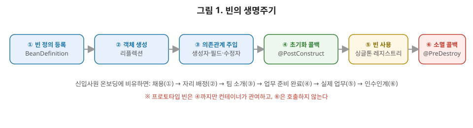

# [스프링 2편] 빈 등록과 라이프사이클, 컨테이너는 빈을 어떻게 다루는가

1편에서 스프링 컨테이너가 IoC를 구현하는 원리와 DI 방식을 다뤘다면, 이번 편은 그 컨테이너가 실제로 **빈을 어떻게 등록하고, 어떤 순서로 살아가고, 어떻게 사라지는지**를 다룬다. `@Component`와 `@Bean`의 차이, 스코프별 동작 방식, 그리고 초기화/소멸 콜백까지 상급자 관점에서 정리한다.

빈의 생명주기는 회사의 신입사원 온보딩 과정과 닮았다. 채용이 결정되면(빈 정의 등록) 바로 업무를 주는 게 아니라, 계약서를 쓰고 자리를 배정받는 절차(객체 생성)를 거친다. 그다음 필요한 동료와 팀을 소개받고 협업 도구 계정을 받는 과정(의존관계 주입)이 있어야 비로소 실제 업무를 시작할 준비(초기화 콜백)가 끝난다. 퇴사할 때도 마찬가지로, 곧바로 자리를 비우는 게 아니라 인수인계(소멸 콜백)를 거친 뒤에 완전히 조직을 떠난다. 스프링 컨테이너가 빈 하나하나에 대해 이 온보딩·오프보딩 절차를 정확한 순서로 관리해준다고 생각하면 이번 편의 내용이 훨씬 자연스럽게 읽힌다.



자, 그림을 한번 보시죠. 빈 하나가 태어나서 사라질 때까지 총 여섯 단계를 거칩니다. 이 중에서 여러분이 직접 코드를 작성하며 개입할 수 있는 지점은 ③, ④, ⑥번입니다. ①, ②번은 스프링이 알아서 처리하고, ⑤번은 그냥 우리가 애플리케이션을 쓰는 기간이죠. 그림 아래에 빨간 글씨로 적어둔 것처럼, 프로토타입 스코프는 ④번까지만 컨테이너가 관여하고 ⑥번 소멸 콜백은 절대 호출되지 않는다는 걸 꼭 기억해두세요. 이거 은근히 많이들 놓치시는 부분입니다.

## 1. 빈을 등록하는 두 가지 방법

스프링에서 빈을 컨테이너에 올리는 방법은 크게 두 가지다.

### 1-1. 컴포넌트 스캔 (`@Component`)

```java
@Service
public class OrderService {
    // ...
}
```

`@Component`가 붙은 클래스를 스프링이 클래스패스를 뒤져서 자동으로 찾아 빈으로 등록하는 방식이다. `@Service`, `@Repository`, `@Controller`, `@RestController`는 전부 `@Component`를 메타 애노테이션으로 갖는 **스테레오타입 애노테이션**이다. 기능적으로는 동일하게 빈으로 등록되지만, 계층을 명시적으로 드러내는 역할을 한다. 예를 들어 `@Repository`는 단순히 마킹 용도만이 아니라 해당 클래스에서 발생하는 플랫폼 종속적인 예외(JDBC, JPA 예외 등)를 스프링의 `DataAccessException` 계열로 변환해주는 `PersistenceExceptionTranslationPostProcessor`가 동작하는 기준점이 된다.

### 1-2. 자바 설정 (`@Bean`)

```java
@Configuration
public class AppConfig {

    @Bean
    public DiscountPolicy discountPolicy() {
        return new RateDiscountPolicy();
    }
}
```

개발자가 직접 코드 흐름을 만든 클래스가 아니라 **외부 라이브러리 클래스**를 빈으로 등록해야 할 때는 `@Component`를 붙일 수 없다. 소스 코드를 수정할 수 없기 때문이다. 이럴 때 `@Configuration` 클래스 안에서 `@Bean`으로 직접 등록한다. 또한 같은 타입의 빈을 여러 개 다른 이름으로 등록하거나, 생성자 호출 전에 커스텀 로직이 필요한 경우에도 `@Bean` 방식이 유리하다.

### 1-3. 언제 어떤 걸 쓰나

실무 기준을 정리하면 이렇다. 애플리케이션 내부에서 직접 작성하는 비즈니스 로직 클래스는 컴포넌트 스캔(`@Component` 계열)으로 등록하고, 외부 라이브러리 객체나 조건에 따라 다르게 만들어야 하는 객체는 `@Bean`으로 명시적으로 등록한다. 두 방식을 섞어 써도 문제는 없지만, 한 프로젝트 안에서 등록 기준이 일관되지 않으면 "이 빈이 어디서 등록됐는지" 찾는 데 시간이 걸린다는 점은 의외로 상급자도 자주 놓친다.

## 2. 컴포넌트 스캔의 동작 원리

`@ComponentScan`은 지정된 패키지(및 하위 패키지)를 탐색하며 `@Component` 계열 애노테이션이 붙은 클래스를 찾아 `BeanDefinition`으로 등록한다.

```java
@ComponentScan(
    basePackages = "com.example.app",
    excludeFilters = @Filter(type = FilterType.ANNOTATION, classes = Configuration.class)
)
```

스프링 부트를 쓴다면 `@SpringBootApplication` 안에 `@ComponentScan`이 이미 포함돼 있고, 기본적으로 **해당 클래스가 위치한 패키지와 그 하위 패키지**를 스캔 범위로 잡는다. 그래서 스프링 부트 프로젝트에서는 메인 애플리케이션 클래스를 프로젝트 최상위 패키지에 두는 관례가 있다. 이걸 모르고 패키지 구조를 잘못 잡으면 특정 패키지의 빈들이 스캔 범위 밖에 있어 등록되지 않는 문제가 생긴다.

### 빈 이름 충돌

컴포넌트 스캔은 기본적으로 클래스명의 첫 글자를 소문자로 바꾼 이름을 빈 이름으로 쓴다(`OrderService` → `orderService`). 서로 다른 패키지에 같은 이름의 클래스가 존재하면 빈 이름이 충돌해 `ConflictingBeanDefinitionException`이 발생한다. 반면 수동 등록(`@Bean`)한 빈과 컴포넌트 스캔으로 자동 등록된 빈의 이름이 겹치면, 스프링 부트 최신 버전에서는 예외를 던지도록 기본값이 바뀌었다(과거 버전에서는 수동 등록 빈이 자동 등록 빈을 덮어썼다). 이 차이는 버전 업그레이드 시 실제로 장애를 만든 사례가 있는 부분이라 상급자라면 알아둘 필요가 있다.

## 3. 빈 스코프

빈 스코프는 컨테이너가 빈을 어떤 생명주기로 관리할지를 결정한다.

| 스코프 | 설명 |
|---|---|
| `singleton` | 기본값. 컨테이너당 하나의 인스턴스만 생성해 공유한다. |
| `prototype` | 조회할 때마다 새 인스턴스를 생성한다. |
| `request` | HTTP 요청 하나당 하나의 인스턴스(웹 환경 전용). |
| `session` | HTTP 세션 하나당 하나의 인스턴스(웹 환경 전용). |

### 3-1. 프로토타입 빈의 함정

프로토타입 빈에서 상급자가 반드시 짚고 넘어가야 할 특성이 있다. **스프링 컨테이너는 프로토타입 빈을 생성하고 의존관계를 주입하고 초기화 콜백까지만 관여한 뒤, 클라이언트에게 넘겨주고 나면 더 이상 관리하지 않는다.** 즉 `@PreDestroy` 같은 소멸 콜백이 호출되지 않는다. 소멸 책임은 그 빈을 받은 클라이언트에게 넘어간다.

실무에서 더 자주 발생하는 문제는 **싱글톤 빈이 프로토타입 빈을 주입받는 경우**다.

```java
@Component
public class ClientBean {
    @Autowired
    private PrototypeBean prototypeBean; // 생성 시점에 딱 한 번만 주입됨
}
```

`ClientBean`은 싱글톤이므로 딱 한 번 생성될 때 `PrototypeBean`을 주입받는다. 이후 `ClientBean.prototypeBean`을 아무리 여러 번 사용해도 최초에 주입된 **동일한 인스턴스**가 재사용된다. 매번 새로운 프로토타입 빈을 받고 싶다는 의도와 정반대의 결과가 나오는 것이다. 이 문제를 해결하는 방법은 여러 가지다.

- `ObjectProvider<PrototypeBean>` (스프링 제공): `getObject()` 호출 시점에 새 빈을 컨테이너에서 조회한다.
- `Provider<PrototypeBean>` (JSR-330, `javax.inject`/`jakarta.inject`): 표준 스펙이라 스프링에 대한 의존을 줄이고 싶을 때 사용한다.
- `@Lookup` 애노테이션: 메서드 주입 방식으로 매번 새 빈을 반환하도록 스프링이 코드를 조작한다.

셋 다 결국 "빈을 직접 주입받지 말고, 필요한 시점에 컨테이너에서 다시 조회하라"는 동일한 해결 방향을 가진다.

## 4. 빈 생명주기 콜백

빈이 생성되는 시점과 "사용할 준비가 끝난" 시점은 다르다. 생성자는 필수 의존관계를 전달받아 객체를 만드는 역할까지만 담당해야 하고, 외부 커넥션을 맺거나 초기 데이터를 로딩하는 등 무거운 작업은 **모든 의존관계 주입이 끝난 뒤** 별도로 실행돼야 한다. 이걸 분리하기 위해 스프링은 초기화/소멸 콜백을 제공한다.

### 4-1. 세 가지 방식

```java
// 방법 1: @PostConstruct / @PreDestroy (권장)
@Component
public class NetworkClient {
    @PostConstruct
    public void init() {
        connect();
    }

    @PreDestroy
    public void close() {
        disconnect();
    }
}

// 방법 2: InitializingBean / DisposableBean 인터페이스
public class NetworkClient implements InitializingBean, DisposableBean {
    @Override
    public void afterPropertiesSet() { connect(); }

    @Override
    public void destroy() { disconnect(); }
}

// 방법 3: @Bean(initMethod=, destroyMethod=)
@Bean(initMethod = "connect", destroyMethod = "disconnect")
public NetworkClient networkClient() {
    return new NetworkClient();
}
```

세 방식의 차이와 선택 기준을 표로 정리하면 이렇습니다.

| 구분 | `@PostConstruct`/`@PreDestroy` | `InitializingBean`/`DisposableBean` | `initMethod`/`destroyMethod` |
|---|---|---|---|
| 표준 여부 | 자바 표준(`jakarta.annotation`) | 스프링 전용 인터페이스 | 스프링 전용 설정 |
| 스프링 결합도 | 낮음 | 높음(인터페이스 직접 구현) | 낮음(코드 수정 없음) |
| 메서드 이름 | 자유롭게 지정 | 고정(`afterPropertiesSet`, `destroy`) | 자유롭게 지정 |
| 적용 대상 | 내가 만든 클래스 | 내가 만든 클래스 | **외부 라이브러리 클래스도 가능** |
| 실무 권장도 | **1순위 (가장 널리 쓰임)** | 레거시 코드에서나 확인 | 외부 클래스 등록 시 유일한 선택지 |

- **`@PostConstruct`/`@PreDestroy`**: 자바 표준 애노테이션이라 스프링에 종속되지 않는다. 실무에서 가장 널리 쓰이는 방식이다.
- **`InitializingBean`/`DisposableBean`**: 스프링 인터페이스를 직접 구현해야 해서 코드가 스프링에 강하게 결합된다. 메서드 이름도 고정돼 커스터마이징이 어렵다. 레거시 코드에서나 볼 수 있다.
- **`initMethod`/`destroyMethod`**: 외부 라이브러리 클래스처럼 소스 코드를 수정할 수 없어 애노테이션을 붙일 수 없는 경우 유일한 선택지다. 참고로 `destroyMethod`는 스프링 5.3부터 라이브러리 클래스가 `close()`나 `shutdown()` 메서드를 가지고 있으면 별도 설정 없이도 자동으로 추론해서 호출해준다(`inferred destroy method`).

강의할 때 자주 받는 질문 하나 짚고 갈게요. "그럼 굳이 세 가지나 필요한가요, 그냥 `@PostConstruct`만 쓰면 안 되나요?"라는 질문인데요, 정답은 "내 코드인지 남의 코드인지"에 달려 있습니다. 내가 만든 클래스라면 무조건 `@PostConstruct`를 쓰시면 되고, `HikariDataSource`처럼 소스 코드를 건드릴 수 없는 외부 라이브러리 객체를 `@Bean`으로 등록할 때만 `initMethod`/`destroyMethod`를 쓰는 거라고 생각하시면 됩니다.

## 5. BeanPostProcessor: 빈 생성 과정에 개입하는 확장 포인트

여기까지는 "내 빈"의 생명주기였다면, `BeanPostProcessor`는 **컨테이너가 관리하는 모든 빈의 생성 과정 자체에 개입**할 수 있는 확장 포인트다.

```java
public interface BeanPostProcessor {
    Object postProcessBeforeInitialization(Object bean, String beanName);
    Object postProcessAfterInitialization(Object bean, String beanName);
}
```

`postProcessBeforeInitialization`은 초기화 콜백(`@PostConstruct` 등) 실행 전에, `postProcessAfterInitialization`은 실행 후에 호출된다. 이 두 메서드는 원본 빈 대신 **다른 객체(주로 프록시)를 반환**할 수 있다는 점이 핵심이다.

상급자가 이 개념을 알아야 하는 이유는, 스프링의 핵심 기능 상당수가 이 메커니즘 위에서 동작하기 때문이다. `@Transactional`이 붙은 빈에 트랜잭션 프록시를 씌우는 것, `@Async`가 비동기 프록시를 만드는 것, AOP가 적용된 빈이 실제로는 원본이 아니라 프록시 객체로 컨테이너에 등록되는 것 모두 `BeanPostProcessor`(정확히는 `AnnotationAwareAspectJAutoProxyCreator` 같은 구현체)가 `postProcessAfterInitialization` 시점에 개입해서 만든 결과물이다. 즉 `@Autowired`로 주입받는 객체가 내가 작성한 클래스의 순수한 인스턴스가 아니라 프록시일 수 있다는 사실은, 이후 AOP를 이해하기 위한 전제 지식이다.

## 6. 실무에서는 이렇게 체감된다

외부 API 클라이언트를 쓰는 상황을 예로 들어보자. `PaymentGatewayClient`가 애플리케이션 시작 시점에 외부 결제사와 커넥션을 미리 맺어둬야 한다면, 이 로직을 생성자에 넣으면 안 된다. 생성자에서 네트워크 호출을 하면 아직 다른 의존관계가 다 채워지기 전일 수도 있고, 예외가 나면 컨테이너 초기화 자체가 실패해 원인 추적이 어려워진다. 대신 `@PostConstruct`가 붙은 별도 메서드에서 커넥션을 맺으면, 모든 의존관계 주입이 끝난 뒤 안전하게 초기화 로직만 따로 실행되고, 애플리케이션 종료 시에는 `@PreDestroy`로 커넥션을 정리해 리소스 릭을 막을 수 있다. 이게 바로 위에서 든 온보딩 비유에서 "업무 시작 전 마지막 준비 단계"에 해당한다.

## 7. 정리

- 빈 등록은 컴포넌트 스캔(`@Component` 계열)과 자바 설정(`@Bean`) 두 가지 방식이 있으며, 내가 만든 클래스인지 외부 라이브러리 클래스인지가 선택 기준이다.
- 컴포넌트 스캔은 클래스패스를 탐색해 `BeanDefinition`을 등록하는 방식이고, 빈 이름 충돌 시 수동/자동 등록 우선순위는 스프링 부트 버전에 따라 다르다.
- 싱글톤이 기본 스코프이며, 프로토타입 빈을 싱글톤에서 주입받으면 매번 새 인스턴스를 기대한 의도와 다르게 동작한다. `ObjectProvider`, `Provider`, `@Lookup`으로 해결한다.
- 초기화/소멸 콜백은 생성자와 역할을 분리하기 위해 존재하며, `@PostConstruct`/`@PreDestroy`가 표준적이고 권장되는 방식이다.
- `BeanPostProcessor`는 빈 생성 과정에 개입해 프록시로 바꿔치기할 수 있는 확장 포인트이며, 스프링의 트랜잭션·AOP·비동기 처리가 모두 이 메커니즘 위에서 동작한다.

다음 편에서는 이 컴포넌트 스캔과 설정 방식을 더 깊게 파고들어, XML 설정과 자바 설정의 차이, `@Configuration`의 내부 동작(CGLIB 프록시로 싱글톤을 보장하는 방식)까지 다룬다.
