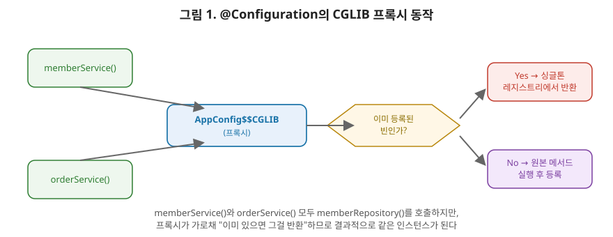

# [스프링 3편] 컴포넌트 스캔과 설정 방식, @Configuration의 진짜 동작 원리

2편에서 빈이 등록되고 살아가는 흐름을 봤다면, 이번 편은 그 빈들을 "어떤 설정 방식으로 조립하는가"를 다룬다. 특히 `@Configuration`이 왜 평범한 자바 클래스가 아니라 CGLIB 프록시로 다시 태어나는지 — 상급자 인터뷰에서 자주 나오는 주제 — 를 원리부터 짚는다.

이번 편의 핵심(CGLIB 프록시)을 이해하는 가장 쉬운 비유는 "대리 출석을 확인하는 반장"이다. 교실에서 반장이 출석을 부르는데, 이미 출석 체크가 끝난 학생의 이름이 다시 불리면 반장은 새로 확인하지 않고 "이미 체크됨"이라고만 표시하고 넘어간다. `@Bean` 메서드가 다른 `@Bean` 메서드를 코드에서 직접 호출하는 상황이 바로 이 "이름이 다시 불리는" 순간이고, CGLIB 프록시는 그 반장 역할을 한다. 이미 만들어둔 빈이 있으면 새로 만들지 않고 있는 걸 그대로 돌려준다. 이 비유를 기억해두면 2절의 동작 원리가 훨씬 직관적으로 들어온다.



이 그림이 이번 편에서 가장 중요한 그림입니다. `memberService()`와 `orderService()`가 각각 `memberRepository()`를 호출하는데, 이 호출이 진짜 자바 메서드 호출이 아니라 프록시를 한 번 거쳐 가는 호출이라는 게 핵심이에요. 프록시는 마름모(다이아몬드) 부분에서 "이 빈이 이미 등록돼 있나?"를 확인하고, 있으면 새로 만들지 않고 그냥 있는 걸 돌려줍니다. 두 서비스가 똑같은 질문을 프록시에게 던지기 때문에, 결과적으로 똑같은 `MemberRepository` 인스턴스를 돌려받게 되는 거죠.

## 1. XML 설정에서 자바 설정으로

스프링 초창기에는 빈 설정을 전부 XML로 작성했다.

```xml
<bean id="memberService" class="com.example.MemberServiceImpl">
    <constructor-arg ref="memberRepository" />
</bean>
```

XML 설정은 코드와 설정을 완전히 분리한다는 장점이 있었지만, 실무에서는 단점이 더 크게 부각됐다. 오타가 나도 컴파일 타임에 잡히지 않고 런타임에야 발견되고, 클래스나 생성자 시그니처가 바뀌면 XML을 수동으로 맞춰야 하며, IDE의 리팩토링(이름 변경, 타입 추적) 지원을 거의 받지 못한다. 이런 이유로 스프링은 자바 설정(`@Configuration` + `@Bean`)을 표준으로 밀었고, 지금은 XML 설정을 신규 프로젝트에서 쓰는 경우는 거의 없다. XML은 레거시 프로젝트를 유지보수할 때나 마주치는 존재로 이해하면 된다.

| 구분 | XML 설정 | 자바 설정(`@Configuration`) |
|---|---|---|
| 오타·타입 오류 | 런타임에 발견 | **컴파일 타임에 발견** |
| 리팩터링(이름 변경 등) | IDE 지원 거의 없음 | **IDE가 자동 추적** |
| 조건부 로직 작성 | 어렵거나 불가능 | 자바 코드로 자유롭게 작성 |
| 코드-설정 분리 | 완전히 분리됨 | 같은 언어로 통합 |
| 현재 위치 | 레거시 유지보수용 | **사실상 표준** |

## 2. @Configuration의 핵심: 왜 그냥 @Bean만 쓰면 안 되는가

여기서부터가 이번 편의 핵심이다. 다음 설정 클래스를 보자.

```java
@Configuration
public class AppConfig {

    @Bean
    public MemberRepository memberRepository() {
        return new MemoryMemberRepository();
    }

    @Bean
    public MemberService memberService() {
        return new MemberServiceImpl(memberRepository()); // 메서드를 직접 호출
    }

    @Bean
    public OrderService orderService() {
        return new OrderServiceImpl(memberRepository()); // 여기서도 호출
    }
}
```

`memberService()`와 `orderService()`가 둘 다 `memberRepository()`를 코드에서 직접 호출하고 있다. 순수한 자바 코드라면 이 메서드가 호출될 때마다 `new MemoryMemberRepository()`가 실행돼 서로 다른 인스턴스가 생성돼야 정상이다. 즉 `memberService`가 들고 있는 `MemberRepository`와 `orderService`가 들고 있는 `MemberRepository`가 다른 객체여야 한다.

하지만 실제로 스프링을 써보면 그렇지 않다. 두 서비스는 **완전히 동일한 `MemberRepository` 싱글톤 인스턴스**를 참조한다. 어떻게 이게 가능할까.

### 2-1. CGLIB 프록시가 만드는 마법

답은 `@Configuration`이 붙은 클래스를 스프링 컨테이너가 있는 그대로 등록하지 않는다는 데 있다. 컨테이너는 `AppConfig`를 상속받는 **CGLIB 바이트코드 조작 기반 프록시 클래스**를 대신 만들어 빈으로 등록한다. 실제로 컨테이너에서 `AppConfig` 빈을 꺼내 `getClass()`를 찍어보면 `AppConfig$$SpringCGLIB$$0` 같은 이름이 나오는 걸 확인할 수 있다.

이 프록시는 `@Bean`이 붙은 메서드가 호출될 때 다음과 같이 동작하도록 가로챈다.

1. 이 메서드에 해당하는 빈이 **이미 스프링 컨테이너(싱글톤 레지스트리)에 등록돼 있는지** 먼저 확인한다.
2. 등록돼 있다면, 실제 메서드 코드를 실행하지 않고 컨테이너에 있는 기존 인스턴스를 그대로 반환한다.
3. 등록돼 있지 않다면(최초 호출), 원래 메서드를 실행해 객체를 생성하고 컨테이너에 등록한 뒤 반환한다.

그래서 `memberService()` 안에서 호출한 `memberRepository()`도, `orderService()` 안에서 호출한 `memberRepository()`도 결국 프록시를 거치면서 "이미 만들어진 빈이 있으니 그걸 반환"하는 흐름을 타게 되고, 결과적으로 싱글톤이 보장된다. 만약 `@Configuration` 없이 `@Component`만 붙이거나 설정 클래스 자체를 없앤다면 이 프록시가 생성되지 않고, 메서드 호출은 진짜 자바 메서드 호출이 돼버려 싱글톤이 깨진다.

### 2-2. proxyBeanMethods 옵션

`@Configuration`에는 `proxyBeanMethods`라는 속성이 있다.

```java
@Configuration(proxyBeanMethods = false)
public class AppConfig { ... }
```

기본값은 `true`(CGLIB 프록시 적용)지만, `false`로 설정하면 이 프록시 생성을 건너뛴다. 이걸 **Lite 모드**라고 부른다. 프록시 생성 비용이 없어 컨테이너 초기화가 빨라지고, 스프링 부트의 자동 설정 클래스(`@AutoConfiguration`) 상당수가 성능을 위해 이 모드를 쓴다. 다만 이 모드에서는 `@Bean` 메서드끼리 서로 호출해도 싱글톤이 보장되지 않으므로, 한 설정 클래스 안에서 `@Bean` 메서드 간 직접 호출을 하지 않는다는 전제하에서만 안전하게 쓸 수 있다. 대신 의존관계가 필요하면 메서드 파라미터로 받는 방식을 쓴다.

```java
@Bean
public MemberService memberService(MemberRepository memberRepository) {
    return new MemberServiceImpl(memberRepository); // 파라미터로 주입받으면 안전
}
```

메서드 파라미터로 받는 방식은 프록시 여부와 무관하게 스프링 컨테이너가 해당 타입의 빈을 찾아 주입해주기 때문에 `proxyBeanMethods` 설정과 상관없이 항상 안전하다.

## 3. 컴포넌트 스캔 필터 심화

2편에서 다룬 컴포넌트 스캔에는 `includeFilters`/`excludeFilters`로 스캔 대상을 세밀하게 제어하는 옵션이 있다.

```java
@ComponentScan(
    includeFilters = @Filter(type = FilterType.ANNOTATION, classes = MyIncludeAnnotation.class),
    excludeFilters = @Filter(type = FilterType.ANNOTATION, classes = MyExcludeAnnotation.class)
)
```

`FilterType`은 다음 다섯 가지를 지원한다.

| FilterType | 판단 기준 | 예시 |
|---|---|---|
| `ANNOTATION` (기본값) | 특정 애노테이션이 붙어 있는가 | `@Repository`가 붙은 클래스만 |
| `ASSIGNABLE_TYPE` | 특정 클래스·인터페이스를 상속/구현하는가 | `BaseController`를 상속한 클래스만 |
| `ASPECTJ` | AspectJ 패턴 표현식과 일치하는가 | `com.example..*Service` |
| `REGEX` | 정규식으로 클래스 이름이 매칭되는가 | `.*Service$` |
| `CUSTOM` | `TypeFilter`를 직접 구현한 조건과 일치하는가 | 팀 자체 규칙 |

실무에서 이 필터를 직접 세밀하게 쓸 일은 많지 않다. 스프링 부트는 `@SpringBootApplication` 안의 기본 `excludeFilters`가 자동 설정 클래스들을 스캔 대상에서 제외해주는 등 이미 합리적인 기본값을 잡아두고 있기 때문이다. 다만 "왜 이 클래스는 스캔되고 저 클래스는 안 되는지"를 디버깅해야 할 때는 이 필터 구조를 알아야 원인을 추적할 수 있다.

## 4. @Import로 설정 클래스 조합하기

설정 클래스가 커지면 도메인별로 나누고 `@Import`로 합치는 게 일반적이다.

```java
@Configuration
@Import({DataSourceConfig.class, RepositoryConfig.class, ServiceConfig.class})
public class AppConfig {
}
```

`@ComponentScan`이 패키지를 스캔해서 빈을 "찾아내는" 방식이라면, `@Import`는 특정 설정 클래스를 명시적으로 "끌어오는" 방식이다. 스프링 부트의 `@EnableXxx` 계열 애노테이션(`@EnableScheduling`, `@EnableAsync` 등)도 내부적으로는 `@Import`를 통해 필요한 설정 클래스를 불러오는 구조로 만들어져 있다. 즉 `@Import`는 라이브러리나 모듈 단위로 설정을 캡슐화해서 배포할 때 쓰는 핵심 도구다.

## 5. @Profile로 환경별 설정 분리

로컬, 개발, 운영 환경마다 다른 빈을 등록해야 할 때는 `@Profile`을 쓴다.

```java
@Configuration
public class DataSourceConfig {

    @Bean
    @Profile("local")
    public DataSource localDataSource() {
        return new EmbeddedDataSourceBuilder().build();
    }

    @Bean
    @Profile("prod")
    public DataSource prodDataSource() {
        return new HikariDataSource(prodConfig());
    }
}
```

활성 프로필은 `spring.profiles.active` 프로퍼티로 지정하며, 실행 시점에 이 값에 해당하는 `@Profile`이 붙은 빈만 컨테이너에 등록된다. 내부적으로 `@Profile`은 `@Conditional`이라는 더 근본적인 조건부 빈 등록 메커니즘 위에 만들어진 애노테이션이며, 스프링 부트의 `@ConditionalOnProperty`, `@ConditionalOnMissingBean` 같은 자동 설정 애노테이션들도 전부 같은 `@Conditional` 기반이다. 즉 `@Profile`은 "환경(프로필)이라는 조건으로 빈 등록 여부를 결정하는" `@Conditional`의 특수한 형태로 이해하면 된다.

## 6. 실무에서는 이렇게 체감된다

실무에서 CGLIB 프록시 문제를 가장 흔히 만나는 순간은 `@Configuration` 안에서 여러 `@Bean`이 서로 얽혀 있는 대형 설정 클래스를 리팩터링할 때다. 예를 들어 `SecurityConfig`의 `passwordEncoder()` 빈을 `AppConfig`의 다른 `@Bean` 메서드 여러 곳에서 호출하는 구조였는데, 누군가 실수로 `@Configuration`을 `@Component`로 바꾸거나 설정을 분리하면서 CGLIB 프록시 대상에서 빠지면, 갑자기 `PasswordEncoder` 인스턴스가 호출할 때마다 새로 생성되는 버그가 생긴다. 겉으로는 애플리케이션이 정상 기동되기 때문에 발견하기 어렵고, 캐시나 상태를 공유해야 하는 로직에서 뒤늦게 문제가 드러난다. 이런 사고를 피하려면 "이 클래스가 정말 `@Configuration`으로 유지되고 있는지, `proxyBeanMethods`가 의도한 값인지"를 리팩터링 시점에 항상 확인하는 습관이 필요하다.

## 7. 정리

- XML 설정은 타입 안정성과 IDE 지원 부족으로 자바 설정(`@Configuration` + `@Bean`)에 자리를 내줬다.
- `@Configuration` 클래스는 컨테이너에 그대로 등록되지 않고 CGLIB 프록시로 대체되며, 이 프록시가 `@Bean` 메서드 간 직접 호출 시에도 싱글톤을 보장해준다.
- `proxyBeanMethods = false`(Lite 모드)는 이 프록시 생성을 생략해 성능을 높이지만, `@Bean` 메서드 간 직접 호출로는 싱글톤을 보장받지 못하므로 파라미터 주입 방식을 써야 한다.
- 컴포넌트 스캔은 `FilterType`으로 대상 범위를 세밀하게 제어할 수 있고, `@Import`는 설정 클래스를 명시적으로 조합하는 도구다.
- `@Profile`은 환경별로 다른 빈을 등록하게 해주며, 내부적으로는 `@Conditional`이라는 조건부 빈 등록 메커니즘의 특수한 형태다.

다음 편에서는 방금 언급한 CGLIB 프록시 이야기를 더 확장해서, 스프링 AOP가 프록시를 통해 관심사를 분리하는 방식 — JDK 동적 프록시와 CGLIB의 차이, `@Aspect`, 포인트컷과 어드바이스 — 를 다룬다.
