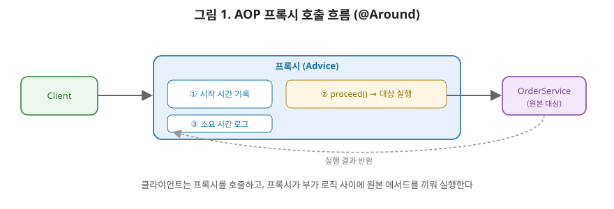

# [스프링 4편] AOP, 프록시로 관심사를 분리하는 방법

3편에서 `@Configuration`이 CGLIB 프록시로 바뀐다는 이야기를 했다. 이번 편의 주인공인 AOP(Aspect-Oriented Programming)는 이 "프록시"라는 도구를 훨씬 더 적극적으로, 그리고 범용적으로 활용하는 스프링의 핵심 기능이다. 로깅, 트랜잭션, 성능 측정처럼 비즈니스 로직과 무관하지만 여기저기 반복해서 등장하는 코드를 어떻게 걷어내는지 원리부터 살펴본다.

AOP는 공항의 보안 검색대에 비유하면 이해가 빠르다. 승객(요청)은 게이트(비즈니스 로직)로 가기 전에 반드시 보안 검색대(프록시)를 통과한다. 검색대 직원은 승객이 어느 항공사를 타는지, 목적지가 어디인지 전혀 몰라도 되고, 그저 정해진 검사 절차(로깅, 트랜잭션, 권한 체크)만 동일하게 수행한 뒤 통과시킨다. 만약 검색대가 없다면 각 게이트(서비스 클래스)마다 자체적으로 보안 검사 절차를 중복해서 마련해야 할 것이다. AOP가 하는 일이 정확히 이거다. 모든 메서드 호출 앞에 공통 검사 지점을 하나 두고, 그 지점을 통과할 때 부가 로직을 일괄 적용한다.



이 그림, 정말 중요합니다. 클라이언트는 `OrderService`를 호출한다고 생각하지만 실제로는 프록시를 호출하고 있는 거예요. 프록시 내부를 보면 ①번에서 시작 시간을 기록하고, ②번에서 `proceed()`를 호출해서 진짜 대상(`OrderService`)의 메서드를 실행하고, 그 결과가 돌아오면 ③번에서 로그를 남깁니다. 클라이언트 입장에서는 이 과정이 전혀 보이지 않고, 그냥 `OrderService.order()`를 호출한 것처럼 느껴지죠. 이게 바로 프록시가 "투명하다"고 말하는 이유입니다.

## 1. AOP가 해결하는 문제: 횡단 관심사

여러 서비스 메서드에 실행 시간을 측정하는 로직을 넣어야 한다고 해보자.

```java
public class OrderService {
    public void order() {
        long start = System.currentTimeMillis();

        // 실제 비즈니스 로직
        processOrder();

        long end = System.currentTimeMillis();
        log.info("order 실행 시간: {}ms", end - start);
    }
}
```

이 패턴을 `MemberService`, `PaymentService` 등 모든 서비스의 모든 메서드에 똑같이 복사해 넣어야 한다고 생각해보자. 코드 중복은 물론이고, 나중에 로깅 포맷을 바꾸려면 수십 개 파일을 다 고쳐야 한다. 이렇게 **핵심 비즈니스 로직과는 무관하지만 애플리케이션 전반에 걸쳐 반복되는 관심사**를 횡단 관심사(cross-cutting concern)라고 부른다. 로깅, 트랜잭션 관리, 보안 검사, 성능 측정이 대표적이다.

AOP는 이 횡단 관심사를 핵심 로직과 물리적으로 분리된 별도의 모듈(Aspect)로 작성하고, 실행 시점에 필요한 곳에만 "끼워 넣는" 방식으로 문제를 해결한다.

## 2. 프록시 패턴으로 다시 보기

관심사를 분리하는 가장 단순한 방법은 프록시 패턴이다. 원본 객체를 감싸는 프록시 객체를 만들어, 클라이언트는 프록시를 호출하고 프록시가 부가 로직을 처리한 뒤 원본을 호출하는 구조다.

```java
public class TimeMeasureProxy implements OrderService {
    private final OrderService target;

    public TimeMeasureProxy(OrderService target) {
        this.target = target;
    }

    @Override
    public void order() {
        long start = System.currentTimeMillis();
        target.order(); // 원본 호출
        long end = System.currentTimeMillis();
        log.info("order 실행 시간: {}ms", end - start);
    }
}
```

원리는 명확하지만, 이 방식을 그대로 쓰면 부가 기능이 필요한 클래스마다 프록시 클래스를 하나씩 직접 만들어야 한다. 서비스가 100개면 프록시도 100개 만들어야 하는 셈이다. AOP는 이 프록시 생성을 **동적으로, 자동으로** 처리해주는 기술이다. 즉 AOP의 실체는 "런타임에 프록시 객체를 자동으로 만들어서 컨테이너에 등록해주는 스프링의 기능"이라고 이해하면 된다.

## 3. 스프링이 프록시를 만드는 두 가지 방식

스프링 AOP는 동적 프록시(dynamic proxy) 기술을 쓰는데, 대상 클래스가 인터페이스를 구현했는지에 따라 두 가지 방식 중 하나를 선택한다.

### 3-1. JDK 동적 프록시 — 인터페이스 기반

자바 표준 라이브러리(`java.lang.reflect.Proxy`)가 제공하는 방식이다. 대상 클래스가 구현한 **인터페이스를 기반으로** 런타임에 프록시 클래스를 생성한다.

```java
public class LogTraceHandler implements InvocationHandler {
    private final Object target;

    public LogTraceHandler(Object target) {
        this.target = target;
    }

    @Override
    public Object invoke(Object proxy, Method method, Object[] args) throws Throwable {
        log.info("호출: {}", method.getName());
        return method.invoke(target, args); // 리플렉션으로 원본 메서드 호출
    }
}
```

`Proxy.newProxyInstance()`로 인터페이스 타입의 프록시 객체를 만들고, 프록시의 메서드가 호출되면 `InvocationHandler.invoke()`로 흐름이 위임된다. 단, 이 방식은 **인터페이스가 반드시 있어야** 동작한다.

### 3-2. CGLIB 프록시 — 클래스 기반

인터페이스가 없는 클래스도 프록시로 감싸야 할 때는 CGLIB을 쓴다. CGLIB은 대상 클래스를 **상속받는 자식 클래스**를 바이트코드 조작으로 만들어 프록시로 사용한다.

```java
public class TimeMethodInterceptor implements MethodInterceptor {
    private final Object target;

    @Override
    public Object intercept(Object obj, Method method, Object[] args, MethodProxy proxy) throws Throwable {
        long start = System.currentTimeMillis();
        Object result = proxy.invoke(target, args);
        log.info("실행 시간: {}ms", System.currentTimeMillis() - start);
        return result;
    }
}
```

상속 기반이기 때문에 제약이 있다. 대상 클래스가 `final`이거나 메서드가 `final`이면 오버라이딩이 불가능해 프록시를 만들 수 없고, 기본 생성자가 필요하다(스프링 4.0 이후로는 objenesis 라이브러리를 사용해 생성자 호출 없이도 프록시 인스턴스를 만들 수 있게 개선됐다).

### 3-3. 스프링의 선택 기준

스프링은 기본적으로 대상이 인터페이스를 구현했으면 JDK 동적 프록시를, 아니면 CGLIB을 자동으로 선택한다. 다만 **스프링 부트는 버전 2.0부터 `proxyTargetClass=true`를 기본값으로 설정해, 인터페이스 유무와 관계없이 항상 CGLIB을 쓰도록 통일**했다. 인터페이스가 있을 때와 없을 때 프록시 기술이 달라지면, 프록시 객체를 캐스팅하는 코드 등에서 타입 관련 문제가 미묘하게 발생할 수 있기 때문에 일관성을 택한 것이다. 이 기본값은 `spring.aop.proxy-target-class` 프로퍼티로 바꿀 수 있다.

두 프록시 기술을 표로 정리해보겠습니다.

| 구분 | JDK 동적 프록시 | CGLIB 프록시 |
|---|---|---|
| 생성 방식 | 인터페이스 구현 | 클래스 상속 |
| 필요 조건 | 반드시 인터페이스 존재 | 기본 생성자 필요(4.0+ objenesis로 완화) |
| `final` 클래스/메서드 | 영향 없음 | **프록시 생성 불가** |
| 소속 | `java.lang.reflect` (자바 표준) | 스프링 내부 포함 라이브러리 |
| 스프링 부트 기본값 | - | **항상 이걸 사용(2.0+)** |

## 4. @Aspect로 AOP 작성하기

스프링은 AspectJ가 정의한 애노테이션 문법을 그대로 가져와, 그 문법으로 작성된 정보를 바탕으로 스프링 AOP(프록시 기반)를 동작시킨다. 즉 문법은 AspectJ 것을 빌려 쓰지만 실제 위빙(코드 삽입)은 스프링의 프록시 방식으로 이뤄진다.

```java
@Slf4j
@Aspect
@Component
public class TimeTraceAspect {

    @Around("execution(* com.example.app.service..*(..))")
    public Object doTrace(ProceedingJoinPoint joinPoint) throws Throwable {
        long start = System.currentTimeMillis();
        try {
            return joinPoint.proceed(); // 실제 대상 메서드 호출
        } finally {
            long end = System.currentTimeMillis();
            log.info("{} 실행 시간: {}ms", joinPoint.getSignature(), end - start);
        }
    }
}
```

- **포인트컷(Pointcut)**: `@Around` 안의 `execution(* com.example.app.service..*(..))` 표현식이 "어떤 메서드에 이 로직을 적용할지"를 정의한다. 여기서는 `service` 패키지 이하의 모든 메서드가 대상이다.
- **어드바이스(Advice)**: 실제로 실행되는 부가 로직, 즉 `doTrace` 메서드 본문이다.
- **조인포인트(JoinPoint)**: 어드바이스가 적용될 수 있는 지점. 스프링 AOP에서는 메서드 실행 시점으로 한정된다.

어드바이스 종류를 실행 시점 기준으로 표로 정리하면 이렇습니다.

| 어드바이스 | 실행 시점 | 대상 메서드 실행 여부 제어 |
|---|---|---|
| `@Before` | 대상 실행 전 | 불가(항상 실행됨) |
| `@AfterReturning` | 정상 반환 후 | 불가 |
| `@AfterThrowing` | 예외 발생 시 | 불가 |
| `@After` | `finally`처럼 항상 | 불가 |
| `@Around` | 실행 전후 전체를 감쌈 | **가능** (`proceed()` 호출 여부로 제어) |

`@Around`는 `ProceedingJoinPoint.proceed()`를 직접 호출해야 대상 메서드가 실행되므로, `proceed()` 호출을 빠뜨리면 원본 로직 자체가 실행되지 않는다는 점을 주의해야 한다. 실무에서는 표현력이 가장 좋은 `@Around` 하나로 대부분의 요구를 처리하는 경우가 많다.

## 5. 셀프 invocation 문제 (상급자가 자주 걸리는 함정)

AOP를 실무에 적용하다 실제로 가장 많이 겪는 이슈는 **같은 클래스 내부에서 메서드를 호출할 때 AOP가 적용되지 않는 문제**다.

```java
@Service
public class OrderService {

    @Transactional
    public void order() {
        // ...
        updateStock(); // 내부 메서드 호출
    }

    @Transactional
    public void updateStock() {
        // ...
    }
}
```

`order()`를 외부에서 호출하면 프록시를 거쳐 `@Transactional`이 정상 적용된다. 하지만 `order()` 내부에서 `this.updateStock()`을 호출하는 순간은 이야기가 다르다. 컨테이너에 등록된 건 프록시 객체지만, `order()` 메서드 안에서 접근하는 `this`는 **프록시가 아니라 원본 객체 자신**이다. 즉 이 호출은 프록시를 거치지 않고 원본 메서드를 직접 호출하는 자바 언어 수준의 메서드 호출이 되어, `updateStock()`에 붙은 `@Transactional`(혹은 어떤 AOP든)이 전혀 동작하지 않는다.

해결 방법은 다음과 같다.

- **구조 분리**: `updateStock()`을 별도의 클래스(빈)로 분리해서, 항상 프록시를 거쳐 호출되도록 만든다. 가장 권장되는 방법이다.
- **`AopContext.currentProxy()`**: `@EnableAspectJAutoProxy(exposeProxy = true)`를 설정하면 현재 스레드에 프록시 객체가 노출되고, `((OrderService) AopContext.currentProxy()).updateStock()`처럼 명시적으로 프록시를 통해 호출할 수 있다. 코드가 지저분해지고 AOP 프레임워크에 강하게 결합되므로 최후의 수단으로만 쓴다.
- **자기 자신을 주입받기**: 스프링 빈에 자기 자신을 `@Autowired`로 주입받아, `self.updateStock()`처럼 프록시를 통해 호출하는 방법도 있다. 다만 순환참조처럼 보이는 코드라 팀 컨벤션에 따라 호불호가 갈린다.

## 6. 실무에서 AOP가 쓰이는 대표 사례

가장 흔한 사례는 단연 `@Transactional`이다. 트랜잭션 시작, 커밋, 롤백이라는 반복적인 로직을 AOP 프록시가 대신 처리해주기 때문에 개발자는 비즈니스 로직만 작성하면 된다. 이 외에도 API 호출 로깅, 접근 권한 검사, 캐싱(`@Cacheable`), 재시도(`@Retryable`) 같은 기능들이 모두 같은 프록시 기반 AOP 위에서 동작한다. 이런 스프링 제공 애노테이션들의 공통점은, 2편에서 다룬 `BeanPostProcessor`가 빈 초기화 시점에 개입해 대상 빈을 프록시로 바꿔치기한다는 점이다. 즉 지금까지 배운 빈 생명주기, `BeanPostProcessor`, 프록시, AOP는 전부 하나의 메커니즘으로 이어져 있다.

## 7. 실무에서는 이렇게 체감된다

API 호출 로그를 남기는 요구사항이 들어왔다고 하자. AOP 없이 처리한다면 모든 `@RestController`의 모든 메서드 첫 줄과 마지막 줄에 로깅 코드를 넣어야 하고, 로그 포맷이 바뀌면 그 많은 파일을 전부 수정해야 한다. `@Around` 어드바이스 하나로 `com.example.app.controller` 패키지 전체를 포인트컷으로 잡으면, 새로 컨트롤러를 추가해도 로깅 코드를 신경 쓸 필요가 없어진다. 다만 이때 실무에서 자주 나오는 질문이 "그럼 컨트롤러에서 같은 클래스의 다른 메서드를 호출하면 어떻게 되나요"인데, 5절에서 다룬 셀프 invocation 문제가 바로 이 상황에 해당한다. 로깅 대상 메서드를 내부에서 호출하면 프록시를 거치지 않아 로그가 안 남는다는 걸 미리 알고 있어야, 나중에 "왜 로그가 하나만 안 찍히지"라는 디버깅 시간을 아낄 수 있다.

## 8. 정리

- AOP는 로깅, 트랜잭션 같은 횡단 관심사를 핵심 로직에서 분리해, 프록시를 통해 실행 시점에 끼워 넣는 기술이다.
- 스프링 AOP는 동적 프록시를 쓰며, 인터페이스가 있으면 JDK 동적 프록시, 없으면 CGLIB을 쓴다. 단 스프링 부트는 기본적으로 항상 CGLIB을 쓰도록 통일했다.
- `@Aspect`는 AspectJ 문법을 빌려 쓰되 실제 동작은 스프링 프록시 방식으로 이뤄지며, 포인트컷으로 대상을 지정하고 어드바이스로 부가 로직을 정의한다.
- 같은 클래스 내부에서 메서드를 호출하면 프록시를 거치지 않아 AOP가 적용되지 않는다(셀프 invocation). 구조 분리가 가장 안전한 해결책이다.
- `@Transactional`을 비롯한 스프링의 핵심 부가 기능 대부분이 `BeanPostProcessor` → 프록시 생성 → AOP 적용이라는 동일한 파이프라인 위에서 동작한다.

다음 편에서는 스프링 MVC의 기본 구조로 넘어가, `DispatcherServlet`이 요청을 받아 컨트롤러까지 전달하는 전체 흐름과 `@Controller`/`@RestController`를 다룬다.
