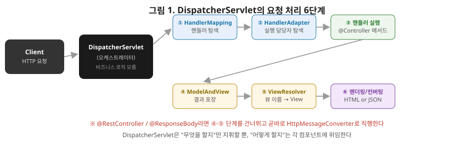

# [스프링 5편] 스프링 MVC 기본 구조, DispatcherServlet은 요청을 어떻게 처리하는가

지금까지 4편에 걸쳐 컨테이너, 빈, 프록시, AOP를 다뤘다. 이제부터는 이 개념들이 실제로 HTTP 요청을 받아 처리하는 웹 계층, 스프링 MVC로 넘어간다. `@Controller` 메서드 하나가 호출되기까지 내부에서 몇 단계를 거치는지, 그리고 `@RestController`가 정확히 무엇을 다르게 하는지 짚는다.

`DispatcherServlet`의 역할은 우체국의 프론트데스크와 비슷하다. 모든 우편물(요청)은 일단 프론트데스크로 접수되고, 직원은 소포인지 편지인지 국내용인지 국제용인지 직접 배달하지 않는다. 대신 우편물 종류에 맞는 분류 담당자(HandlerMapping이 찾은 핸들러)에게 넘기고, 그 담당자가 처리할 수 있는 배달 방식(HandlerAdapter)에 실어 보낸다. 프론트데스크 직원 자신은 편지 내용이 뭔지 전혀 몰라도 되고, 그저 "이건 어디로 보내야 하는지"만 정확히 판단하면 된다. `DispatcherServlet`이 비즈니스 로직을 전혀 모른 채 흐름만 지휘한다는 이번 편의 핵심이 이 비유와 정확히 겹친다.



자, 이 그림이 이번 편의 전부라고 해도 과언이 아닙니다. 왼쪽에서 요청이 들어오면 `DispatcherServlet`이 ①번부터 ⑥번까지 순서대로 다른 컴포넌트를 호출합니다. 그림 아래 빨간 글씨 보이시죠? `@RestController`를 쓰면 ④, ⑤번(뷰 관련 단계)을 그냥 건너뛰고 바로 ⑥번(HttpMessageConverter)으로 간다는 걸 표시해뒀어요. 이 그림 하나만 머릿속에 넣어두시면, 나중에 스프링 MVC 관련 에러가 났을 때 "지금 몇 번 단계에서 문제가 생긴 걸까"를 빠르게 좁혀나갈 수 있습니다.

## 1. 프론트 컨트롤러 패턴

서블릿 하나가 URL 하나를 처리하던 시절을 생각해보자. 로그인 검사, 공통 헤더 처리, 예외 처리 같은 로직을 서블릿마다 반복해서 작성해야 했다. 이 중복을 없애기 위해 나온 게 **프론트 컨트롤러(Front Controller) 패턴**이다. 모든 요청을 하나의 서블릿이 먼저 받아 공통 로직을 처리한 뒤, 실제 처리를 담당할 핸들러에게 위임하는 구조다.

스프링 MVC의 `DispatcherServlet`이 바로 이 패턴의 구현체다. 클라이언트의 모든 요청은 예외 없이 `DispatcherServlet`을 거친다. 스프링 부트를 쓰면 `DispatcherServletAutoConfiguration`이 이 서블릿을 자동으로 등록해주기 때문에 개발자가 직접 `web.xml`에 서블릿을 매핑할 일이 없다.

## 2. 요청 처리 전체 흐름

`DispatcherServlet`이 요청 하나를 처리하는 과정을 단계별로 뜯어보면 다음과 같다.

1. **HandlerMapping 조회**: 요청 URL(`/orders/1` 등)을 처리할 수 있는 핸들러(대부분 `@Controller`의 특정 메서드)를 찾는다. 애노테이션 기반 컨트롤러를 쓰는 지금은 `RequestMappingHandlerMapping`이 이 역할을 담당하며, `@RequestMapping`/`@GetMapping` 등에 선언된 URL 패턴을 미리 분석해 갖고 있다가 매칭한다.
2. **HandlerAdapter 조회**: 찾아낸 핸들러를 실행할 수 있는 어댑터를 찾는다. 지금은 대부분 `RequestMappingHandlerAdapter`가 이 역할을 한다.
3. **핸들러 실행**: `HandlerAdapter`가 실제 컨트롤러 메서드를 호출한다. 이 과정에서 요청 파라미터를 메서드 인자로 바인딩하는 작업(뒤에서 다룬다)이 함께 이뤄진다.
4. **ModelAndView 반환**: 컨트롤러가 반환한 값을 `HandlerAdapter`가 `ModelAndView`(모델 데이터 + 뷰 이름) 형태로 변환해 `DispatcherServlet`에 돌려준다. `@RestController`처럼 뷰가 필요 없는 경우 이 단계는 사실상 생략되고 바로 6번으로 넘어간다.
5. **ViewResolver 조회 및 View 반환**: `ModelAndView`에 담긴 논리 뷰 이름(예: `"orders/detail"`)을 실제 렌더링 가능한 `View` 객체로 변환한다.
6. **View 렌더링 또는 메시지 컨버팅**: 뷰 방식이면 `View.render()`가 모델 데이터를 담아 HTML을 생성하고, `@ResponseBody` 방식이면 `HttpMessageConverter`가 반환 객체를 JSON 등으로 직렬화해 응답 바디에 직접 쓴다.

핵심은 `DispatcherServlet` 자신은 실제 비즈니스 로직을 전혀 알지 못한다는 점이다. "어떤 핸들러를 찾을지"는 `HandlerMapping`에, "그 핸들러를 어떻게 실행할지"는 `HandlerAdapter`에, "결과를 어떻게 그릴지"는 `View`/`HttpMessageConverter`에 위임한다. `DispatcherServlet`은 이 전체 흐름을 지휘하는 오케스트레이터일 뿐이다.

각 컴포넌트가 실제로 무슨 일을 하는지 표로 한 번 더 정리해보겠습니다.

| 컴포넌트 | 역할 | 실제 구현체(대표) |
|---|---|---|
| `HandlerMapping` | URL → 핸들러 매칭 | `RequestMappingHandlerMapping` |
| `HandlerAdapter` | 핸들러 실행 방식 위임 | `RequestMappingHandlerAdapter` |
| `ViewResolver` | 논리 뷰 이름 → `View` 객체 | `InternalResourceViewResolver` 등 |
| `HttpMessageConverter` | 객체 ↔ HTTP 바디 변환 | `MappingJackson2HttpMessageConverter` |

## 3. HandlerAdapter가 어댑터 패턴인 이유

상급자가 짚어볼 만한 부분은 "왜 핸들러를 직접 실행하지 않고 굳이 어댑터를 한 단계 거치는가"다. 스프링은 역사적으로 여러 형태의 핸들러를 지원해왔다. 인터페이스를 구현하는 옛날 방식의 `Controller`, `HttpRequestHandler`, 그리고 지금 거의 유일하게 쓰이는 애노테이션 기반 `@Controller` 메서드까지 형태가 제각각이다. `DispatcherServlet`이 이 모든 핸들러 타입을 `if-else`로 분기해서 직접 호출하는 구조라면, 새로운 핸들러 방식이 추가될 때마다 `DispatcherServlet` 코드 자체를 고쳐야 한다.

이를 피하기 위해 스프링은 `HandlerAdapter`라는 공통 인터페이스를 두고, `DispatcherServlet`은 항상 `handlerAdapter.handle(request, response, handler)`라는 동일한 방식으로만 호출한다. 실제로 어떤 핸들러 타입을 어떻게 실행할지는 각 `HandlerAdapter` 구현체가 알아서 처리한다. 새로운 핸들러 방식을 지원하고 싶으면 `HandlerAdapter` 구현체 하나만 추가하면 되고, `DispatcherServlet`은 손댈 필요가 없다. 개방-폐쇄 원칙(OCP)을 프레임워크 설계 레벨에서 지키기 위한 전형적인 어댑터 패턴 적용 사례다.

## 4. @Controller vs @RestController

### 4-1. @Controller — 뷰를 반환

```java
@Controller
public class OrderViewController {

    @GetMapping("/orders/{id}")
    public String orderDetail(@PathVariable Long id, Model model) {
        model.addAttribute("order", orderService.findOrder(id));
        return "orders/detail"; // 논리 뷰 이름
    }
}
```

메서드가 `String`을 반환하면 스프링은 이걸 HTML 응답 바디로 착각하지 않고, **논리 뷰 이름**으로 해석해 `ViewResolver`에게 넘긴다. 즉 위 흐름에서 5, 6단계(ViewResolver → View 렌더링)를 그대로 탄다.

### 4-2. @ResponseBody와 HttpMessageConverter

```java
@Controller
public class OrderApiController {

    @ResponseBody
    @GetMapping("/api/orders/{id}")
    public OrderResponse orderDetail(@PathVariable Long id) {
        return orderService.findOrder(id); // 객체를 그대로 반환
    }
}
```

`@ResponseBody`가 붙으면 반환값을 뷰 이름으로 해석하지 않고, `HttpMessageConverter`가 객체를 직렬화해 HTTP 응답 바디에 직접 쓴다. 어떤 컨버터를 쓸지는 클라이언트의 `Accept` 헤더와 반환 객체 타입을 기준으로 결정된다. 문자열이면 `StringHttpMessageConverter`, 객체이고 JSON을 기대하는 요청이면 `MappingJackson2HttpMessageConverter`(내부적으로 Jackson 라이브러리 사용)가 선택되는 식이다.

### 4-3. @RestController = @Controller + @ResponseBody

```java
@RestController
public class OrderApiController {

    @GetMapping("/api/orders/{id}")
    public OrderResponse orderDetail(@PathVariable Long id) {
        return orderService.findOrder(id);
    }
}
```

`@RestController`의 소스 코드를 열어보면 `@Controller`와 `@ResponseBody`를 메타 애노테이션으로 조합해놓은 것뿐이다. 즉 `@RestController`가 특별한 별도의 메커니즘을 갖는 게 아니라, 클래스의 모든 메서드에 `@ResponseBody`를 일괄 적용해주는 문법적 편의에 가깝다. 이 사실을 알고 있으면 "왜 REST API 컨트롤러의 모든 메서드마다 `@ResponseBody`를 안 붙여도 되는지"가 자연스럽게 설명된다.

## 5. 파라미터는 어떻게 자동으로 바인딩되는가

`@PathVariable`, `@RequestParam`, `@RequestBody`, `@ModelAttribute`처럼 컨트롤러 메서드 파라미터에 값이 알아서 채워지는 것도 `DispatcherServlet` 흐름의 일부다. `RequestMappingHandlerAdapter`는 컨트롤러 메서드를 호출하기 직전에, 메서드의 각 파라미터를 어떻게 채울지 결정해야 한다. 이 역할을 하는 게 `HandlerMethodArgumentResolver`다.

스프링은 파라미터에 붙은 애노테이션과 타입을 보고 어떤 `ArgumentResolver`를 쓸지 판단한다. `@PathVariable`이 붙어 있으면 `PathVariableMethodArgumentResolver`가 URL 경로에서 값을 꺼내고, `@RequestBody`가 붙어 있으면 `RequestResponseBodyMethodProcessor`가 `HttpMessageConverter`를 이용해 요청 바디를 객체로 역직렬화한다. 이 구조 역시 확장 가능하게 설계돼 있어서, 커스텀 애노테이션을 만들고 `HandlerMethodArgumentResolver`를 직접 구현해 등록하면 나만의 파라미터 바인딩 규칙을 추가할 수 있다(예: `@LoginUser`로 인증된 사용자 객체를 자동 주입받는 패턴이 대표적이다).

## 6. 실무에서는 이렇게 체감된다

로그인한 사용자 정보를 컨트롤러마다 반복해서 꺼내는 코드를 떠올려보자.

```java
@GetMapping("/my-orders")
public List<OrderResponse> myOrders(HttpServletRequest request) {
    Long userId = (Long) request.getSession().getAttribute("userId");
    // ...
}
```

세션에서 값을 꺼내는 이 코드가 컨트롤러 메서드마다 반복되면 지저분해질 뿐 아니라 실수하기도 쉽다. 5절에서 다룬 `HandlerMethodArgumentResolver`를 직접 구현하면, `@LoginUser Member loginUser`처럼 파라미터를 선언하는 것만으로 로그인 사용자 객체가 자동으로 채워지게 만들 수 있다. `@PathVariable`이나 `@RequestBody`가 스프링 기본 제공 리졸버로 동작하는 것과 똑같은 원리를 그대로 빌려 커스텀 애노테이션을 만드는 셈이다. 이게 스프링 MVC의 확장 포인트를 실무에서 가장 체감하기 쉬운 사례다.

## 7. 정리

- 스프링 MVC는 프론트 컨트롤러 패턴을 `DispatcherServlet`으로 구현했으며, 모든 요청이 이 서블릿을 거쳐 공통 흐름을 탄다.
- 요청 처리는 HandlerMapping(핸들러 탐색) → HandlerAdapter(핸들러 실행) → ViewResolver/HttpMessageConverter(응답 생성) 순으로 진행되고, `DispatcherServlet`은 이 단계를 지휘할 뿐 직접 로직을 알지 못한다.
- `HandlerAdapter`는 다양한 핸들러 타입을 일관되게 다루기 위한 어댑터 패턴이며, 덕분에 `DispatcherServlet` 코드를 건드리지 않고 새로운 핸들러 방식을 추가할 수 있다.
- `@Controller`는 반환값을 뷰 이름으로 해석하고, `@ResponseBody`는 반환값을 `HttpMessageConverter`로 직렬화해 바디에 직접 쓴다. `@RestController`는 이 둘을 조합한 메타 애노테이션일 뿐이다.
- 메서드 파라미터 자동 바인딩은 `HandlerMethodArgumentResolver`가 담당하며, 이 구조는 커스텀 애노테이션으로 확장할 수 있다.

다음 편에서는 스프링 MVC 심화로 들어가, 예외를 한 곳에서 처리하는 `@ExceptionHandler`/`@ControllerAdvice`, 요청 전후로 개입하는 인터셉터와 서블릿 필터의 차이, 그리고 `@Valid` 기반 검증을 다룬다.
