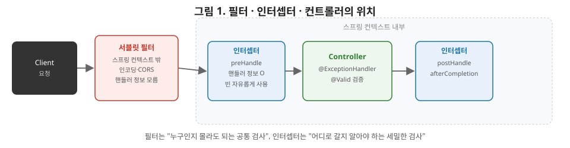

# [스프링 6편] MVC 심화: 예외 처리, 필터·인터셉터, 검증

5편에서 정상 요청이 `DispatcherServlet`을 거쳐 처리되는 흐름을 봤다. 이번 편은 그 흐름에서 벗어나는 세 가지 주제를 다룬다. 예외가 터졌을 때, 요청 전후로 공통 로직을 끼워 넣을 때, 들어온 데이터가 유효한지 검증할 때다. 셋 다 실무에서 매일 마주치지만 내부 동작까지 정확히 아는 사람은 많지 않은 영역이다.

필터와 인터셉터의 차이는 공항의 검색 과정으로 비유하면 명확해진다. 공항 입구의 보안 검색대(필터)는 승객이 어느 항공사를 타는지 전혀 모른 채, 모든 승객에게 동일한 금속 탐지와 짐 검사만 수행한다. 반면 게이트 앞의 항공사 직원(인터셉터)은 이 승객이 어떤 항공편을 탈지, 좌석 등급이 무엇인지 알고 있고, 그에 맞춰 탑승 순서나 추가 확인을 다르게 처리한다. 필터가 "누구인지 몰라도 되는 공통 검사"를, 인터셉터가 "이 요청이 어디로 갈지 알아야 하는 세밀한 검사"를 맡는다는 이번 편의 구분이 이 비유와 정확히 대응한다.



그림을 보시면 점선 박스가 "스프링 컨텍스트 내부"를 나타냅니다. 필터는 이 점선 박스 바깥에 있죠. 그래서 스프링 빈에 자유롭게 접근하지 못하고, 어떤 컨트롤러가 호출될지도 전혀 모릅니다. 반면 인터셉터는 점선 박스 안에 있어서 스프링이 관리하는 모든 자원에 접근할 수 있고, `preHandle`에서 이미 "이 요청이 어떤 컨트롤러의 어떤 메서드로 갈지"까지 알고 있습니다. 이 위치 차이 하나가 두 기술의 용도를 전부 결정한다고 보시면 됩니다.

## 1. 예외 처리

### 1-1. 기본 동작과 그 한계

아무 처리도 하지 않으면 컨트롤러에서 발생한 예외는 `DispatcherServlet`까지 전파되고, 스프링 부트가 기본 제공하는 `BasicErrorController`가 이를 받아 JSON이면 표준화된 에러 응답을, 브라우저 요청이면 Whitelabel Error Page를 반환한다. 문제는 이 기본 응답이 실무에서 원하는 형태(에러 코드, 사용자 메시지, 필드별 오류 등)와 거리가 멀다는 점이다. 그래서 예외를 원하는 형태로 가공하는 계층이 필요하다.

### 1-2. @ExceptionHandler

```java
@RestController
public class OrderApiController {

    @ExceptionHandler(OrderNotFoundException.class)
    public ResponseEntity<ErrorResponse> handleOrderNotFound(OrderNotFoundException e) {
        return ResponseEntity.status(HttpStatus.NOT_FOUND)
                .body(new ErrorResponse("ORDER_NOT_FOUND", e.getMessage()));
    }
}
```

같은 컨트롤러 안에서 특정 예외가 발생하면 이 메서드가 대신 응답을 만든다. 문제는 이 방식이 **컨트롤러 단위로 국한**된다는 점이다. 애플리케이션 전체에서 동일한 예외를 동일하게 처리하고 싶다면 컨트롤러마다 같은 코드를 반복해야 한다.

### 1-3. @ControllerAdvice / @RestControllerAdvice — 전역화

```java
@RestControllerAdvice
public class GlobalExceptionHandler {

    @ExceptionHandler(OrderNotFoundException.class)
    public ResponseEntity<ErrorResponse> handleOrderNotFound(OrderNotFoundException e) {
        return ResponseEntity.status(HttpStatus.NOT_FOUND)
                .body(new ErrorResponse("ORDER_NOT_FOUND", e.getMessage()));
    }

    @ExceptionHandler(Exception.class)
    public ResponseEntity<ErrorResponse> handleUnexpected(Exception e) {
        log.error("예상하지 못한 예외", e);
        return ResponseEntity.status(HttpStatus.INTERNAL_SERVER_ERROR)
                .body(new ErrorResponse("INTERNAL_ERROR", "서버 오류가 발생했습니다."));
    }
}
```

`@RestControllerAdvice`가 붙은 클래스는 애플리케이션 전역의 모든 컨트롤러에 적용된다. `basePackages`나 `assignableTypes` 속성으로 적용 범위를 좁힐 수도 있다. 실무에서는 이 전역 핸들러 하나에 예외 타입별로 매핑을 모아두고, 각 컨트롤러는 순수하게 비즈니스 로직만 담당하도록 분리하는 게 표준적인 구조다.

### 1-4. 내부 동작: HandlerExceptionResolver

`@ExceptionHandler`가 실제로 동작하는 원리는 `HandlerExceptionResolver`라는 인터페이스에 있다. `DispatcherServlet`은 핸들러(컨트롤러 메서드) 실행 중 예외가 발생하면, 등록된 `HandlerExceptionResolver` 목록을 순서대로 순회하며 "이 예외를 처리할 수 있는지" 묻는다. `@ExceptionHandler` 기반 처리는 이 리졸버 중 하나인 `ExceptionHandlerExceptionResolver`가 담당한다. 이 리졸버가 예외 타입과 `@ExceptionHandler`에 선언된 타입을 매칭해서 적절한 처리 메서드를 찾아 실행하는 것이다. 즉 `@ExceptionHandler`/`@ControllerAdvice`도 5편에서 본 `HandlerAdapter`처럼, 스프링이 확장 가능한 인터페이스 위에 애노테이션 기반 편의 계층을 얹은 구조라는 공통점을 갖는다.

## 2. 서블릿 필터 (Filter)

필터는 스프링이 아니라 **서블릿 스펙**이 제공하는 기술이다. 그래서 `DispatcherServlet`보다 앞단, 즉 요청이 스프링 컨텍스트에 진입하기도 전에 동작한다.

```java
@Component
public class LoggingFilter implements Filter {

    @Override
    public void doFilter(ServletRequest request, ServletResponse response, FilterChain chain)
            throws IOException, ServletException {
        long start = System.currentTimeMillis();
        chain.doFilter(request, response); // 다음 필터 또는 서블릿으로 전달
        log.info("요청 처리 시간: {}ms", System.currentTimeMillis() - start);
    }
}
```

필터의 특징은 `ServletRequest`/`ServletResponse` 자체를 감싼(wrapping) 새로운 객체로 바꿔서 다음 단계로 넘길 수 있다는 점이다. 예를 들어 요청 바디는 스트림이라 한 번 읽으면 다시 읽을 수 없는데, 로깅을 위해 바디를 미리 읽어야 한다면 필터 단계에서 `ContentCachingRequestWrapper`로 감싸 재사용 가능하게 만든다. 문자 인코딩 설정, CORS 처리, XSS 방지처럼 스프링의 비즈니스 컨텍스트와 무관한 저수준 공통 처리에 적합하다. 스프링 빈으로 등록해도 되지만, `FilterRegistrationBean`으로 등록 순서와 적용 URL 패턴을 세밀하게 제어하는 경우도 많다.

## 3. 스프링 인터셉터 (HandlerInterceptor)

인터셉터는 서블릿이 아니라 **스프링 MVC**가 제공하는 기술이며, `DispatcherServlet`과 컨트롤러 사이에 위치한다.

```java
@Component
public class AuthInterceptor implements HandlerInterceptor {

    @Override
    public boolean preHandle(HttpServletRequest request, HttpServletResponse response, Object handler) {
        if (!isLoggedIn(request)) {
            response.setStatus(HttpServletResponse.SC_UNAUTHORIZED);
            return false; // false를 반환하면 컨트롤러 호출 자체를 막는다
        }
        return true;
    }

    @Override
    public void postHandle(HttpServletRequest request, HttpServletResponse response, Object handler, ModelAndView modelAndView) {
        // 컨트롤러 실행 후, 뷰 렌더링 전
    }

    @Override
    public void afterCompletion(HttpServletRequest request, HttpServletResponse response, Object handler, Exception ex) {
        // 뷰 렌더링까지 끝난 뒤, 예외 발생 여부와 무관하게 항상 호출
    }
}
```

인터셉터는 세 가지 시점(`preHandle`, `postHandle`, `afterCompletion`)에 개입할 수 있어 필터보다 세밀한 제어가 가능하다. 특히 `preHandle`의 세 번째 파라미터로 **어떤 핸들러(컨트롤러의 어떤 메서드)가 실행될지**에 대한 정보(`HandlerMethod`)를 받을 수 있다는 게 필터와의 결정적 차이다. 이 정보를 활용해 특정 메서드에 붙은 커스텀 애노테이션(`@RequireLogin` 등)을 검사하는 식의 정교한 처리가 가능하다. 또한 인터셉터는 스프링 컨텍스트 안에서 동작하므로 다른 스프링 빈을 자유롭게 주입받아 쓸 수 있다.

## 4. 필터 vs 인터셉터, 어떤 기준으로 나누는가

두 기술이 하는 일이 겹쳐 보이지만, 선택 기준은 명확하다.

| 구분 | 서블릿 필터 | 스프링 인터셉터 |
|---|---|---|
| 소속 | 서블릿 스펙(스프링 컨텍스트 밖) | 스프링 MVC(스프링 컨텍스트 안) |
| 핸들러 정보 접근 | 불가 | **가능**(어떤 컨트롤러·메서드인지) |
| 스프링 빈 사용 | 제한적 | **자유롭게 가능** |
| 개입 시점 | 요청 전/후(1단계) | `preHandle`/`postHandle`/`afterCompletion`(3단계) |
| 요청·응답 자체 래핑 | **가능**(`ContentCachingRequestWrapper` 등) | 불가 |
| 적합한 용도 | 인코딩, CORS, XSS 방지 | 인증/인가, 커스텀 애노테이션 검사 |

실무에서 자주 쓰는 조합은 인코딩·CORS는 필터로, 로그인 체크·권한 검사는 인터셉터로 나누는 방식이다. 다만 이 경계가 절대적인 규칙은 아니고, 팀 컨벤션에 따라 인증까지 필터에서 처리하는 경우도 있다.

## 5. 검증 (Validation)

### 5-1. Bean Validation과 @Valid

```java
public class OrderRequest {
    @NotBlank
    private String productName;

    @Positive
    private int quantity;
}

@PostMapping("/orders")
public ResponseEntity<Void> createOrder(@Valid @RequestBody OrderRequest request, BindingResult bindingResult) {
    if (bindingResult.hasErrors()) {
        // 검증 실패 처리
    }
    // ...
}
```

`@NotBlank`, `@Positive`, `@Size` 같은 애노테이션은 특정 프레임워크가 아니라 **Bean Validation**이라는 자바 표준 스펙(`jakarta.validation`)이 정의한 것이고, 스프링 부트는 Hibernate Validator를 구현체로 기본 포함한다. `@Valid`는 이 표준 스펙의 애노테이션이다.

### 5-2. 검증이 실행되는 시점

5편에서 다룬 `HandlerMethodArgumentResolver`가 다시 등장한다. `@RequestBody`가 붙은 파라미터를 객체로 역직렬화하는 `RequestResponseBodyMethodProcessor`(또는 폼 데이터의 경우 `ModelAttributeMethodProcessor`)는, 객체 바인딩을 끝낸 직후 파라미터에 `@Valid`나 `@Validated`가 붙어 있는지 확인하고, 붙어 있으면 등록된 `Validator`를 실행해 검증을 수행한다. 즉 검증은 컨트롤러 메서드가 호출되기 **직전**, 파라미터 바인딩 과정의 연장선에서 자동으로 일어난다.

검증 결과 오류가 있으면 어떻게 되는지가 중요하다. 메서드 파라미터에 `BindingResult`(또는 `Errors`)가 있으면, 검증 오류를 예외로 던지지 않고 `BindingResult`에 담아 컨트롤러 메서드를 정상 호출한다. 개발자가 `bindingResult.hasErrors()`로 직접 분기해서 처리할 수 있게 하기 위해서다. 반대로 `BindingResult`가 파라미터에 없으면, 검증 실패 시 `MethodArgumentNotValidException`이 곧바로 던져진다. 이 경우 1절에서 다룬 `@ExceptionHandler`/`@ControllerAdvice`로 잡아서 일관된 에러 응답을 만드는 게 일반적이다. `BindingResult`를 굳이 받지 않고 예외로 흘려보내 전역에서 처리하는 방식이 코드가 더 간결해 최근에는 이쪽을 더 선호한다.

### 5-3. @Valid와 @Validated의 차이

`@Valid`는 표준 스펙, `@Validated`는 스프링이 제공하는 애노테이션이다. 기능적으로 겹치지만 `@Validated`는 **검증 그룹(group)**을 지정할 수 있다는 차이가 있다. 예를 들어 등록 시에는 필수지만 수정 시에는 선택인 필드가 있을 때, 그룹 인터페이스를 정의해 상황별로 다른 검증 규칙을 적용할 수 있다. 그룹 기능이 필요 없다면 표준 스펙인 `@Valid`를 쓰는 것이 스프링에 대한 결합을 줄이는 방향이라 더 권장된다.

## 6. 실무에서는 이렇게 체감된다

회원가입 API를 만든다고 하자. 이메일 형식, 비밀번호 길이, 필수 약관 동의 여부를 검증해야 하는데, 이 검사를 컨트롤러 메서드 안에서 `if`문으로 하나하나 작성하면 코드가 금방 지저분해진다. `SignUpRequest` DTO 필드에 `@Email`, `@Size(min = 8)`, `@AssertTrue` 같은 애노테이션만 붙이고 `@Valid`로 받으면, 검증 실패 시 컨트롤러 코드는 한 줄도 실행되지 않고 곧바로 `MethodArgumentNotValidException`이 던져진다. 이걸 `@RestControllerAdvice`의 전역 핸들러 하나가 받아 "어떤 필드가 왜 틀렸는지"를 일관된 JSON 형식으로 응답하도록 만들면, 회원가입뿐 아니라 프로필 수정, 상품 등록 등 다른 모든 API의 검증 실패 응답까지 자동으로 동일한 형식을 갖추게 된다. 이 조합(Bean Validation + 전역 예외 처리)이 실무에서 입력 검증을 다루는 사실상 표준 패턴이다.

## 7. 정리

- 예외 처리는 `@ExceptionHandler`(컨트롤러 단위)와 `@ControllerAdvice`(전역)로 하며, 내부적으로는 `HandlerExceptionResolver` 체인이 이 동작을 구현한다.
- 필터는 서블릿 스펙 기술로 스프링 컨텍스트 밖(더 앞단)에서 동작하고, 요청/응답 자체를 감싸는 것도 가능하다. 인코딩, CORS 같은 저수준 공통 처리에 적합하다.
- 인터셉터는 스프링 MVC 기술로 핸들러 정보에 접근할 수 있고 스프링 빈을 자유롭게 쓸 수 있어, 인증/인가처럼 비즈니스 문맥이 필요한 공통 처리에 적합하다.
- 검증은 Bean Validation 표준(`@Valid`) 또는 스프링 확장(`@Validated`, 그룹 검증)으로 하며, 파라미터 바인딩 직후 `ArgumentResolver` 단계에서 자동 실행된다.
- `BindingResult`를 받으면 검증 실패도 정상 흐름으로 처리할 수 있고, 받지 않으면 예외로 던져져 전역 예외 처리기에서 처리된다.

다음 편에서는 데이터 접근 계층으로 넘어가, JDBC의 한계에서 시작해 MyBatis, JPA/Hibernate가 이를 어떻게 해결하는지, 그리고 스프링의 트랜잭션 관리가 내부적으로 어떻게 동작하는지를 다룬다.
