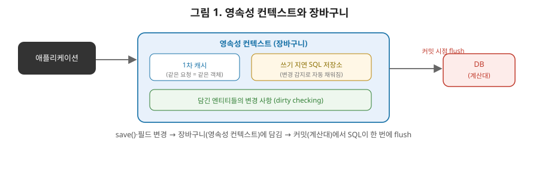

# [스프링 7편] 데이터 접근 계층: JDBC부터 JPA, 그리고 트랜잭션의 진짜 동작

지금까지 컨테이너와 웹 계층을 다뤘다면, 이번 편은 애플리케이션이 결국 다뤄야 하는 데이터, 즉 DB 접근 계층이다. 순수 JDBC의 문제에서 시작해 MyBatis와 JPA가 각각 어떤 방식으로 이를 해결하는지, 그리고 4편에서 예고한 `@Transactional`의 실제 동작 원리까지 정리한다.

JPA의 영속성 컨텍스트는 마트에서 장을 볼 때 쓰는 장바구니에 비유하면 이해하기 쉽다. 장바구니에 물건을 담는 순간마다 계산대로 뛰어가 결제하지 않는다. 담고 싶은 걸 다 담은 뒤 계산대(트랜잭션 커밋)에서 한 번에 결제한다. 장바구니 안에서 물건을 바꾸거나(엔티티 필드 변경) 다시 넣었다 뺐다 해도, 최종적으로 계산대에서 실제 담긴 물건 목록만 계산되는 것과 마찬가지로, JPA도 트랜잭션 커밋 시점에 변경된 상태를 한 번에 SQL로 반영한다. 이 비유를 기억해두면 뒤에 나올 쓰기 지연, 변경 감지 개념이 왜 그렇게 설계됐는지 훨씬 자연스럽게 이해된다.



이 그림을 4-1절을 읽으실 때 계속 옆에 띄워두시면 좋습니다. 애플리케이션이 엔티티를 조회하거나 저장하면 곧바로 DB로 가는 게 아니라 먼저 영속성 컨텍스트라는 장바구니에 담깁니다. 이 장바구니 안에는 "1차 캐시"와 "쓰기 지연 SQL 저장소"라는 두 개의 칸이 있는데요, 1차 캐시는 이미 조회한 엔티티를 다시 조회할 때 DB에 안 가고 바로 꺼내주는 칸이고, 쓰기 지연 저장소는 변경된 내용을 모아뒀다가 커밋 시점에 한 번에 DB로 보내는 칸입니다. 계산대(커밋)에 도착하기 전까지는 장바구니 안에서 뭘 넣었다 뺐다 해도 상관없다는 게 이번 절의 핵심입니다.

## 1. 순수 JDBC의 문제

스프링 없이 JDBC로 데이터를 조회하는 코드를 보면 왜 스프링이 필요한지 바로 체감된다.

```java
public Member findById(Long id) {
    String sql = "select * from member where id = ?";
    Connection con = null;
    PreparedStatement pstmt = null;
    ResultSet rs = null;
    try {
        con = dataSource.getConnection();
        pstmt = con.prepareStatement(sql);
        pstmt.setLong(1, id);
        rs = pstmt.executeQuery();
        // ... 결과 매핑
    } catch (SQLException e) {
        throw new RuntimeException(e);
    } finally {
        // con, pstmt, rs를 순서대로 null 체크하며 close (또 다른 SQLException 처리 필요)
    }
}
```

실제 비즈니스 로직(SQL 실행, 결과 매핑)은 몇 줄뿐인데, 커넥션을 열고 닫는 반복 코드가 훨씬 많은 자리를 차지한다. `SQLException`은 체크 예외라서 호출부까지 계속 던지거나 잡아야 하고, DB마다 에러 코드 체계가 달라 예외만 보고는 "이게 데이터 중복 오류인지 제약조건 위반인지" 구분하기도 어렵다.

## 2. JdbcTemplate — 반복을 템플릿으로

스프링은 이 반복 구조를 템플릿 콜백 패턴으로 걷어낸 `JdbcTemplate`을 제공한다.

```java
public Member findById(Long id) {
    String sql = "select * from member where id = ?";
    return jdbcTemplate.queryForObject(sql, memberRowMapper(), id);
}
```

커넥션을 열고 닫는 고정된 흐름(템플릿)은 `JdbcTemplate`이 담당하고, SQL과 결과 매핑처럼 매번 달라지는 부분(콜백)만 개발자가 채워 넣는다. 커넥션 close 누락 같은 리소스 릭 문제가 원천적으로 사라진다.

여기서 중요한 부가 기능이 하나 더 있다. `JdbcTemplate`은 DB별로 제각각인 `SQLException`을 스프링이 정의한 **일관된 예외 계층**(`DataAccessException`과 그 하위 예외들)으로 변환해서 던진다. `SQLErrorCodeSQLExceptionTranslator`가 DB 종류와 에러 코드를 보고 이 변환을 수행한다. 덕분에 개발자는 MySQL을 쓰든 PostgreSQL을 쓰든, 데이터 중복이면 `DuplicateKeyException`처럼 동일한 스프링 예외로 처리하는 코드를 작성할 수 있다. 이건 2편에서 언급한 "`@Repository`가 예외 변환 대상 표시 역할을 한다"는 내용과 정확히 연결되는 부분이다.

## 3. MyBatis — SQL을 코드 밖으로

`JdbcTemplate`도 결국 자바 코드 안에 SQL 문자열이 섞여 들어간다. 쿼리가 복잡해지고 동적 조건(검색 필터 등)이 많아지면 문자열 조합이 지저분해진다. MyBatis는 SQL을 XML(또는 애노테이션)로 완전히 분리하고, 동적 SQL을 위한 전용 태그(`<if>`, `<where>`, `<foreach>` 등)를 제공해 이 문제를 해결한다.

```xml
<select id="findByCondition" resultType="Member">
    select * from member
    <where>
        <if test="name != null">
            and name like concat('%', #{name}, '%')
        </if>
        <if test="age != null">
            and age >= #{age}
        </if>
    </where>
</select>
```

MyBatis는 스프링 프레임워크 자체의 일부가 아니라 별도 라이브러리지만, `mybatis-spring` 연동 모듈을 통해 스프링 생태계에 자연스럽게 통합된다. 내부적으로 `SqlSessionTemplate`이 `JdbcTemplate`과 유사하게 스프링의 트랜잭션 동기화 구조에 맞춰 커넥션을 관리해준다. 즉 MyBatis를 쓰더라도 트랜잭션 관리는 여전히 스프링의 `@Transactional`이 담당하는 구조다.

## 4. ORM과 JPA — 패러다임 자체를 바꾸다

`JdbcTemplate`과 MyBatis는 결국 SQL을 어떻게 다루기 편하게 만드느냐의 문제였다. JPA는 접근 자체가 다르다. 객체지향 프로그래밍과 관계형 데이터베이스는 설계 철학이 근본적으로 다른데(상속, 연관관계, 식별자 개념 등이 서로 매핑되지 않는 부분이 있다), 이를 **임피던스 불일치(impedance mismatch)**라고 부른다. JPA는 개발자가 SQL 대신 객체 중심으로 코드를 작성하면, 이를 SQL로 자동 변환해 이 불일치를 해소하려는 ORM(Object-Relational Mapping) 기술이다.

`JPA`는 자바 진영의 ORM 표준 스펙이고, `Hibernate`는 그 스펙의 구현체다. 스프링 부트에서 `spring-boot-starter-data-jpa`를 쓰면 기본적으로 Hibernate가 구현체로 동작한다.

여기까지 다룬 세 가지 데이터 접근 기술을 한눈에 비교해보겠습니다.

| 구분 | JdbcTemplate | MyBatis | JPA |
|---|---|---|---|
| SQL 작성 | 자바 코드 안에 문자열 | XML/애노테이션으로 분리 | 직접 작성 안 함(자동 생성) |
| 동적 쿼리 | 직접 문자열 조합 | 전용 태그(`<if>` 등) 지원 | JPQL/QueryDSL로 처리 |
| 패러다임 | SQL 중심 | SQL 중심 | **객체 중심** |
| 학습 난이도 | 낮음 | 낮음~중간 | 높음(영속성 컨텍스트 이해 필요) |
| 적합한 상황 | 단순 쿼리, 세밀한 SQL 제어 | 복잡한 동적 쿼리 | 도메인 모델 중심 설계 |

### 4-1. 영속성 컨텍스트

JPA를 상급자 수준으로 이해하려면 **영속성 컨텍스트(Persistence Context)** 개념이 핵심이다. `EntityManager`를 통해 조회하거나 저장한 엔티티는 바로 DB에 반영되는 게 아니라, 먼저 영속성 컨텍스트라는 논리적 공간에 관리된다. 여기서 나오는 특성들이 있다.

- **1차 캐시**: 같은 트랜잭션 안에서 동일한 식별자로 엔티티를 다시 조회하면, DB에 다시 쿼리를 날리지 않고 캐시에 있는 객체를 반환한다.
- **동일성 보장**: 같은 트랜잭션 안에서 같은 엔티티를 두 번 조회하면 `==` 비교가 참이 되는 완전히 동일한 객체가 반환된다.
- **쓰기 지연(write-behind)**: `save()`를 호출해도 즉시 INSERT 쿼리가 나가지 않고, 트랜잭션이 커밋되는 시점에 모아뒀던 SQL이 한 번에 flush된다.
- **변경 감지(dirty checking)**: 영속 상태의 엔티티 필드 값을 변경하면, 별도로 update 메서드를 호출하지 않아도 트랜잭션 커밋 시점에 변경분을 감지해 자동으로 UPDATE 쿼리를 생성한다.

이 중 변경 감지는 상급자가 특히 자주 오해하는 부분이다. `member.setName("변경")`처럼 세터만 호출해도 트랜잭션이 끝날 때 UPDATE가 나가는 이유가 바로 이 메커니즘 때문이며, JPA를 쓸 때 개발자가 명시적으로 저장 메서드를 호출하지 않는 코드가 자연스러운 이유이기도 하다.

## 5. 스프링 데이터 JPA — Repository를 인터페이스만으로

JPA를 직접 쓰려면 `EntityManager`를 다뤄야 하지만, 스프링 데이터 JPA를 쓰면 인터페이스 선언만으로 구현체가 자동 생성된다.

```java
public interface MemberRepository extends JpaRepository<Member, Long> {
    List<Member> findByNameAndAgeGreaterThan(String name, int age);
}
```

메서드를 구현하지 않았는데도 동작하는 이유는, 스프링 데이터 JPA가 애플리케이션 실행 시점에 이 인터페이스의 **프록시 구현체를 동적으로 생성**해서 빈으로 등록하기 때문이다(내부적으로 JDK 동적 프록시를 사용한다). `findByNameAndAgeGreaterThan`처럼 정해진 규칙을 따르는 메서드 이름은 파싱해서 자동으로 쿼리를 만들어주고, 복잡한 쿼리는 `@Query`로 직접 JPQL을 작성한다. 4편에서 다룬 프록시 개념이 AOP뿐 아니라 이런 "구현체 없는 인터페이스를 런타임에 완성하는" 용도로도 쓰인다는 걸 확인할 수 있는 대목이다.

## 6. 트랜잭션 관리의 진짜 동작

### 6-1. PlatformTransactionManager 추상화

스프링은 JDBC, JPA, MyBatis 등 기술이 달라도 동일한 방식으로 트랜잭션을 다룰 수 있도록 `PlatformTransactionManager`라는 추상화를 제공한다. JDBC를 쓰면 `DataSourceTransactionManager`가, JPA를 쓰면 `JpaTransactionManager`가 이 인터페이스의 구현체로 동작한다. 개발자는 `@Transactional` 애노테이션 하나만 붙이면 되고, 실제로 어떤 트랜잭션 매니저가 동작할지는 스프링 부트가 클래스패스를 보고 자동으로 결정해준다.

### 6-2. @Transactional은 결국 AOP다

4편에서 이미 예고했던 부분이다. `@Transactional`은 특별한 마법이 아니라, `BeanPostProcessor`가 해당 빈을 프록시로 감싸고, 이 프록시가 메서드 호출 전후로 `TransactionInterceptor`라는 어드바이스를 실행하는 구조다. 흐름을 요약하면 프록시가 메서드 호출 전에 트랜잭션을 시작하고, 원본 메서드를 실행하고, 예외 없이 끝나면 커밋, 특정 예외가 발생하면 롤백을 수행한다. 4편에서 다룬 셀프 invocation 문제(같은 클래스 내부 호출 시 프록시를 거치지 않는 문제)가 `@Transactional`에서도 똑같이 적용된다는 점은 실무에서 자주 발생하는 버그의 원인이다.

### 6-3. 트랜잭션 전파(Propagation)

트랜잭션이 걸린 메서드가 트랜잭션이 걸린 다른 메서드를 호출하면 어떻게 될까. 이 동작을 결정하는 게 전파 옵션이다. 스프링은 총 7가지 전파 옵션을 제공하는데, 실무에서 자주 쓰는 두 가지 외에 전체를 표로 정리해보겠습니다.

| 전파 옵션 | 동작 |
|---|---|
| **REQUIRED** (기본값) | 기존 트랜잭션이 있으면 참여, 없으면 새로 시작 |
| **REQUIRES_NEW** | 항상 새 트랜잭션 시작(기존은 잠시 보류) |
| SUPPORTS | 기존 트랜잭션이 있으면 참여, 없으면 트랜잭션 없이 실행 |
| NOT_SUPPORTED | 트랜잭션 없이 실행(기존은 잠시 보류) |
| MANDATORY | 기존 트랜잭션이 반드시 있어야 함(없으면 예외) |
| NEVER | 트랜잭션이 있으면 안 됨(있으면 예외) |
| NESTED | 기존 트랜잭션 안에 중첩된 저장점(savepoint) 생성 |

실무에서는 사실상 **REQUIRED**와 **REQUIRES_NEW** 두 개만 압도적으로 많이 쓰입니다. 이 두 가지의 동작 방식을 조금 더 풀어서 설명하면 다음과 같습니다.

- **REQUIRED(기본값)**: 기존 트랜잭션이 있으면 참여하고, 없으면 새로 시작한다. 대부분의 경우 이 기본값으로 충분하다.
- **REQUIRES_NEW**: 항상 새로운 트랜잭션을 만든다. 기존 트랜잭션은 잠시 보류(suspend)된다. 예를 들어 메인 로직은 실패해도 로그는 반드시 남겨야 하는 경우처럼, 독립적으로 커밋/롤백돼야 하는 로직에 쓴다.

REQUIRED로 여러 메서드가 하나의 트랜잭션에 참여할 때, 스프링은 **트랜잭션 동기화 매니저(TransactionSynchronizationManager)**에 현재 트랜잭션의 커넥션을 스레드 로컬로 보관해둔다. 그래서 같은 트랜잭션 범위 안에서 호출되는 여러 리포지토리 메서드가 매번 새 커넥션을 얻는 게 아니라, 이미 보관된 동일한 커넥션을 공유해서 사용한다. 이 덕분에 트랜잭션 범위 안의 모든 쿼리가 하나의 커넥션, 하나의 트랜잭션으로 묶여 처리된다.

### 6-4. 롤백 규칙

스프링 트랜잭션의 기본 롤백 규칙은 처음 접하면 헷갈리기 쉽다. **기본적으로 언체크 예외(`RuntimeException`과 `Error`)가 발생하면 롤백하고, 체크 예외가 발생하면 커밋한다.** 이건 자바 예외 설계 철학과 맞닿아 있다. 체크 예외는 "복구 가능한 예외"로 간주되기 때문에, 스프링은 기본적으로 이런 예외는 비즈니스적으로 정상 처리된 것으로 보고 커밋을 진행한다. 만약 특정 체크 예외에서도 롤백하고 싶다면 명시적으로 지정해야 한다.

```java
@Transactional(rollbackFor = BusinessException.class)
public void process() { ... }
```

실무에서는 이 기본 규칙을 모르고 체크 예외를 던졌다가 "예외는 났는데 데이터가 그대로 커밋됐다"는 버그를 겪는 경우가 흔하다. 이런 혼란을 피하려고 커스텀 예외를 아예 전부 `RuntimeException` 기반으로만 설계하는 팀도 많다.

## 7. 실무에서는 이렇게 체감된다

주문과 재고 차감을 한 트랜잭션으로 묶는 상황을 생각해보자. `orderService.order()` 안에서 `paymentRepository.save()`와 `stockRepository.decrease()`를 순서대로 호출한다면, `REQUIRED` 전파 옵션 덕분에 이 두 호출은 같은 트랜잭션·같은 커넥션 위에서 실행된다. 재고 차감 중 예외가 나면 이미 저장된 결제 내역까지 함께 롤백되어 데이터 정합성이 깨지지 않는다. 반대로 "결제 시도 자체는 실패하더라도 시도 이력만은 반드시 남겨야 한다"는 요구가 있다면, 이력 저장 메서드에 `REQUIRES_NEW`를 걸어 메인 트랜잭션과 분리해야 한다. 그래야 메인 로직이 롤백되더라도 이력 저장은 별도로 커밋된다. 이 둘을 구분하지 못하고 전부 기본값(`REQUIRED`)으로 두면, "실패 이력을 남기려 했는데 이력조차 롤백되어 사라졌다"는 흔한 버그로 이어진다.

## 8. 정리

- 순수 JDBC는 반복적인 커넥션 관리 코드와 예외 처리가 문제였고, `JdbcTemplate`은 템플릿 콜백 패턴과 `DataAccessException` 변환으로 이를 해결한다.
- MyBatis는 SQL을 코드에서 분리하고 동적 쿼리를 편리하게 다루되, 트랜잭션 관리는 여전히 스프링에 위임하는 구조다.
- JPA는 영속성 컨텍스트를 통해 1차 캐시, 동일성 보장, 쓰기 지연, 변경 감지 같은 기능을 제공해 객체와 관계형 DB의 패러다임 불일치를 완화한다.
- 스프링 데이터 JPA는 리포지토리 인터페이스의 프록시 구현체를 런타임에 동적으로 생성해준다.
- `@Transactional`은 AOP 프록시(`TransactionInterceptor`) 기반으로 동작하며, 전파 옵션과 트랜잭션 동기화 매니저가 여러 메서드를 하나의 트랜잭션·커넥션으로 묶는다.
- 기본 롤백 규칙은 언체크 예외에서만 동작하므로, 체크 예외를 다룰 때는 `rollbackFor`를 명시하거나 예외 설계 자체를 언체크 기반으로 통일하는 게 안전하다.

다음 편에서는 스프링 부트 기초로 넘어가, 자동 설정(`@EnableAutoConfiguration`)이 실제로 어떻게 조건부 빈 등록을 하는지, `application.yml`과 프로퍼티 바인딩, 스타터 의존성의 원리를 다룬다.
