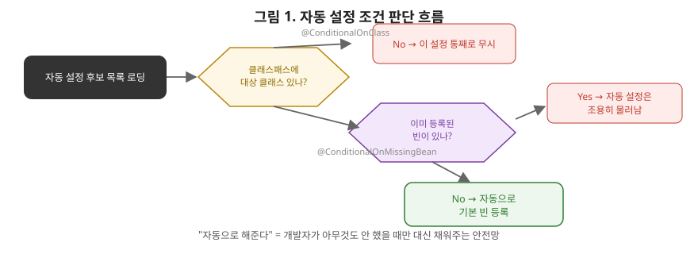

# [스프링 8편] 스프링 부트 기초: 자동 설정은 어떻게 동작하는가

여기까지 오는 동안 "스프링 부트는 이걸 자동으로 해준다"는 표현을 여러 번 썼다. `DispatcherServlet` 자동 등록, `excludeFilters` 기본값, `proxyTargetClass=true` 기본값 같은 것들이 전부 스프링 부트가 조용히 처리해준 부분이다. 이번 편에서는 이 "자동으로"의 실체를 파헤친다. 스타터 의존성, `@SpringBootApplication`의 구성, 자동 설정이 조건부로 빈을 등록하는 원리까지 다룬다.

스프링 부트의 자동 설정은 레고 스타터 키트에 비유할 수 있다. 키트를 사면 필요한 블록이 이미 모아져 있고(스타터 의존성), 조립 설명서대로 조립하면 바로 완성품이 나온다(합리적인 기본값). 그런데 이 키트의 진짜 장점은, 사용자가 특정 부분만 다른 블록으로 바꿔 끼우고 싶을 때 설명서의 나머지 지시는 그대로 유지되면서 그 부분만 자연스럽게 대체된다는 점이다. 개발자가 `DataSource` 빈을 직접 만들면 스프링 부트의 자동 설정은 그 조각만 조용히 비켜주고 나머지는 계속 기본 설명서대로 조립되는 것과 똑같다. `@ConditionalOnMissingBean`이 바로 이 "이미 끼워진 블록이 있으면 기본 블록을 놓지 않는다"는 규칙을 구현한 장치다.



이 순서도가 자동 설정의 전부입니다. 후보 목록에 올라온 설정 클래스 하나하나가 이 두 개의 마름모(조건 분기)를 통과해야만 실제로 빈이 등록됩니다. 첫 번째 마름모(`@ConditionalOnClass`)에서 걸리면 아예 이 설정 자체가 무시되고, 두 번째 마름모(`@ConditionalOnMissingBean`)에서 걸리면 클래스는 있지만 개발자가 이미 직접 등록했으니 자동 설정이 양보하는 겁니다. 두 관문을 모두 통과해야 비로소 우리가 흔히 말하는 "자동으로 빈이 등록됐다"는 상태가 되는 거죠.

## 1. 스프링 부트가 해결한 문제

순수 스프링(Spring Framework)만 쓰던 시절에는 프로젝트를 하나 시작할 때마다 해야 할 일이 많았다. 웹 개발을 하려면 스프링 MVC 관련 라이브러리를 일일이 찾아 버전을 맞춰 추가해야 했고, `DispatcherServlet`을 직접 등록해야 했고, 실행 가능한 형태로 배포하려면 WAS(톰캣 등)를 별도로 설치하고 war 파일을 배포해야 했다. 스프링 부트는 이 모든 과정을 "합리적인 기본값(Convention over Configuration)"으로 대체해, 최소한의 설정만으로 바로 실행 가능한 애플리케이션을 만들 수 있게 했다.

## 2. 스타터 의존성

```groovy
dependencies {
    implementation 'org.springframework.boot:spring-boot-starter-web'
    implementation 'org.springframework.boot:spring-boot-starter-data-jpa'
}
```

`spring-boot-starter-web` 자체는 실제 코드를 거의 담고 있지 않다. 이 의존성이 하는 일은 웹 개발에 필요한 라이브러리들(스프링 MVC, 내장 톰캣, Jackson 등)을 한 번에 끌어오는 것뿐이다. 여기서 중요한 부분은 **버전 관리**다. 스프링 부트는 `spring-boot-dependencies`라는 BOM(Bill of Materials)을 통해, 자신이 지원하는 특정 스프링 부트 버전에서 호환이 검증된 각 라이브러리의 버전을 한 곳에 못 박아둔다. 그래서 개발자가 스타터를 추가할 때 버전을 명시하지 않아도, 스프링 부트가 정한 검증된 조합의 버전이 자동으로 선택된다. 라이브러리 버전 충돌로 인한 문제를 스프링 부트 팀이 미리 해결해준 셈이다.

## 3. @SpringBootApplication 분해

메인 클래스에 붙는 이 애노테이션은 사실 세 개의 애노테이션을 합쳐놓은 것이다.

```java
@SpringBootConfiguration // 내부적으로 @Configuration
@EnableAutoConfiguration
@ComponentScan
public @interface SpringBootApplication { ... }
```

- **`@SpringBootConfiguration`**: 실질적으로 `@Configuration`과 동일하다. 이 클래스 자체도 설정 클래스이자 컴포넌트 스캔의 기준점이 된다는 뜻이다.
- **`@ComponentScan`**: 3편에서 다룬 그 애노테이션이다. 메인 클래스가 위치한 패키지 기준으로 하위 패키지를 스캔한다.
- **`@EnableAutoConfiguration`**: 이번 편의 핵심. 스프링 부트의 "자동 설정" 마법이 실제로 시작되는 지점이다.

## 4. 자동 설정의 진짜 동작 원리

### 4-1. 자동 설정 후보 목록 로딩

`@EnableAutoConfiguration`은 컨테이너가 뜰 때, 클래스패스에 있는 특정 파일(`META-INF/spring/org.springframework.boot.autoconfigure.AutoConfiguration.imports`, 스프링 부트 2.x까지는 `spring.factories`)을 읽어 **자동 설정 클래스 후보 목록**을 가져온다. 여기에는 `DataSourceAutoConfiguration`, `JpaRepositoriesAutoConfiguration`, `WebMvcAutoConfiguration` 등 수백 개의 `@Configuration` 클래스가 등록돼 있다. 이 목록에 있다고 전부 적용되는 게 아니라, 이 시점부터가 진짜 시작이다.

### 4-2. @Conditional 계열로 조건부 적용

각 자동 설정 클래스는 `@Conditional` 계열 애노테이션으로 "이 조건을 만족할 때만 적용된다"는 전제를 달고 있다.

```java
@Configuration(proxyBeanMethods = false)
@ConditionalOnClass(DataSource.class)
public class DataSourceAutoConfiguration {

    @Bean
    @ConditionalOnMissingBean
    public DataSource dataSource(DataSourceProperties properties) {
        // ...
    }
}
```

| 애노테이션 | 판단 기준 |
|---|---|
| `@ConditionalOnClass` | 클래스패스에 특정 클래스가 존재하는가 |
| `@ConditionalOnMissingBean` | 해당 타입의 빈이 컨테이너에 아직 없는가 |
| `@ConditionalOnProperty` | 특정 프로퍼티 값이 조건과 일치하는가 |
| `@ConditionalOnMissingClass` | 클래스패스에 특정 클래스가 존재하지 않는가 |
| `@ConditionalOnWebApplication` | 웹 애플리케이션 환경인가 |

- **`@ConditionalOnClass`**: 클래스패스에 특정 클래스가 존재할 때만 적용된다. 예를 들어 `DataSource` 클래스가 클래스패스에 없으면(JDBC 관련 의존성을 추가하지 않았다면) 이 설정 자체가 통째로 무시된다.
- **`@ConditionalOnMissingBean`**: 해당 타입의 빈이 컨테이너에 아직 없을 때만 적용된다. 개발자가 직접 `DataSource` 빈을 등록했다면, 자동 설정은 조용히 물러난다.
- **`@ConditionalOnProperty`**: 특정 프로퍼티 값에 따라 적용 여부를 결정한다.
- **`@ConditionalOnMissingClass`, `@ConditionalOnWebApplication`** 등도 같은 계열이다.

이 구조가 스프링 부트 자동 설정을 이해하는 데 있어 가장 중요한 지점이다. **"자동으로 해준다"는 건 무조건 실행되는 게 아니라, 개발자가 직접 설정하지 않았을 때만 대신 채워주는 안전망에 가깝다.** 그래서 개발자가 원하는 부분만 직접 빈으로 등록하면 그 부분만 자동 설정이 물러나고, 나머지는 여전히 자동으로 동작한다. `@ConditionalOnMissingBean`이 이 "필요한 만큼만 직접 개입하고 나머지는 맡긴다"는 스프링 부트 설계 철학의 핵심 도구다.

참고로 3편에서 언급했듯, 자동 설정 클래스들은 대부분 `proxyBeanMethods = false`로 선언돼 있다. 수백 개의 자동 설정 클래스마다 CGLIB 프록시를 만들면 초기화 비용이 커지기 때문에, 성능을 위해 Lite 모드를 기본으로 쓰는 것이다.

## 5. 내장 서버

`spring-boot-starter-web`에는 내장 톰캣이 포함돼 있어서, 별도로 WAS를 설치하지 않아도 `main()` 메서드 실행만으로 웹 서버가 함께 뜬다. 이 역시 `ServletWebServerFactoryAutoConfiguration`이라는 자동 설정 클래스가 `@ConditionalOnClass`로 톰캣 관련 클래스가 클래스패스에 있는지 확인하고, 있으면 내장 웹 서버를 만들어주는 방식으로 동작한다. 실행 가능한 jar(fat jar, 모든 의존성을 포함한 단일 파일) 형태로 배포하면 `java -jar app.jar` 한 줄로 애플리케이션과 서버가 함께 실행된다. 이게 스프링 부트가 마이크로서비스 환경에서 특히 널리 쓰이게 된 실질적인 이유 중 하나다.

## 6. application.yml과 프로퍼티 바인딩

### 6-1. properties vs yml

```yaml
spring:
  datasource:
    url: jdbc:mysql://localhost:3306/app
    username: root
server:
  port: 8080
```

`application.properties`(키=값, 평면 구조)와 `application.yml`(계층 구조, 들여쓰기 기반) 둘 다 지원되며 기능상 차이는 없다. 계층이 깊은 설정이 많은 실무에서는 가독성 때문에 yml을 더 선호하는 편이다.

### 6-2. @Value vs @ConfigurationProperties

```java
// 방법 1: 개별 값 하나씩
@Value("${server.port}")
private int port;

// 방법 2: 타입-세이프 바인딩
@ConfigurationProperties(prefix = "my-app")
public class MyAppProperties {
    private String name;
    private Duration timeout;
    // getter, setter
}
```

`@Value`는 프로퍼티 하나를 필드 하나에 매핑하는 단순한 방식이라, 설정 항목이 많아지면 코드 곳곳에 문자열 키가 흩어진다. `@ConfigurationProperties`는 관련된 프로퍼티 묶음을 하나의 객체로 타입-세이프하게 바인딩해준다. 오타가 있으면 (설정에 따라) 애플리케이션 실행 시점에 검증 실패로 걸러낼 수 있고, `@Valid`를 함께 붙이면 Bean Validation(6편에서 다룬)까지 적용할 수 있어 실무에서는 이 방식이 더 권장된다.

### 6-3. 프로파일별 설정 분리

```yaml
# application.yml
spring:
  profiles:
    active: local

---
spring:
  config:
    activate:
      on-profile: prod
datasource:
  url: jdbc:mysql://prod-db:3306/app
```

3편에서 다룬 `@Profile`과 정확히 같은 개념이 프로퍼티 레벨에도 적용된다. `spring.profiles.active`로 활성 프로필을 지정하면, 해당 프로필에 맞는 설정 블록만 로드된다. 로컬/개발/운영 환경마다 DB 접속 정보 등을 분리하는 가장 표준적인 방법이다.

### 6-4. 프로퍼티 우선순위

같은 키가 여러 곳에서 설정되면 스프링 부트는 정해진 우선순위대로 값을 덮어쓴다. 우선순위가 높은 것부터 표로 정리하면 다음과 같다.

| 우선순위 | 설정 위치 |
|---|---|
| 1 (가장 높음) | 커맨드라인 인자 (`--server.port=8081`) |
| 2 | 자바 시스템 프로퍼티 (`-Dserver.port=8081`) |
| 3 | OS 환경변수 |
| 4 | `application-{profile}.yml` |
| 5 (가장 낮음) | `application.yml` |

뒤로 갈수록(더 일반적인 설정일수록) 우선순위가 낮다. 이 우선순위를 알아두면 "로컬에서는 잘 되는데 운영에서만 다르게 동작한다"는 문제를 프로퍼티 충돌 관점에서 훨씬 빠르게 추적할 수 있다.

## 7. 실무에서는 이렇게 체감된다

`spring-boot-starter-data-redis`만 의존성에 추가해도 `RedisAutoConfiguration`이 `application.yml`의 `spring.data.redis.host`, `port` 값을 읽어 `RedisConnectionFactory`와 `RedisTemplate` 빈을 알아서 만들어준다. 개발자가 직접 `RedisConnectionFactory`를 설정해야 했다면 커넥션 풀 옵션까지 일일이 신경 써야 했겠지만, 자동 설정 덕분에 대부분의 경우 프로퍼티만 채우면 끝난다. 반대로 커넥션 풀을 세밀하게 튜닝해야 하는 상황이라면, 직접 `RedisConnectionFactory` 빈을 등록하는 순간 `@ConditionalOnMissingBean` 규칙에 따라 자동 설정이 물러나고 개발자가 만든 빈이 그대로 쓰인다. "라이브러리를 추가하기만 해도 동작한다"는 스프링 부트 특유의 경험이 정확히 이 메커니즘에서 나온다.

## 8. 정리

- 스프링 부트는 스타터 의존성과 BOM으로 라이브러리 버전 관리 부담을 없애고, "합리적인 기본값"으로 최소 설정 실행을 가능하게 한다.
- `@SpringBootApplication`은 `@SpringBootConfiguration`, `@ComponentScan`, `@EnableAutoConfiguration`의 조합이다.
- 자동 설정은 `META-INF`의 후보 목록을 읽어온 뒤, `@ConditionalOnClass`/`@ConditionalOnMissingBean` 같은 조건으로 실제 적용 여부를 결정한다. 개발자가 직접 빈을 등록하면 자동 설정은 조용히 물러난다.
- 내장 톰캣 덕분에 별도 WAS 없이 jar 하나로 애플리케이션과 서버를 함께 실행할 수 있다.
- `@ConfigurationProperties`는 `@Value`보다 타입-세이프하고 검증이 쉬운 프로퍼티 바인딩 방식이며, 프로파일과 우선순위 규칙으로 환경별 설정을 관리한다.

다음 편에서는 스프링 시큐리티로 넘어가, 인증과 인가의 차이, 시큐리티 필터체인이 실제 요청 흐름에 어떻게 끼어드는지, 그리고 JWT를 이용한 무상태(stateless) 인증 연동 방식을 다룬다.
