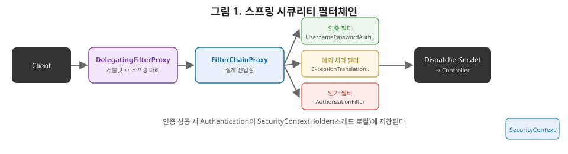

# [스프링 9편] 스프링 시큐리티: 필터체인, 인증/인가, 그리고 JWT

6편에서 필터가 `DispatcherServlet`보다 앞단에서 동작한다고 했다. 스프링 시큐리티는 바로 이 필터 메커니즘을 가장 적극적으로 활용하는 모듈이다. 이번 편에서는 요청 하나가 시큐리티의 여러 필터를 거치며 인증·인가되는 전체 흐름과, 세션 대신 JWT를 쓸 때 이 흐름이 어떻게 바뀌는지 다룬다.

인증과 인가는 건물 출입 시스템에 비유하면 명확히 구분된다. 로비에 들어설 때 리셉션에서 신분증을 확인받는 절차가 인증이다. "당신이 누구인지"만 확인한다. 신분 확인이 끝난 뒤 엘리베이터에서 층별 카드키를 태그해야 특정 층에 내릴 수 있는 절차가 인가다. 이미 신원이 확인된 사람이라도 카드키 권한이 없는 층에는 접근할 수 없다. 로비 리셉션을 통과하지 못한 사람은 애초에 엘리베이터 근처에도 갈 수 없다는 점에서, 인증이 인가보다 항상 먼저 이뤄져야 한다는 순서도 이 비유와 그대로 맞아떨어진다.



이 그림 순서대로 요청이 흘러갑니다. `DelegatingFilterProxy`가 서블릿 컨테이너 쪽 관문이고, 그 뒤의 `FilterChainProxy`가 진짜 일을 하는 필터들을 순서대로 호출합니다. 인증 필터가 먼저 실행되고, 그다음 예외 처리 필터, 마지막으로 인가 필터가 실행되는 이 순서 자체가 곧 "인증이 인가보다 먼저"라는 원칙을 코드로 구현한 겁니다. 인증에 성공하면 오른쪽 아래 박스처럼 `SecurityContext`에 정보가 저장되고, 이후 인가 필터는 이 정보를 꺼내서 권한을 판단합니다.

## 1. 인증과 인가, 먼저 구분하자

두 단어가 섞여 쓰이는 경우가 많지만 명확히 다른 개념이다.

- **인증(Authentication)**: "너는 누구인가"를 확인하는 과정. 로그인이 대표적이다.
- **인가(Authorization)**: "너는 이걸 할 권한이 있는가"를 확인하는 과정. 특정 API가 관리자만 호출 가능한지 검사하는 게 그 예다.

인증이 먼저 이뤄져야 인가를 판단할 수 있는 정보(어떤 사용자인지, 어떤 권한을 갖고 있는지)가 생기므로, 시큐리티 필터체인은 이 둘을 순서대로 처리하도록 설계돼 있다.

| 구분 | 인증(Authentication) | 인가(Authorization) |
|---|---|---|
| 질문 | 너는 누구인가 | 너는 이걸 할 권한이 있는가 |
| 처리 시점 | 먼저 | 인증 이후 |
| 대표 예시 | 로그인 | 관리자 전용 API 접근 제한 |
| 실패 시 응답 | 401 Unauthorized | 403 Forbidden |
| 담당 필터(대표) | `UsernamePasswordAuthenticationFilter` | `AuthorizationFilter` |

## 2. 시큐리티 필터체인의 위치

스프링 시큐리티는 스프링 MVC가 아니라 **서블릿 필터** 위에서 동작한다. 6편에서 다룬 필터 개념 그대로다. 다만 필터 하나가 모든 걸 처리하는 게 아니라, 역할이 나뉜 여러 필터가 정해진 순서로 체인을 이룬다.

- **`DelegatingFilterProxy`**: 서블릿 컨테이너가 관리하는 필터와 스프링 컨텍스트가 관리하는 빈 사이를 연결하는 다리 역할이다. 서블릿 컨테이너 입장에서는 이게 유일한 필터처럼 보이지만, 실제 처리는 스프링 빈으로 등록된 `FilterChainProxy`에 위임한다.
- **`FilterChainProxy`**: 시큐리티의 실제 진입점. 내부에 등록된 여러 `SecurityFilterChain`(URL 패턴별로 다른 필터 조합을 적용할 수 있다) 중 요청에 맞는 체인을 찾아 그 안의 필터들을 순서대로 실행한다.

이 체인 안에는 목적이 다른 필터들이 순서대로 배치돼 있다. 대표적으로 폼 로그인을 처리하는 `UsernamePasswordAuthenticationFilter`, 인증/인가 예외를 처리하는 `ExceptionTranslationFilter`, 그리고 체인의 가장 마지막에서 실제 인가 판단을 내리는 `AuthorizationFilter`(스프링 시큐리티 6 이전에는 `FilterSecurityInterceptor`)가 있다. 이 필터들의 실행 순서 자체가 스프링 시큐리티의 동작을 규정한다고 봐도 된다.

## 3. 인증 흐름

폼 로그인을 기준으로 인증이 처리되는 흐름을 따라가 보자.

1. 사용자가 아이디/비밀번호를 제출하면 `UsernamePasswordAuthenticationFilter`가 이를 가로채 `Authentication` 객체(아직 인증 전, 자격 증명만 담긴 상태)를 만든다.
2. 이 객체를 `AuthenticationManager`에게 넘긴다. `AuthenticationManager`는 실제 인증 로직을 직접 수행하지 않고, 등록된 여러 `AuthenticationProvider` 중 이 인증 방식을 처리할 수 있는 것에 위임한다.
3. 폼 로그인이라면 `DaoAuthenticationProvider`가 처리하는데, 이 안에서 `UserDetailsService.loadUserByUsername()`을 호출해 DB 등에서 사용자 정보(`UserDetails`)를 조회하고, `PasswordEncoder`로 비밀번호를 비교한다.
4. 인증에 성공하면 완전한 `Authentication` 객체(권한 정보 포함)가 만들어지고, 이를 **`SecurityContextHolder`**에 저장한다.

`SecurityContextHolder`는 기본적으로 `ThreadLocal`을 이용해 현재 요청을 처리하는 스레드 안 어디서든(컨트롤러, 서비스 등) `SecurityContextHolder.getContext().getAuthentication()`으로 인증 정보에 접근할 수 있게 해준다. 세션 기반 인증에서는 이 `SecurityContext`가 요청이 끝난 뒤 `HttpSession`에 저장되고, 다음 요청이 오면 세션에서 다시 꺼내 `SecurityContextHolder`에 채워 넣는 과정을 필터가 담당한다(스프링 시큐리티 6 기준 `SecurityContextHolderFilter`).

## 4. 인가 흐름과 메서드 보안

### 4-1. URL 기반 인가

```java
@Bean
public SecurityFilterChain filterChain(HttpSecurity http) throws Exception {
    http.authorizeHttpRequests(auth -> auth
            .requestMatchers("/admin/**").hasRole("ADMIN")
            .requestMatchers("/api/public/**").permitAll()
            .anyRequest().authenticated()
    );
    return http.build();
}
```

필터체인의 마지막 단계에 있는 `AuthorizationFilter`가 이 설정을 바탕으로 요청 URL과 현재 `SecurityContext`에 담긴 권한을 비교해 접근 허용 여부를 결정한다. 인증되지 않은 사용자가 보호된 자원에 접근하면 `AuthenticationException`이, 인증은 됐지만 권한이 부족하면 `AccessDeniedException`이 발생하고, 이는 `ExceptionTranslationFilter`가 잡아서 로그인 페이지 리다이렉트나 403 응답으로 변환한다.

### 4-2. 메서드 레벨 보안 — 다시 등장하는 AOP

```java
@PreAuthorize("hasRole('ADMIN')")
public void deleteUser(Long userId) {
    // ...
}
```

`@PreAuthorize`, `@Secured` 같은 메서드 레벨 보안 애노테이션은 URL 기반 인가와 완전히 다른 계층에서 동작하는 것처럼 보이지만, 사실 4편에서 다룬 AOP와 정확히 같은 메커니즘 위에 서 있다. `@EnableMethodSecurity`를 활성화하면 스프링은 이 애노테이션이 붙은 빈을 프록시로 감싸고, 메서드 호출 시 실제 로직이 실행되기 전에 `AuthorizationManagerBeforeMethodInterceptor` 같은 어드바이스가 `SecurityContextHolder`의 인증 정보를 확인해 권한을 검사한다. `@Transactional`이 `TransactionInterceptor`로 동작하는 것과 동일한 패턴이다. 그래서 4편에서 다룬 셀프 invocation 문제 — 같은 클래스 내부 호출은 프록시를 거치지 않는다 — 는 메서드 보안에서도 똑같이 적용된다. 내부 호출로 `@PreAuthorize`가 붙은 메서드를 호출하면 권한 검사가 통째로 생략될 수 있다는 뜻이므로, URL 기반 인가만 믿지 말고 이 함정도 함께 알아둬야 한다.

## 5. JWT 기반 무상태 인증

### 5-1. 세션 기반의 한계

세션 기반 인증은 서버가 로그인한 사용자의 상태(세션)를 메모리나 별도 저장소에 들고 있어야 한다. 서버를 여러 대로 확장(스케일아웃)하면, 특정 사용자가 로그인 후 다른 서버로 요청이 라우팅됐을 때 그 서버에는 세션이 없는 문제가 생긴다. 이를 해결하려면 세션 클러스터링(세션 정보를 여러 서버가 공유)이나 로드밸런서의 스티키 세션(같은 사용자는 항상 같은 서버로 보냄) 같은 추가 인프라가 필요해진다.

### 5-2. JWT는 서버가 상태를 갖지 않는다

JWT(JSON Web Token)는 사용자 식별 정보와 권한 정보를 토큰 자체에 담고, 서버의 비밀키로 서명해 위변조를 방지한다. 서버는 이 토큰을 저장하지 않고, 매 요청마다 클라이언트가 보내온 토큰의 서명만 검증하면 되므로 **상태를 갖지 않는(stateless) 인증**이 가능해진다. 이 덕분에 서버를 몇 대로 늘려도 세션 공유 문제가 사라진다.

### 5-3. 시큐리티 필터체인에 JWT 끼워 넣기

JWT를 쓴다고 시큐리티 필터체인 구조 자체가 바뀌는 건 아니다. 폼 로그인용 필터(`UsernamePasswordAuthenticationFilter`) 대신, 혹은 그 앞단에 **커스텀 JWT 검증 필터**를 추가하는 방식으로 통합한다.

```java
public class JwtAuthenticationFilter extends OncePerRequestFilter {

    @Override
    protected void doFilterInternal(HttpServletRequest request, HttpServletResponse response, FilterChain chain)
            throws ServletException, IOException {
        String token = resolveToken(request);
        if (token != null && jwtProvider.validateToken(token)) {
            Authentication authentication = jwtProvider.getAuthentication(token);
            SecurityContextHolder.getContext().setAuthentication(authentication);
        }
        chain.doFilter(request, response);
    }
}
```

이 필터는 `OncePerRequestFilter`를 상속해 요청당 한 번만 실행되도록 보장하고, 토큰이 유효하면 인증 절차(DB 조회 등) 없이 토큰 안의 정보만으로 `Authentication` 객체를 만들어 `SecurityContextHolder`에 직접 채워 넣는다. 이렇게 만든 필터를 `HttpSecurity` 설정에서 기존 필터 앞에 끼워 넣는다.

```java
http.addFilterBefore(jwtAuthenticationFilter, UsernamePasswordAuthenticationFilter.class)
    .sessionManagement(session -> session.sessionCreationPolicy(SessionCreationPolicy.STATELESS));
```

`sessionCreationPolicy(STATELESS)`를 설정하면 스프링 시큐리티가 세션을 아예 생성하거나 사용하지 않도록 지시한다. 결과적으로 3번에서 본 인증 흐름 중 "세션에 `SecurityContext`를 저장하고 다음 요청에서 복원하는" 과정이 통째로 사라지고, 매 요청마다 JWT 필터가 토큰을 검증해 그때그때 `SecurityContext`를 새로 채우는 구조로 바뀐다. 즉 JWT 통합은 시큐리티 필터체인이라는 기존 뼈대는 그대로 두고, 그 안의 필터 하나를 무엇으로 채우느냐만 바꾸는 확장이다.

## 6. 실무에서는 이렇게 체감된다

모바일 앱과 웹 프런트가 같은 백엔드 API를 쓰는 서비스를 만든다고 하자. 세션 기반이라면 모바일 클라이언트가 쿠키를 다루기 번거롭고, 서버를 여러 대로 늘릴 때 세션 클러스터링 인프라까지 구축해야 한다. JWT로 전환하면 클라이언트는 로그인 시 받은 토큰을 `Authorization` 헤더에 실어 보내기만 하면 되고, 서버는 인스턴스를 몇 대로 늘려도 세션 공유 걱정 없이 각자 토큰 서명만 검증하면 된다. 다만 이때 주의할 부분이 있다. 관리자 전용 API에 `@PreAuthorize("hasRole('ADMIN')")`을 걸어뒀다고 안심하고, 같은 서비스 클래스 내부에서 이 메서드를 다른 메서드가 직접 호출하도록 코드를 짜면 권한 검사가 조용히 우회된다. JWT로 인증 방식을 바꿔도 4절에서 다룬 셀프 invocation 함정은 그대로 남아 있다는 걸 잊지 말아야 한다.

## 7. 정리

- 인증은 신원 확인, 인가는 권한 확인이며 스프링 시큐리티는 이 순서로 필터체인을 구성한다.
- `DelegatingFilterProxy`가 서블릿 컨테이너와 스프링 컨텍스트를 연결하고, `FilterChainProxy`가 실제 보안 필터들을 순서대로 실행한다.
- 인증에 성공하면 `Authentication`이 `SecurityContextHolder`(ThreadLocal)에 저장되며, 세션 기반에서는 이 컨텍스트를 세션에 보관했다가 다음 요청에서 복원한다.
- `@PreAuthorize` 같은 메서드 보안은 URL 기반 인가와 별개처럼 보이지만, 실제로는 4편에서 다룬 AOP 프록시 메커니즘 위에서 동작하며 셀프 invocation 함정도 동일하게 적용된다.
- JWT는 토큰 자체에 정보를 담아 서버가 세션 상태를 갖지 않게 하며, 커스텀 필터를 시큐리티 체인에 끼워 넣고 `STATELESS` 정책을 설정하는 방식으로 통합한다.

다음 편, 마지막 10편에서는 스프링 테스트(`@SpringBootTest`, 슬라이스 테스트)와 프로파일 분리, 그리고 실전 배포까지 다루며 시리즈를 마무리한다.
