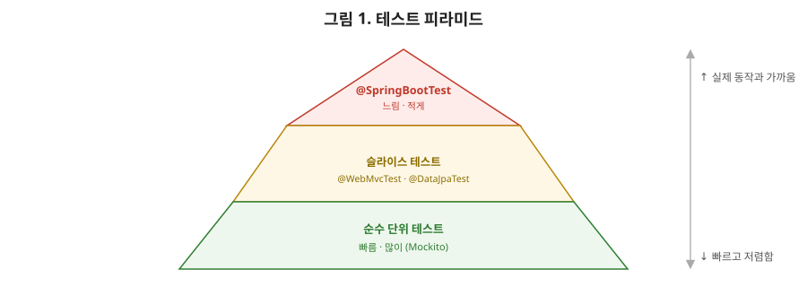

# [스프링 10편] 테스트와 배포, 시리즈를 마무리하며

1편부터 9편까지 컨테이너, AOP, MVC, 데이터 접근, 시큐리티를 다뤘다. 이번 마지막 편은 이 모든 걸 검증하고 실제로 서비스에 올리는 단계다. 스프링 테스트가 컨텍스트를 다루는 방식과 배포 시 신경 써야 할 실전 포인트들을 정리한다.

이번 편은 신차 출고 과정에 비유할 수 있다. 공장에서 차 한 대가 완성되면 바로 고객에게 넘기지 않는다. 부품 단위 검사(순수 단위 테스트), 하위 시스템 조립 검사(슬라이스 테스트), 마지막으로 시동을 걸고 실제 주행까지 해보는 완성차 검사(`@SpringBootTest`)를 순서대로 거친다. 검사가 끝난 뒤에도 곧바로 고객에게 넘기지 않고, 인도 시점의 안전 점검(배포 파이프라인의 환경별 설정)과 사고 시 즉시 대응할 수 있는 비상 연락망(Actuator, 헬스체크)까지 갖춰야 비로소 "출고 완료"라고 부를 수 있다. 지금까지 9편에 걸쳐 만든 애플리케이션을 실제로 사용자에게 내보내는 마지막 단계가 이번 편이다.



이 삼각형 그림, 테스트 전략을 짤 때 제가 항상 그려드리는 그림입니다. 아래로 갈수록 테스트 개수는 많아지고 실행 속도는 빨라집니다. 위로 갈수록 실제 운영 환경에 가깝지만 느리고 비싸지죠. 좋은 테스트 전략은 이 피라미드 모양 그대로, 아래쪽 순수 단위 테스트를 압도적으로 많이 쓰고, 위쪽 `@SpringBootTest`는 정말 필요한 핵심 시나리오에만 최소한으로 쓰는 겁니다. 이 모양이 거꾸로 뒤집혀서 `@SpringBootTest`만 잔뜩 있는 프로젝트를 종종 보는데, 그러면 테스트 스위트 전체를 돌리는 데 몇 분씩 걸리게 됩니다.

## 1. 스프링 테스트 계층

### 1-1. @SpringBootTest — 전체 컨텍스트

```java
@SpringBootTest
class OrderServiceIntegrationTest {

    @Autowired
    private OrderService orderService;

    @Test
    void order() {
        // 실제 빈들이 전부 뜬 상태로 통합 테스트
    }
}
```

`@SpringBootTest`는 애플리케이션을 실행할 때와 거의 동일하게 전체 스프링 컨텍스트를 띄운다. 실제 동작에 가장 가까운 테스트를 할 수 있지만, 컨테이너 초기화 자체에 시간이 걸려 테스트가 느려진다는 단점이 있다.

### 1-2. 슬라이스 테스트 — 필요한 계층만

전체 컨텍스트가 아니라 테스트하려는 계층만 골라서 로딩하는 게 슬라이스 테스트다.

```java
@WebMvcTest(OrderApiController.class)
class OrderApiControllerTest {

    @Autowired
    private MockMvc mockMvc;

    @MockBean
    private OrderService orderService; // 실제 빈 대신 목(mock)으로 대체

    @Test
    void getOrder() throws Exception {
        given(orderService.findOrder(1L)).willReturn(new OrderResponse(...));

        mockMvc.perform(get("/api/orders/1"))
                .andExpect(status().isOk());
    }
}
```

`@WebMvcTest`는 5, 6편에서 다룬 웹 계층(`DispatcherServlet`, `HandlerMapping`, `HandlerAdapter`, `HandlerMethodArgumentResolver` 등)만 로딩하고, 서비스나 리포지토리 빈은 컨텍스트에 올리지 않는다. `@MockBean`으로 필요한 협력 객체를 목으로 대체하고, `MockMvc`로 실제 HTTP 요청과 유사한 형태로 컨트롤러를 검증한다. `@DataJpaTest`는 반대로 JPA 관련 설정(`EntityManager`, 리포지토리)만 로딩하고 기본적으로 내장 DB(H2 등)를 자동 구성해준다. 슬라이스 테스트는 필요한 빈만 최소로 올리기 때문에 `@SpringBootTest`보다 훨씬 빠르다.

### 1-3. 순수 단위 테스트와의 관계

Mockito만으로 스프링 컨텍스트 없이 클래스 하나를 테스트하는 순수 단위 테스트가 가장 빠르다. 1편에서 생성자 주입을 권장하는 이유로 "테스트 용이성"을 들었던 게 바로 이 지점과 연결된다. 생성자로 의존관계를 주입받는 클래스는 `new OrderService(mockRepository)`처럼 스프링 없이도 얼마든지 테스트할 수 있다. 테스트 전략을 세울 때는 비즈니스 로직이 복잡한 곳은 순수 단위 테스트로 빠르게 촘촘히 검증하고, 계층 간 연결(컨트롤러의 URL 매핑, JPA 쿼리 등)은 슬라이스 테스트로, 전체 흐름이 실제로 맞물려 돌아가는지는 `@SpringBootTest`로 소수만 검증하는 식으로 계층을 나누는 게 일반적이다. 이렇게 빠르고 저렴한 테스트를 많이, 느리고 비싼 테스트를 적게 두는 구조를 테스트 피라미드라고 부른다.

| 구분 | 순수 단위 테스트 | 슬라이스 테스트 | `@SpringBootTest` |
|---|---|---|---|
| 로딩되는 빈 | 없음(Mockito만) | 필요한 계층만 | 전체 |
| 속도 | **가장 빠름** | 중간 | 가장 느림 |
| 실제 동작 근접도 | 낮음 | 중간 | **가장 높음** |
| 대표 애노테이션 | 없음 | `@WebMvcTest`, `@DataJpaTest` | `@SpringBootTest` |
| 권장 비중 | 가장 많이 | 중간 | 최소한으로 |

## 2. 테스트 컨텍스트 캐싱 (상급자가 놓치는 성능 포인트)

스프링은 테스트 클래스마다 매번 컨텍스트를 새로 띄우지 않는다. 동일한 설정(같은 `@ContextConfiguration`, `@ActiveProfiles`, `@MockBean` 조합 등)을 쓰는 테스트 클래스들이 있으면, 최초 한 번 만든 컨텍스트를 캐싱해서 재사용한다. 문제는 이 캐시 키가 **설정의 조합 전체**라는 점이다. 테스트 클래스마다 `@MockBean`을 조금씩 다르게 붙이거나 `@ActiveProfiles`를 다르게 지정하면, 캐시가 매번 미스(miss)되어 컨텍스트가 계속 새로 생성된다. 테스트가 늘어날수록 전체 스위트 실행 시간이 눈에 띄게 느려지는 흔한 원인이 이것이다. 정말 컨텍스트를 새로 띄워야 하는 경우(빈 상태를 의도적으로 오염시킨 테스트 등)에는 `@DirtiesContext`로 명시적으로 캐시를 무효화해야 한다는 것도 함께 알아둘 부분이다.

## 3. 테스트에서의 트랜잭션 롤백

```java
@SpringBootTest
@Transactional
class OrderServiceTest {

    @Test
    void order() {
        orderService.order(...); // 실제 DB에 반영되는 것처럼 보이지만
    } // 테스트 종료 시 자동으로 롤백된다
}
```

7편에서 다룬 `@Transactional`이 테스트에서는 조금 다르게 동작한다. 테스트 클래스나 메서드에 `@Transactional`을 붙이면, 스프링 테스트 프레임워크가 테스트 실행 전 트랜잭션을 시작하고, **테스트가 끝나면 커밋이 아니라 자동으로 롤백**한다. 덕분에 테스트가 실제 DB에 값을 넣고 검증해도 다음 테스트에 영향을 주지 않고 항상 깨끗한 상태에서 시작할 수 있다. 다만 이 특성 때문에 "여러 트랜잭션에 걸쳐 동작하는 로직"(예를 들어 `REQUIRES_NEW`로 별도 커밋되는 로직)을 검증할 때는 이 자동 롤백이 오히려 실제 운영 동작과 다른 결과를 보여줄 수 있다는 점을 주의해야 한다.

## 4. 프로파일 분리와 배포 환경

8편에서 다룬 `@Profile`과 `application-{profile}.yml`은 배포 관점에서 더 실질적인 의미를 갖는다. 로컬, 개발(dev), 스테이징(staging), 운영(prod) 환경마다 DB 접속 정보, 외부 API 엔드포인트, 로그 레벨 등이 다르기 때문에, 배포 파이프라인(CI/CD)에서는 환경별로 다른 `spring.profiles.active` 값을 주입해 동일한 빌드 산출물(jar)을 여러 환경에 재사용한다.

```bash
java -jar app.jar --spring.profiles.active=prod
```

운영 환경의 DB 비밀번호, API 키 같은 민감 정보는 `application-prod.yml`에 평문으로 넣지 않고, 환경변수나 별도의 시크릿 관리 도구(AWS Secrets Manager, HashiCorp Vault 등)로 외부화하는 게 실무 표준이다. 스프링은 환경변수도 프로퍼티 소스로 자동 인식하므로, `DB_PASSWORD` 같은 환경변수를 `${DB_PASSWORD}` 형태로 설정 파일에서 참조하는 방식이 흔히 쓰인다.

## 5. 실전 배포에서 고려할 것들

### 5-1. Fat jar와 컨테이너화

스프링 부트는 의존성을 모두 포함한 실행 가능한 jar(fat jar)를 만들어주므로 `java -jar app.jar` 하나로 배포가 가능하다. 여기에 컨테이너 환경(Docker/Kubernetes)까지 얹는 게 요즘 표준이다. Dockerfile을 작성할 때는 멀티스테이지 빌드로 빌드 환경과 실행 환경을 분리해 최종 이미지 크기를 줄이는 게 일반적이다. 자바 10 이후 JVM은 컨테이너의 cgroup 리소스 제한을 인식할 수 있게 개선됐지만, 컨테이너에 할당된 메모리 한도와 JVM 힙 설정(`-Xmx` 등)이 어긋나면 컨테이너가 OOMKilled로 강제 종료되는 문제가 생길 수 있어 실제 운영에서는 이 값을 신경 써서 맞춰야 한다.

### 5-2. 무중단 배포와 Graceful Shutdown

배포 시점에 인스턴스를 내리면서 처리 중이던 요청이 끊기는 문제를 막기 위해 스프링 부트는 graceful shutdown을 지원한다.

```yaml
server:
  shutdown: graceful
spring:
  lifecycle:
    timeout-per-shutdown-phase: 30s
```

이 설정을 켜면, 종료 신호(SIGTERM)를 받았을 때 새 요청은 더 받지 않으면서 이미 처리 중인 요청은 지정된 시간 안에서 완료할 때까지 기다린 뒤 종료한다. 쿠버네티스 같은 오케스트레이션 환경에서는 여기에 더해 `readinessProbe`/`livenessProbe`를 함께 활용한다. 인스턴스를 새로 배포할 때 readiness probe가 "아직 준비 안 됨"을 반환하는 동안은 로드밸런서가 트래픽을 보내지 않고, 기존 인스턴스를 내릴 때는 이 probe가 먼저 실패 상태가 되어 트래픽이 빠진 뒤에야 실제 종료가 이뤄지는 식으로 무중단 배포가 완성된다.

### 5-3. Actuator

`spring-boot-starter-actuator`는 애플리케이션의 상태를 운영 관점에서 들여다볼 수 있는 엔드포인트(`/actuator/health`, `/actuator/metrics` 등)를 제공한다. `/actuator/health`는 방금 언급한 readiness/liveness probe의 실제 구현체로 자주 쓰이며, DB 커넥션 풀 상태, 디스크 여유 공간 같은 세부 지표까지 조합해서 애플리케이션이 실제로 정상 동작 중인지 판단하는 데 쓰인다. 여기서 8편에서 다룬 자동 설정 원리가 다시 등장한다. Actuator 역시 클래스패스에 관련 의존성이 있는지에 따라 `@ConditionalOnClass`로 활성화되는 자동 설정 클래스들의 묶음이다.

## 6. 실무에서는 이렇게 체감된다

새 버전을 배포할 때 실제로 벌어지는 일을 순서대로 그려보자. 쿠버네티스가 새 파드를 띄우면, 애플리케이션이 기동되는 동안 `readinessProbe`는 계속 실패 상태를 반환하므로 로드밸런서는 이 파드로 트래픽을 보내지 않는다. `/actuator/health`가 "UP"을 반환하는 순간부터 이 파드는 정상 트래픽을 받기 시작한다. 이제 기존 구버전 파드를 내릴 차례인데, 종료 신호를 받은 순간 곧바로 프로세스를 죽이면 마침 처리 중이던 결제 요청이 중간에 끊겨버릴 수 있다. `graceful shutdown`이 설정돼 있으면 이 파드는 새 요청은 거절하되 이미 받은 요청은 끝까지 처리한 뒤 종료한다. 이 세 가지(readiness probe, health 엔드포인트, graceful shutdown)가 한 세트로 맞물려야 사용자가 배포 사실을 전혀 눈치채지 못하는 무중단 배포가 완성된다. 이 중 하나라도 빠지면 배포할 때마다 순간적으로 502 에러가 튀는 경험을 하게 된다.

## 7. 정리

- `@SpringBootTest`는 전체 컨텍스트로 실제 동작에 가장 가깝지만 느리고, 슬라이스 테스트(`@WebMvcTest`, `@DataJpaTest`)는 필요한 계층만 로딩해 빠르게 검증한다. 생성자 주입 덕분에 스프링 없이도 순수 단위 테스트가 가능하다는 점이 테스트 전략의 기반이 된다.
- 스프링은 동일한 설정의 테스트 컨텍스트를 캐싱해서 재사용하며, `@MockBean`/`@ActiveProfiles` 조합이 자주 바뀌면 캐시 미스로 테스트 스위트가 느려질 수 있다.
- 테스트에 붙인 `@Transactional`은 테스트 종료 시 자동 롤백되어 DB 상태를 격리해준다.
- 프로파일 분리로 동일한 빌드 산출물을 여러 환경에 배포하고, 민감 정보는 환경변수나 시크릿 관리 도구로 외부화한다.
- 실전 배포에서는 컨테이너 메모리와 JVM 힙 설정, graceful shutdown, readiness/liveness probe, Actuator를 함께 고려해야 무중단 배포가 완성된다.

여기까지가 스프링을 IoC/DI라는 출발점부터 컨테이너 내부 동작, 프록시와 AOP, MVC 요청 흐름, 데이터 접근과 트랜잭션, 시큐리티, 테스트·배포까지 훑은 10편의 시리즈다. 각 편에서 반복해서 등장한 프록시(2, 3, 4, 7, 9편)와 `@Conditional` 기반 확장(3, 8편)이라는 두 축을 기억해두면, 앞으로 스프링의 새로운 기능을 마주쳐도 "이것도 결국 프록시거나 조건부 빈 등록이겠구나" 하는 감으로 접근할 수 있을 것이다.
