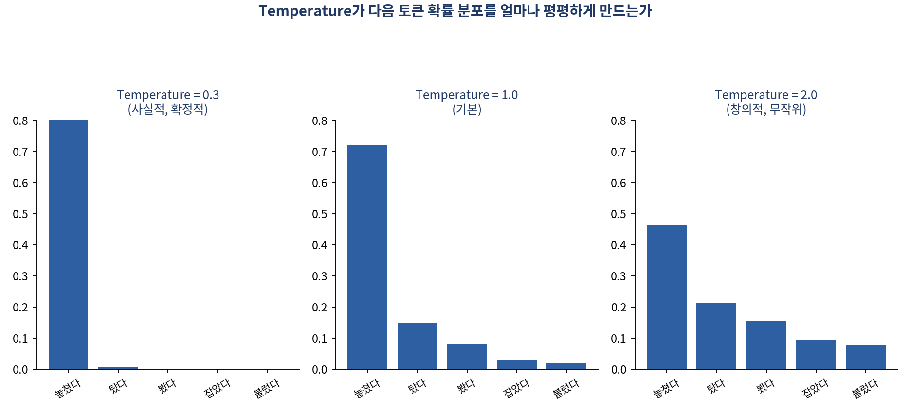
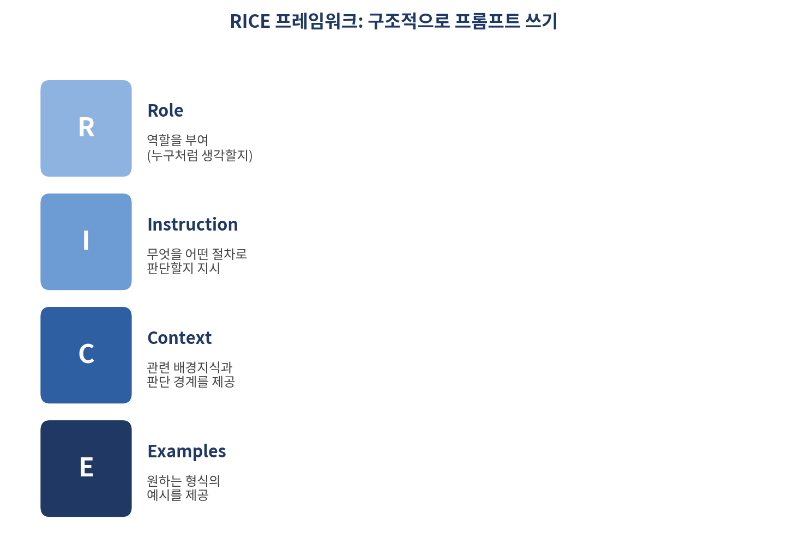

# 같은 질문도 이렇게 다르게 답할 수 있다 — 프롬프트 엔지니어링 기초부터 실전까지

*[데이터와 AI, 제대로 읽는 법] 시리즈 8/10*

"温度를 0.2로 설정해줘." 프롬프트에 이렇게 적어봤자 소용없습니다. 이건 실제 API 파라미터가 아니기 때문입니다. 반면 "확정된 사실과 데이터에 근거해서만 답하라, 모호한 표현은 금지한다"처럼 출력의 성격 자체를 규정하는 문장으로 바꾸면 훨씬 안정적으로 작동합니다. 프롬프트를 어떻게 쓰느냐가 왜 이렇게 중요한지, 오늘은 그 원리와 실전 기법을 정리합니다.

## 토큰, 그리고 프롬프트 엔지니어링이란

LLM은 텍스트를 **토큰** 이라는 단위로 쪼개 처리합니다. 영어는 1,000토큰이 대략 750단어에 해당하지만, 한국어는 토크나이저가 더 잘게 쪼개는 경향이 있어 같은 의미라도 더 많은 토큰을 소모합니다. 토큰 수는 API 비용과 응답 길이 제한에 직결되므로 실무에서 반드시 감안해야 할 요소입니다.

구글의 공식 가이드(Lee Boonstra, 2025)를 빌리면, **프롬프트 엔지니어링** 은 "LLM이 정확한 결과를 생성하도록 안내하는 고품질 프롬프트를 설계하는 과정"입니다. LLM은 이전 토큰들과 학습 과정에서 익힌 패턴을 근거로 다음 토큰을 예측하는 방식으로 작동하기 때문에, 프롬프트를 어떻게 구성하느냐에 따라 결과가 크게 달라집니다.

## 출력을 제어하는 다이얼들

- **Temperature(0~2)**: 토큰 선택의 무작위성을 조절합니다. 0에 가까울수록 가장 확률 높은 단어를 고르는 사실적인 출력, 값이 클수록 창의적이지만 불안정한 출력이 나옵니다. 사실 기반 응답엔 0.2~0.4, 창의적 응답엔 1.6~1.8 정도가 실무에서 권장됩니다.

- **Top-K / Top-p(nucleus sampling)**: 각각 확률 상위 K개, 또는 누적 확률이 특정 값을 넘지 않는 범위 내에서만 다음 토큰 후보를 제한하는 방식입니다.
- **reasoning.effort / verbosity**(최신 모델의 신규 옵션): reasoning.effort는 "얼마나 깊이 생각할 것인가"를, verbosity는 "얼마나 상세히 답할 것인가"를 조절합니다. 사고의 깊이와 표현의 길이라는 서로 다른 축을 다룹니다.

## RICE 프레임워크: 구조적으로 프롬프트 쓰기

좋은 프롬프트는 질문을 길게 늘어놓는 게 아니라 구조적으로 작성하는 것입니다. 대표적인 틀이 **RICE** 입니다.

| 요소 | 의미 | 역할 |
|---|---|---|
| Role(역할) | AI에게 페르소나를 부여 | 어떤 지식·표현·판단 기준을 우선할지 결정 |
| Instruction(지시) | 무엇을 어떤 절차로 판단할지 명시 | "무엇을 생각하라"가 아니라 "어떤 절차로 판단하라"를 지정 |
| Context(맥락) | 관련 배경지식·정보 제공 | 환각을 줄이고, 유효한 해석의 경계를 설정 |
| Examples(예시) | 원하는 형식·내용의 예시 제공 | 모델에게 암묵적인 채점 기준을 전달 |

여기에 하지 말아야 할 것을 정하는 **정책(Policy)**, 말투를 정하는 **스타일(Style)**, 분량을 제한하는 **제약조건(Constraints)**, 표·JSON·마크다운 등 틀을 정하는 **형식(Format)** 을 더하면 더 정교한 통제가 가능합니다. 특히 마크다운은 LLM이 학습 과정에서 접한 구조화된 문서 형식과 유사해, 마크다운으로 정리된 프롬프트가 더 안정적으로 해석되는 경향이 있습니다.

## 알아두면 바로 써먹는 핵심 기법들

- **Zero-shot / One-shot / Few-shot**: 예시 없이(제로샷), 예시 1개(원샷), 예시 여러 개(퓨샷, 통상 3~5개)를 제공하는 방식입니다. "Language Models are Few-Shot Learners"(Brown et al., 2020) 논문은 few-shot의 효과가 모델 파라미터 수가 클 때(대략 100B 이상) 뚜렷하게 나타난다는 걸 보였습니다.
- **Chain of Thought(CoT)**: 문제를 단계별로 나누어 중간 추론 과정을 거치게 하는 기법입니다. 복잡한 문제의 정확도를 높이고, 오답의 원인을 추적하기도 쉽게 만듭니다. 다만 이 역시 모델 규모가 충분히 클 때 효과가 뚜렷하며, 소형 모델에서는 향상이 미미합니다.
- **Step-back Prompting**: 구체적인 질문에 바로 답하기 전에 "이 문제의 더 근본적인 원인이나 배경은 무엇인가"를 먼저 묻게 함으로써, 문제의 프레임 자체를 재점검하게 만드는 기법입니다.
- **Self-Consistency**: 같은 질문에 CoT 추론을 여러 번 반복시킨 뒤, 가장 많이 나온 답을 채택하는 다수결 방식입니다.
- **Devil's Advocate Prompting**: "무엇이 잘못될 수 있는가"라고 물으면 두루뭉술한 답이 나오지만, "이미 실패했다고 가정하고 그 이유를 말해달라"고 물으면 훨씬 구체적인 약점이 드러난다는 심리학의 프리모템(pre-mortem) 기법을 응용한 것입니다.
- **Meta Prompting**: AI에게 답을 직접 구하는 대신, 더 나은 질문이나 프롬프트 자체를 설계하게 하는 기법입니다.

## 프롬프트에 관한 세 가지 흥미로운 연구 결과

- **예시의 형식이 정답 여부보다 중요할 수 있다**: 연구("Rethinking the Role of Demonstrations", 2022)에 따르면 few-shot 예시의 정답 라벨을 무작위로 바꿔도 모델 성능이 크게 나빠지지 않는 경우가 있었던 반면, 입력-출력의 형식(포맷) 자체를 유지하는 건 필수적이었습니다.
- **공손한 표현이 응답 품질에 영향을 준다**: 연구("Should we respect LLMs", 2024)는 무례한 프롬프트가 응답 품질을 떨어뜨리는 경향을 여러 언어에서 확인했습니다. 다만 지나치게 예의 바른 표현이 항상 더 좋은 결과를 보장하는 건 아니었습니다.
- **온도와 환각은 생각보다 단순한 관계가 아니다**: 연구("Is Temperature the Creativity Parameter of LLMs", 2024)는 온도가 참신성과는 약한 상관, 불일치성과는 중간 정도 상관을 보이지만, 응집성이나 전형성과는 뚜렷한 관계가 없다는 걸 실증했습니다. "온도를 높이면 창의성이 좋아진다"는 통념은 지나친 단순화라는 뜻입니다.

**더 알아보기: RAG와 ReAct.** 이 밖에도 학계에는 Tree-of-Thoughts, ReAct, Chain-of-Verification, RAG(Retrieval-Augmented Generation) 등 더 많은 기법이 있습니다. 이 중 실무에서 특히 자주 쓰이는 두 가지만 짚으면, RAG는 프롬프트에 검색된 외부 문서를 함께 넣어 최신 정보나 사내 지식을 근거로 답하게 하는 방식이고, ReAct는 "생각"과 "행동(예: 검색 도구 호출)"을 번갈아 수행하게 하여 스스로 필요한 정보를 찾아가며 답을 완성하는 방식입니다.

## 핵심 정리

- Temperature, Top-p 같은 파라미터는 프롬프트 문장으로 100% 제어되지 않는다. 출력의 "성격"을 규정하는 문장으로 설계해야 안정적이다.
- RICE(역할-지시-맥락-예시) 프레임워크로 구조화된 프롬프트가 즉흥적인 긴 질문보다 낫다.
- Few-shot과 CoT는 모델 규모가 충분히 클 때 효과가 뚜렷하다.
- 예시의 "형식"을 지키는 것이 정답 라벨 자체보다 중요할 수 있고, 공손함과 온도-창의성의 관계는 생각보다 단순하지 않다.

다음 편에서는 프롬프트 하나만 잘 쓰는 걸 넘어선 이야기, 컨텍스트 엔지니어링과 하네스 엔지니어링을 다룹니다. AI 에이전트 시대엔 왜 프롬프트만으로 부족해졌을까요?
